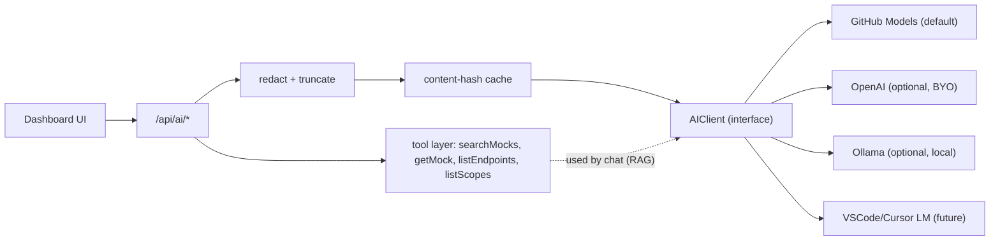

# AI Insights and Chat for the Mockifyer dashboard

## Goal

- Add an **Insights** tab and a **Chat panel** to the dashboard, grounded on real recordings (request/response/scenarios/duration/UI bindings when present).
- Avoid forcing developers to bring an OpenAI/Anthropic key — use **their GitHub identity** instead.
- Keep architecture provider-agnostic so we can add Copilot (via IDE), Anthropic, Ollama later.

## Access model (important reality-check)

Three candidate paths, in order of practicality for v1:

- **GitHub Models API (recommended for v1)** — official, supported, OpenAI-compatible. Endpoint `https://models.github.ai/inference/chat/completions`, auth via a GitHub **PAT with `models:read` scope**. Available models include `gpt-4o`, `gpt-4o-mini`, Llama, Mistral, Phi, etc. Aligns with “use my GitHub login for AI” without a separate AI account. **Note**: this is **not** the Copilot subscription per se — it’s GitHub’s official developer AI surface.
- **Copilot via VS Code/Cursor LM API (v1.x, optional)** — an editor extension can call the user’s Copilot models through `vscode.lm.selectChatModels(...)`. This *does* use the user’s Copilot. Out of scope for the dashboard MVP because Copilot Chat is not exposed to server-side apps. Architected as a future provider behind the same `AIClient` interface.
- **Copilot reverse-engineered endpoints (rejected)** — unsupported and against ToS.

We will design `AIClient` so all three plug in identically.

## Why an MCP-first option is a great fit for Mockifyer

Mockifyer’s “AI value” is mostly about **grounding**: being able to ask questions about *your mocks* (request flows, response data, status codes, UI consumers) and get answers with citations.

An MCP server is often the best way to deliver that because it flips the integration model:

- **Mockifyer provides tools + data** (local, private, fast).
- **The developer’s AI client provides the model** (Copilot/Cursor/Claude Desktop/etc.) using whatever subscription they already have.

This avoids the two biggest product risks for an OSS developer tool:

- **Key management and billing**: no need to store API keys or run a paid inference service.
- **Privacy/compliance**: data can stay local, and the user controls what their AI client sends to the model.

### What MCP unlocks in practice

- **Use the user’s existing AI provider**: Cursor, Claude Desktop, and some IDE setups can use the user’s own provider/account without Mockifyer needing to handle tokens.
- **Codebase-aware answers**: IDE AIs already see the repo. With MCP tools for mocks, the AI can connect “response field” → “where it’s used in code” without you building a full in-dashboard AI product.
- **Better UX for developers**: developers naturally ask these questions in the IDE while debugging (“why is this 401 happening?”). MCP keeps the workflow where the developer already works.
- **Extensibility**: you can add new tools over time (schema drift, session summarization, response search) and all MCP clients immediately benefit.

### Concrete MCP tool set (v1)

Expose the same operations your dashboard already supports as MCP tools:

- `mockifyer.searchMocks({ q, scenario, limit })` → list of matching filenames + key metadata
- `mockifyer.getMock({ filename, scenario })` → full `MockData`
- `mockifyer.listMocks({ scenario })` → list view (filename, endpoint, method, status if available, modified)
- `mockifyer.listScenarios()` / `mockifyer.getCurrentScenario()`
- `mockifyer.listSessions({ scenario })` → sessionIds + counts + time ranges
- `mockifyer.getSession({ sessionId, scenario })` → ordered request flow
- `mockifyer.getEndpointStats({ scenario })` → status distributions, latency summaries

Optional once `ui.consumers` exists:

- `mockifyer.getFieldUsage({ fieldPath, scenario })` → endpoints + components that consume it
- `mockifyer.getViewUsage({ viewKey, scenario })` → endpoints + fields used

### Example user experience (IDE + MCP)

User (in IDE chat):

> “In scenario `default`, which endpoints return 5xx and what do their error bodies look like?”

Assistant calls tools:

1) `mockifyer.getEndpointStats({ scenario: "default" })`
2) `mockifyer.searchMocks({ q: "status:5", scenario: "default", limit: 10 })` (or plain `q: "500"`)
3) `mockifyer.getMock({ filename: "api.example.com/orders/....json" })` for a couple examples

Then it answers with citations to filenames and a short explanation.

### Dashboard vs MCP: recommended split

- **Dashboard** remains the best place for browsing/editing mocks + filters + visualizations.
- **MCP** is the best place for “ask questions / draw conclusions” because it naturally integrates with the user’s existing AI and code context.

This plan keeps the dashboard AI (GitHub Models) as an optional path, while MCP provides a “bring your own model” path that aligns strongly with how developers actually work.



## Architecture

- New folder `packages/mockifyer-dashboard/src/ai/`:
  - `client.ts` — `AIClient` interface + `GitHubModelsClient`. Stubs for `OpenAIClient`, `OllamaClient`.
  - `redact.ts` — strip auth headers, cookies, API keys, email/token-like values; configurable allowlist.
  - `cache.ts` — disk + in-memory cache keyed by hash of (prompt + redacted context + model).
  - `prompts/` — system prompts per task: `insights-errors.md`, `insights-latency.md`, `insights-schema-drift.md`, `insights-flow.md`, `chat-system.md`.
  - `tools.ts` — RAG tools the chat model can call: `searchMocks` (uses existing `/api/mocks/search`), `getMock`, `listEndpoints`, `listScopes`, `summarizeScenario`.
- New backend route file `packages/mockifyer-dashboard/src/routes/ai.ts`:
  - `GET /api/ai/config` — provider, model list, redaction status.
  - `POST /api/ai/config` — set provider + PAT + model. PAT stored only on dashboard server, encrypted at rest using `MOCKIFYER_DASHBOARD_SECRET`.
  - `POST /api/ai/insights` — body `{ kind, scope: { scenario?, endpoint?, view?, sessionId? }, mode: 'fresh' | 'cached' }`.
  - `POST /api/ai/chat` — body `{ scenario, messages, toolCalls? }`. Streams tokens (SSE) for responsiveness.
- Wire in [packages/mockifyer-dashboard/src/server.ts](packages/mockifyer-dashboard/src/server.ts) (`app.use('/api/ai', aiRouter)`).

## v1 insight types

- **Errors / non-2xx clusters** — group similar 4xx/5xx, summarize likely cause from request/response shape.
- **Latency outliers** — surface recordings with abnormal `duration` per endpoint.
- **Schema drift per endpoint** — infer JSON schema across recordings, flag breaking changes.
- **Flow narrative per `sessionId`** — short bullet narrative + retries / redundant calls.
- **PII / secret hygiene** — flag tokens/emails/keys present in response bodies.
- **View dependency note** — when `ui.consumers` is present, list which views depend on this endpoint’s fields.

Each insight runs as a small, focused prompt with structured JSON output, so the dashboard can render badges/lists rather than free-form text.

## Chat panel (grounded RAG)

- The model gets **tool access**, not raw blobs:
  - `searchMocks(q, { scenario, limit })`
  - `getMock(id, { scenario })`
  - `listEndpoints({ scenario })`
  - `listScopes({ scenario })`
  - `summarizeScenario({ scenario })`
- Default scope: currently selected scenario.
- Every answer must cite mock filenames; clicking a citation opens that recording.
- Conversation persisted per scenario in browser local storage; clearable.

Wireframe (text):

```text
[Scenario: prod-frozen]
Q: Which endpoints returned 5xx in the last session?
A: GET /orders -> 502 (3x), POST /pay -> 503 (1x)
   Sources: orders/2026-05-08T...json, pay/...json
   The 502s share retry-after: 0; likely upstream rate-limit.
```

## Privacy & cost guardrails

- Redaction (server side):
  - Strip `Authorization`, `Cookie`, `X-Api-Key` (reuse existing `anonymizeHeaders` defaults from core).
  - Mask email/token-like strings in payloads.
  - Configurable allowlist of fields to keep raw.
- Truncate any payload over a threshold; replace tail with `"...[truncated N chars]"`.
- Per-day token cap + per-request preview (“show what will be sent”).
- Disk cache keyed by hash of (prompt + redacted context + model) to avoid re-billing identical queries.
- Audit log: every AI call appended to `~/.mockifyer/dashboard-ai-audit.log` for trust.

## Frontend

- New components in [packages/mockifyer-dashboard/frontend/src/components/](packages/mockifyer-dashboard/frontend/src/components/):
  - `AiInsights.tsx` — tab with cards per insight kind, scoped via existing scenario selector.
  - `AiChat.tsx` — slide-over panel; SSE streaming; tool-call indicators.
  - Extend `Settings.tsx` with an “AI” section: provider picker, PAT entry (link to `https://github.com/settings/tokens?type=beta` with required scopes), model dropdown (auto-listed from provider), redaction toggles, “Show what’s sent” preview, daily cap.
- Add new route to `Dashboard.tsx` and a sidebar entry in `SidebarNav.tsx`.

## Build verification (per `release-pr-build-check.mdc`)

- `npm --prefix packages/mockifyer-dashboard/frontend run build`
- `npm --prefix packages/mockifyer-dashboard run build:backend`

## Tests

- `redact.ts` — headers, query params, JSON values; round-trip preserves shape.
- `cache.ts` — hash stability across irrelevant context order changes.
- `GitHubModelsClient` — mocked HTTP, retries, rate-limit handling.
- Insights endpoint contract — fixture mocks in -> structured JSON out.
- Chat tool routing — model can call `searchMocks`/`getMock` with bounded recursion.

## Docs

- New `packages/mockifyer-dashboard/AI_INSIGHTS.md`: setup (PAT with `models:read`), models, redaction, examples.
- Update `packages/mockifyer-dashboard/README.md` with the new tab and chat.
- Add a short note in root `README.md` linking to `AI_INSIGHTS.md`.

## Future (architected for, out of v1 scope)

- **VS Code/Cursor extension** that mirrors Insights and Chat into the IDE using `vscode.lm.selectChatModels` — this is the path that actually uses the user’s Copilot.
- **MCP server** exposing the same tool layer (`searchMocks`, `getMock`, ...) so any MCP-aware AI (Cursor/Claude Desktop/etc.) can drive it natively.
- **OAuth device flow** instead of pasted PAT for nicer onboarding.
- **Ollama** provider for fully offline use.
- **Schema drift watcher**: cron-like background job + dashboard alert badges.
- **Bug repro report**: turn an error session into a Linear/Jira-ready markdown.

## Risks / mitigations

- **“Copilot subscription” expectation mismatch** — document clearly that the dashboard uses **GitHub Models** (still GitHub-identity, no extra account). Plan the IDE extension as the official Copilot-using path for users who care.
- **Token leakage** — never store the PAT in the browser; encrypt at rest using `MOCKIFYER_DASHBOARD_SECRET`.
- **Redaction gaps** — show “what’s being sent” preview; configurable allowlist; opt-in for response bodies.
- **Cost runaway** — daily cap + cache + structured prompts that minimize tokens.
- **Latency** — stream chat responses; cache insights and re-run on demand.

