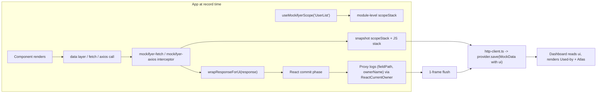

# Component-aware recordings (Phases A + B + C)

## Goal

When recording, capture which React component fired the request and which components read which response fields. Persist as a new `ui` block on `MockData`. Surface in the dashboard so a developer can answer:

- "Who fired `GET /users`?"
- "Which components consume `data.0.email`?"
- "If I change this mock, what UI breaks?"

All capture work runs **only when `recordMode === true`** — zero overhead in replay or production.

## Files we will leverage / change

- [packages/mockifyer-core/src/types.ts](packages/mockifyer-core/src/types.ts) — extend `MockData` with `ui?: UiBinding`. Reuse the existing dot/index path syntax used by `MockResponseDateOverride.path` (e.g. `items.0.expiresAt`).
- [packages/mockifyer-core/src/index.ts](packages/mockifyer-core/src/index.ts) — export new utilities.
- [packages/mockifyer-core/src/clients/http-client.ts](packages/mockifyer-core/src/clients/http-client.ts) — common record path; this is where the `ui` block gets attached before persistence.
- [packages/mockifyer-fetch/src/clients/](packages/mockifyer-fetch/src/clients/) and [packages/mockifyer-axios/src/clients/](packages/mockifyer-axios/src/clients/) — call into the new utilities at the interception seam (so we honor `useGlobalFetch` / interceptor flows already there).
- [packages/mockifyer-dashboard/frontend/src/](packages/mockifyer-dashboard/frontend/src/) — new "Used by" panel, per-component filter, Data Atlas view.
- [packages/mockifyer-dashboard/src/](packages/mockifyer-dashboard/src/) — server-side index of `ui.consumers` for fast component-pivoted queries.
- [packages/mockifyer-dashboard/REQUEST_FLOW_ENHANCEMENT.md](packages/mockifyer-dashboard/REQUEST_FLOW_ENHANCEMENT.md) — extend with the new fields.

## Data shape (in core types)

```typescript
export interface UiBinding {
  initiator?: { component?: string; path?: string[]; source?: string };
  scopeStack?: string[];
  consumers?: Array<{
    fieldPath: string;
    component: string;
    componentPath?: string[];
    source?: string;
    sampleValue?: unknown;
  }>;
  screenshot?: {
    /**
     * Where the screenshot is stored.
     * - filesystem: a relative path under `mockDataPath` (recommended for repo-backed mocks)
     * - data-url: inline base64 data URL (discouraged; huge diffs)
     */
    storage: 'filesystem' | 'data-url';
    /** e.g. `mock-data/__screenshots__/session-abc123/request-0003.png` */
    path?: string;
    /** When storage === 'data-url' */
    dataUrl?: string;
    /** ISO timestamp close to when capture happened */
    capturedAt?: string;
    /** Optional context */
    viewport?: { width?: number; height?: number; scale?: number };
    platform?: 'web' | 'react-native';
  };
  capture?: {
    incomplete?: boolean;
    reason?: string;
    react?: { major: number; minor: number };
  };
}

export interface MockData {
  request: StoredRequest;
  response: StoredResponse;
  timestamp: string;
  scenario?: string;
  ui?: UiBinding;
}
```

## Capture architecture



### Without manually setting screen/view names (no `useMockifyerScope`)

If the app never calls `useMockifyerScope`, `ui.scopeStack` will be empty/undefined. The system still works, but the “view” concept becomes **best-effort**:

- **Initiator (where it was called)**: driven by `ui.initiator.source` derived from the JS stack trace, e.g. `src/services/ordersApi.ts:42`. This often points to shared data layers, not the actual screen.
- **Used fields (what was consumed)**: still driven by `ui.consumers[]` from Proxy + React owner detection, so you still get “fieldPath → component” (the higher value part).
- **View aggregation (Level 3)**: when `scopeStack` is missing, aggregate by a fallback key:
  - `viewKey = initiator.source (file path only)` (recommended default), e.g. `src/services/ordersApi.ts`
  - optionally: `viewKey = initiator.component` **if** we can detect a current React owner at call time (sometimes possible, often not)

Realistic dashboard look in this “no manual view names” mode:

```text
Recording: GET /orders (200)     Scenario: default
Initiator: src/services/ordersApi.ts:42   (View: Unknown)

Used-by (field -> components)
- orders.0.total -> TotalPill
- orders.0.status -> StatusChip
- user.email -> UserHeader

View usage (fallback grouping)
Group by: Source file
- src/services/ordersApi.ts (37 recordings)
  Top used fields:
  - orders.*.status (StatusChip) 31
  - orders.*.total (TotalPill)   29
```

Takeaway: **you still get accurate “used fields” and component mapping**, but the “which screen/workflow” grouping will be less human-meaningful unless you add scopes at a handful of screens/routes.

## Implementation steps

### 1) Core: scope stack + scope hook (Phase A)

- New `packages/mockifyer-core/src/ui/scope.ts`: pure-JS module-level `scopeStack: string[]` with `pushScope/popScope/snapshotScope()`. No React dependency.
- New `packages/mockifyer-core/src/ui/use-mockifyer-scope.ts` (subpath export so non-React consumers don't pull React): exports `useMockifyerScope(name)` which uses `useLayoutEffect` to push/pop the current name. Same module works on React Native (same `useLayoutEffect`).
- Snapshotting at the interceptor seam guarantees we capture the stack at the call site, even if the call resolves later.

### 2) Core: owner detection probe (Phase B groundwork)

- New `packages/mockifyer-core/src/ui/owner.ts`: `getCurrentOwnerName()` that reads `React.__SECRET_INTERNALS_DO_NOT_USE_OR_YOU_WILL_BE_FIRED.ReactCurrentOwner.current?.type?.displayName ?? type?.name`, with a React 18 / 19 probe and graceful fallback returning `undefined`. Marks `capture.incomplete = true` when probe fails.
- React Native works because RN uses the same React internals.

### 3) Core: lazy Proxy wrapper (Phase B core)

- New `packages/mockifyer-core/src/ui/wrap-response.ts`: `wrapResponseForUi(value, onRead)` that returns a **lazy** recursive Proxy:
  - `get` traps record `(fieldPath, getCurrentOwnerName())` then return a wrapped child if the value is a non-null object/array, raw value otherwise.
  - WeakMap to avoid double-wrap and cycles.
  - Handles `Symbol.iterator`, `Symbol.toPrimitive`, `Symbol.toStringTag`, and `toJSON` so `JSON.stringify` and array iteration don't break consumers.
  - Reads with `ownerName === undefined` are dropped (only fiber-owned reads count as "consumption").
- Strictly opt-in: only used when `recordMode === true`.

### 4) Core: glue in `http-client.ts`

- In the record path of [packages/mockifyer-core/src/clients/http-client.ts](packages/mockifyer-core/src/clients/http-client.ts):
  - Snapshot `scopeStack` at request time.
  - Compute `initiator.source` from existing stack-trace logic in `REQUEST_FLOW_ENHANCEMENT.md`.
  - If `recordMode`, wrap the resolved response payload via `wrapResponseForUi` before returning to the app.
  - Buffer save by ~1 frame (microtask + `setTimeout(0)`); when flushing, attach `ui = { initiator, scopeStack, consumers, capture }` to `MockData`.
- Provide a small flag in `MockifyerConfig` to disable UI capture explicitly: `captureUiBindings?: boolean` (default `true` when `recordMode`).

### 5) Wire into both clients

- In [packages/mockifyer-fetch/src/clients/](packages/mockifyer-fetch/src/clients/) and [packages/mockifyer-axios/src/clients/](packages/mockifyer-axios/src/clients/), the existing interceptor calls into `http-client.ts`. Confirm both pass through the wrapped response.
  - Axios returns a plain object — wrap `response.data`.
  - Fetch returns a `Response` — wrap parsed JSON only when the consumer calls `.json()`; implement via returning a tiny `Response`-like proxy whose `.json()` returns the wrapped object.
- Ensure `excludedUrls` (Metro/dashboard internals, Resend, etc.) skip UI capture too (they already short-circuit recording).

### 6) Dashboard: backend index

- In [packages/mockifyer-dashboard/src/](packages/mockifyer-dashboard/src/), at mock-load time, build an in-memory inverted index:
  - `componentToRecordings: Map<string, MockId[]>`
  - `componentToFields: Map<string, Set<fieldPath>>`
- Expose two endpoints: `GET /api/ui/components` and `GET /api/ui/atlas`.

### 7) Dashboard: frontend surfaces

- In [packages/mockifyer-dashboard/frontend/src/](packages/mockifyer-dashboard/frontend/src/):
  - **Used-by panel** on the recording detail view: list of `(component, fieldPath)` rows; clicking a row highlights the corresponding path in the JSON viewer.
  - **Per-component view**: sidebar lists components from the index; selecting one filters the recordings and shows which fields they read.
  - **Data Atlas**: 3-column SVG view (Endpoints ⇄ Fields ⇄ Components) using a simple force-free layout. Render edges from `ui.consumers`.
  - **Screenshot viewer (optional but recommended)**: when `ui.screenshot` exists, render the image next to the response JSON and show a compact legend: initiator + top consumer components for quick context.

#### Level 2: highlight “used” fields inside the Response JSON viewer

Add a “Used fields” mode to the response JSON tree on the recording detail view.

- Build an index from `ui.consumers[]`:
  - `Map<fieldPath, Set<component>>`
- When rendering each JSON node, compute its dot-path (same convention as `MockResponseDateOverride.path`):
  - Examples: `user.email`, `items.0.price`, `meta.pagination.nextCursor`
- Mark each node:
  - `directUsed`: exact path exists in map
  - `descendantUsed`: any recorded `fieldPath` has this path as a prefix

Dashboard UX (recording detail):

```text
Recording: GET /orders (200)     Scenario: default     Session: session-abc123

Left: Screenshot (optional)      Right: Response JSON
┌─────────────────────────┐      ┌─────────────────────────────────────────────┐
│ [screenshot image]      │      │ [x] Highlight used fields   [ ] Only used  │
│ Initiator: OrdersScreen │      │                                             │
│ Top consumers:          │      │ response.data                               │
│ - OrdersListItem        │      │  ├─ user                                    │
│ - TotalPill             │      │  │   ├─ id                                   │
└─────────────────────────┘      │  │   ├─ email        ● Used by: UserHeader  │
                                  │  ├─ orders         ◐ Has used descendants │
Used-by (field -> components)      │  │   ├─ 0                                 │
┌───────────────────────────────┐ │  │   │   ├─ total   ● Used by: TotalPill   │
│ user.email -> UserHeader      │ │  │   │   ├─ status  ● Used by: StatusChip  │
│ orders.0.total -> TotalPill   │ │  │   │   ├─ ...                            │
│ orders.0.status -> StatusChip │ │  └─ debugInfo      (not used)              │
└───────────────────────────────┘ └─────────────────────────────────────────────┘
```

Behavior:
- Clicking an entry in “Used-by” scrolls/focuses the JSON node and opens a small popover: “Used by …”.
- “Only used” prunes branches where `directUsed === false` and `descendantUsed === false`.

#### Level 3: view/screen-level aggregated usage (“View usage”)

Define a “view” as the **top-most scope** (first element of `ui.scopeStack`) or a dedicated `viewId` convention:
- Example: `ui.scopeStack = ["OrdersScreen", "OrdersList", "OrdersListItem"]` → view = `OrdersScreen`

Aggregate across all recordings:
- group key: `(scenario, view)`
- metrics:
  - endpoints called: `{ method + pathname } -> count`
  - used fields: `fieldPath -> count` (optionally per endpoint)
  - components involved: `component -> count`

Dashboard UX (View usage page):

```text
View usage: OrdersScreen     Scenario: default

Top endpoints
- GET /orders (37 recordings)
- GET /user (12 recordings)

Top used fields (across recordings)
- orders.*.status (StatusChip)          31
- orders.*.total (TotalPill)            29
- user.email (UserHeader)               12

Recordings timeline (filtered)
[2026-05-08 10:12] GET /orders (200)  Used fields: 14   Components: 6
[2026-05-08 10:10] GET /orders (200)  Used fields: 12   Components: 5
...
```

Notes:
- Use a simple wildcard normalization for arrays to reduce noise in aggregated views:
  - `orders.0.status`, `orders.1.status` → `orders.*.status`
- Let the user toggle “wildcard arrays” on/off in the view usage UI.

### 7a) Screenshot capture (dev-only, record mode only)

**Goal**: capture a screenshot around the moment a request resolves (or once per `sessionId`) and store it alongside the mock recording, so the dashboard can show “what the app looked like” when the data was consumed.

- **Core API**
  - Extend `MockifyerConfig` with:
    - `captureUiBindings?: boolean` (already planned; default `true` in record mode)
    - `captureScreenshots?: boolean` (default `false`)
    - `screenshotCapture?: { mode: 'per-request' | 'per-session'; format?: 'png' | 'jpeg'; quality?: number }`
  - Add an optional capture hook, not bundled by default (so core stays dependency-free):
    - Web: `@sgedda/mockifyer-core/ui/screenshot-web` (expects an injected `capture()` function; can be implemented by app using e.g. `html2canvas`)
    - React Native: `@sgedda/mockifyer-core/ui/screenshot-react-native` (expects an injected `capture()` function; app can implement via `react-native-view-shot`)

- **Storage**
  - Preferred: **filesystem** storage under `mockDataPath/__screenshots__/...` and record only the relative `path` in `ui.screenshot`.
  - Avoid: inline base64 `data-url` except for ephemeral demo mode.

- **When to capture**
  - `per-request`: capture after the response resolves and after the 1-frame “field read flush” window.
  - `per-session`: capture only once per `sessionId` (first request in session wins, or capture the latest).

- **Dashboard behavior**
  - If the screenshot file is missing, show a non-blocking warning and continue (do not break mock loading).

#### React Native capturer example (`react-native-view-shot`)

This is one workable approach: the app installs `react-native-view-shot`, keeps a `ref` to the root view, and registers a capturer function that returns a temporary file URI. Mockifyer then copies that file into `mockDataPath/__screenshots__/...` and persists `ui.screenshot.path` in the mock JSON.

- Install:
  - Expo managed: `npx expo install react-native-view-shot`
  - Bare RN: `npm i react-native-view-shot` (then rebuild / pods as needed)

Example app wiring:

```tsx
import React, { useEffect, useRef } from 'react';
import { View } from 'react-native';
import { captureRef } from 'react-native-view-shot';

// Proposed Mockifyer API (app-side registration)
import { registerMockifyerScreenshotCapturer } from '@sgedda/mockifyer-core/ui/screenshot-react-native';

export function AppRoot() {
  const rootRef = useRef<View>(null);

  useEffect(() => {
    registerMockifyerScreenshotCapturer(async () => {
      if (!rootRef.current) return undefined;

      // Prefer tmpfile over base64 to avoid huge JSON diffs
      const tmpUri = await captureRef(rootRef, {
        format: 'png',
        quality: 1,
        result: 'tmpfile',
      });

      return {
        platform: 'react-native',
        tmpUri,
      };
    });
  }, []);

  return (
    <View ref={rootRef} style={{ flex: 1 }}>
      {/* NavigationContainer / screens go here */}
    </View>
  );
}
```

Notes:
- For performance, prefer `screenshotCapture.mode = 'per-session'` (one screenshot per workflow) over per-request.
- Screenshots may contain sensitive data; keep `captureScreenshots` default `false` and consider an env var kill switch.


### 8) Build verification (per `release-pr-build-check.mdc`)

- `npm --prefix packages/mockifyer-core run build`
- `npm --prefix packages/mockifyer-fetch run build`
- `npm --prefix packages/mockifyer-axios run build`
- `npm --prefix packages/mockifyer-dashboard/frontend run build`
- `npm --prefix packages/mockifyer-dashboard run build:backend`

### 9) Tests

- `packages/mockifyer-core`: unit tests for `scope.ts` (push/pop ordering across async), `wrap-response.ts` (Proxy handles iteration, JSON.stringify, primitives, cycles), and `owner.ts` (probe returns reasonable values across React versions).
- `packages/mockifyer-fetch`: integration test in record mode asserting `ui.consumers` is populated when a component reads a field.
- `packages/mockifyer-axios`: same.
- Dashboard: snapshot test for "Used by" panel given a fixture recording.

### 10) Docs

- Update [packages/mockifyer-dashboard/REQUEST_FLOW_ENHANCEMENT.md](packages/mockifyer-dashboard/REQUEST_FLOW_ENHANCEMENT.md) and [README.md](README.md) with the new `ui` field, the `useMockifyerScope` hook, and the `captureUiBindings` config.
- Add a small section to [REACT_NATIVE.md](REACT_NATIVE.md) noting RN is supported and what to do if Hermes truncates stacks.

## Example usage (app code)

## Example: how recording works at code level (pseudo-code)

This is the “happy path” for **record mode** showing where each piece of metadata is gathered.

### 1) Interceptor snapshots context at call time

```typescript
import { snapshotScope } from '@sgedda/mockifyer-core/ui/scope';

export async function interceptedRequest(req: StoredRequest, config: MockifyerConfig) {
  const startedAt = Date.now();
  const scopeStackAtCallTime = snapshotScope(); // e.g. ["AppShell", "OrdersScreen"]
  const callStack = new Error().stack?.split('\n') ?? [];
  const source = pickBestSourceFrame(callStack); // e.g. "src/api/orders.ts:42"

  const upstreamResponse = await callRealNetwork(req);
  const duration = Date.now() - startedAt;

  if (!config.recordMode || config.captureUiBindings === false) {
    // No special wrapping; just persist the response normally
    await saveMock({
      request: req,
      response: upstreamResponse,
      timestamp: new Date().toISOString(),
      duration,
      ui: {
        initiator: { source },
        scopeStack: scopeStackAtCallTime,
        capture: { incomplete: true, reason: 'captureUiBindings disabled' },
      },
    });
    return upstreamResponse;
  }

  // Wrap the payload so reads during render are observed
  const consumerReads = new Map<string, Set<string>>(); // component -> fieldPaths
  const wrappedData = wrapResponseForUi(upstreamResponse.data, ({ fieldPath, ownerName }) => {
    if (!ownerName) return;
    const set = consumerReads.get(ownerName) ?? new Set<string>();
    set.add(fieldPath);
    consumerReads.set(ownerName, set);
  });

  // Return wrapped response to the app so renders can “touch” fields
  const wrappedResponse = { ...upstreamResponse, data: wrappedData };

  // Defer persistence: allow one frame for components to render and read fields
  queueMicrotask(() => {
    setTimeout(async () => {
      const consumers = [...consumerReads.entries()].flatMap(([component, fieldPaths]) =>
        [...fieldPaths].map((fieldPath) => ({ component, fieldPath }))
      );

      const screenshot = config.captureScreenshots
        ? await tryCaptureScreenshotMaybe(config) // returns { storage, path, capturedAt, ... } or undefined
        : undefined;

      await saveMock({
        request: req,
        response: { ...upstreamResponse, data: unwrapForStorage(upstreamResponse.data) },
        timestamp: new Date().toISOString(),
        duration,
        ui: {
          initiator: { source },
          scopeStack: scopeStackAtCallTime,
          consumers,
          screenshot,
          capture: { incomplete: consumers.length === 0, reason: consumers.length === 0 ? 'No owner-tagged reads observed' : undefined },
        },
      });
    }, 0);
  });

  return wrappedResponse;
}
```

### 2) Proxy logs field reads during render

```typescript
// Called when app code does something like: response.data.user.email
// The Proxy sees `.user` and `.email` gets and can report the accumulated path.

export function wrapResponseForUi(value: unknown, onRead: (e: { fieldPath: string; ownerName?: string }) => void) {
  // - lazily wrap nested objects/arrays
  // - dedupe with WeakMap
  // - on `get`, compute next path and report:
  //     onRead({ fieldPath: "user.email", ownerName: getCurrentOwnerName() })
  return new Proxy(/* ... */);
}
```

### 3) Dashboard uses the persisted `ui` block

Once saved, the mock JSON contains `ui.scopeStack`, `ui.initiator.source`, and `ui.consumers[]`.
The dashboard inverts those to build:

- recording detail “Used by” list
- per-component view (“show all mocks that feed `OrdersScreen`”)
- Data Atlas (endpoints ↔ fields ↔ components)

### React (web) + `fetch` (record mode)

```typescript
import { setupMockifyer } from '@sgedda/mockifyer-fetch';
import { useMockifyerScope } from '@sgedda/mockifyer-core/ui';

setupMockifyer({
  mockDataPath: './mock-data',
  recordMode: process.env.MOCKIFYER_RECORD === 'true',
  useGlobalFetch: true,
  // New features:
  captureUiBindings: true,
  captureScreenshots: false, // enable only when you have a capture hook wired
});

export function UserList() {
  useMockifyerScope('UserList');

  // Any fetch inside this scope will pick up scopeStack + (in record mode) field consumers
  // ...
  return null;
}
```

### React (web) + `axios`

```typescript
import axios from 'axios';
import { setupMockifyer } from '@sgedda/mockifyer-axios';
import { useMockifyerScope } from '@sgedda/mockifyer-core/ui';

setupMockifyer({
  mockDataPath: './mock-data',
  axiosInstance: axios,
  recordMode: process.env.MOCKIFYER_RECORD === 'true',
  // New features:
  captureUiBindings: true,
});

export function UserHeader() {
  useMockifyerScope('UserHeader');

  // axios.get(...) initiated under this scope will be tagged
  return null;
}
```

### React Native / Expo + `fetch`

```typescript
import { setupMockifyerForReactNative } from '@sgedda/mockifyer-fetch';
import { useMockifyerScope } from '@sgedda/mockifyer-core/ui';

export async function initializeMockifyer() {
  return setupMockifyerForReactNative({
    isDev: __DEV__,
    mockDataPath: 'mock-data',
    bundledDataPath: './assets/mock-data',
    recordMode: __DEV__ && process.env.MOCKIFYER_RECORD === 'true',
    config: {
      // New features:
      captureUiBindings: true,
      captureScreenshots: false,
    },
  });
}

export function OrdersScreen() {
  useMockifyerScope('OrdersScreen');
  return null;
}
```

## Risks / mitigations

- **React internals churn**: probe + graceful fallback; tag `capture.incomplete` so the UI shows a soft warning instead of silently lying.
- **Proxy edge cases (cloning into Redux/IndexedDB/workers)**: provide an explicit `useMockifyerFieldUse(response, "data.user.email", "UserHeader")` escape hatch.
- **Recording size growth**: keep `sampleValue` opt-in; cap `consumers` per recording (e.g. 200) and dedupe by `(component, fieldPath)`.
- **Timing**: 1-frame flush window can miss late readers; document the limit and offer the manual hook for those cases.
