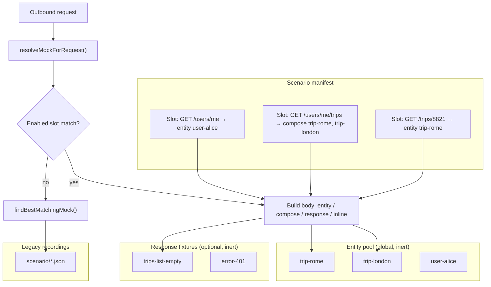

# Fixture pool (entities + response fixtures)

> **Status (2026-07-22):** **Endpoint slots are deferred.** Ship the **global fixture pool** only (entities + full response fixtures): extract/promote, dashboard browse, MCP CRUD. Matching stays request-keyed recordings as today. A later optional phase may add either slots *or* `$entity` / `$response` refs inside mock bodies — TBD; slots are not required for the pool to be useful as a shared catalog.

Technical specification for an **entity-first fixture pool** (reusable domain objects) and optional **response fixtures** (full HTTP payloads). Recording and scenario folders stay the primary serve path.

---

## Deferred: endpoint slots

The earlier design added **per-scenario endpoint slots** (named rules: path pattern → compose entities). That layer is **out of scope for now** because:

- Scenarios already express variants; slot naming often feels like duplicate ceremony.
- Refs inside normal mock responses (`$entity`) may be a lighter activation path later.

Code for slot matching/compose may remain in core as unused library helpers; **runtime, `/api/scenario-slots`, slot UI, and slot MCP tools are removed/unwired.**

---

## Problem statement

Today Mockifyer stores mocks as **request-keyed recordings** under `mock-data/<scenario>/`. A file becomes active when an outbound request **matches** it. That works for record/replay but breaks down when teams need to:

1. **Curate** which data an endpoint serves in a scenario — not “whatever file happens to match.”
2. **Reuse domain objects** (a trip, a user, a booking) across list *and* detail endpoints without duplicating JSON.
3. **Compose list responses** by picking entities from a shelf (e.g. `trips: [trip-rome, trip-london]`), not only by promoting an entire list payload.
4. **Overlay** scenario-specific fields (especially dates/status) on shared base data.
5. **Keep pool data inert** until a slot assigns it — existing on disk must not change runtime by itself.

A **whole-response-only** pool (one slot → one full `MockData`) is simple but awkward for “grab two trips from the shelf.” This plan is **entity-first**, with full response fixtures as an escape hatch.

Related pain today:

- `similarMatch` picks the first path match; the user does not choose variants.
- `responseFieldOverrides` patches one recording; it does not share entities across endpoints.
- Scenario import/export copies whole bundles; variant scenarios duplicate identical JSON.
- MCP can list/edit mocks but cannot assemble scenarios from shared base data.

## Goals

| # | Goal |
|---|------|
| G1 | **Entity pool**: catalogued domain objects (`entityType` + `data`), inert until referenced. |
| G2 | **Response fixtures** (optional): full HTTP payloads for envelopes/errors that are not worth modeling as entities. |
| G3 | **Endpoint slots** per scenario: REST path patterns or GraphQL operation + variable template. |
| G4 | **Assignment kinds**: `none` \| `entity` \| `compose` \| `response` \| `inline`. |
| G5 | **Compose lists** from entity ids + wrap rules; detail slots reuse the same entity ids. |
| G6 | **Slot/item overlays**: `responseFieldOverrides` + `responseDateOverrides` at serve time. |
| G7 | **Clear precedence** vs legacy exact/similar match; recording behavior unchanged unless a slot hits. |
| G8 | **Dashboard UX**: extract entities, browse pool, assign/compose slots, preview serve result, diff scenarios. |
| G9 | **MCP parity**: agents can list/extract/assign/preview via tools backed by the same dashboard APIs. |
| G10 | **Backward compatible**: no manifest → 100% current behavior. |

## Non-goals (v1)

- Auto-discovery of entity relationships from OpenAPI/GraphQL schema.
- Live remote fixture registry / cross-repo pool sync.
- Replacing `generateRequestKey` or hash storage for legacy recordings.
- Full JSONPath / templating engine (dot-path extract + existing overrides only).
- Nested entity composition (booking embeds trip) — promote whole response or extract one level only.
- Per-lane / per-client pools — **one global pool per `mockDataPath`**.

## Pre-build decisions (locked before implementation)

| Decision | Choice |
|----------|--------|
| Pool scope | One global pool under `mock-data/pool/` shared by all scenarios/lanes |
| Wrap v1 | `bare` + `object` only; `graphql` wrap deferred to Phase 3 |
| Entity edits | Global; dashboard/MCP must show “used in N scenarios”; **Fork entity** required in Phase 1 |
| Record + slots | Env `MOCKIFYER_SLOTS_IN_RECORD` default `true` (mock-hit semantics). Set `false` to skip slot resolution while recording |
| MCP writes | Validate + prefer preview; assign/upsert fail closed on `entityType` / missing `arrayPath` |
| Provenance | Synthetic served mocks expose `slot:<id>` / `entity:<id>` / `compose:<slotId>` / `response:<id>` in filename/filepath for UI + traces |
| Response fixtures | Included in Phase 1 storage (sibling of entities), but entity+compose is the primary UX |

## Current baseline

| Area | Behavior today | Relevant files |
|------|----------------|----------------|
| Storage | `mock-data/<scenario>/*.json` + scenario/date/domain configs | [`scenario.ts`](../../packages/mockifyer-core/src/utils/scenario.ts) |
| Matching | Exact key → similar path/method (REST); GraphQL exact query+variables | [`mock-matcher.ts`](../../packages/mockifyer-core/src/utils/mock-matcher.ts) |
| Overlays | `responseFieldOverrides`, `responseDateOverrides` | [`mock-response-prepare.ts`](../../packages/mockifyer-core/src/utils/mock-response-prepare.ts) |
| Dashboard | Mock CRUD, scenarios, proxy, bundles | [`packages/mockifyer-dashboard`](../../packages/mockifyer-dashboard) |
| MCP | Tools over dashboard HTTP API | [`packages/mockifyer-mcp`](../../packages/mockifyer-mcp) |

## Proposed mental model



**Entity** — reusable domain object (`data` only). Not matched by request key.

**Response fixture** — full status + body (and optional request metadata for editors). Escape hatch.

**Endpoint slot** — “when this request shape hits, build a response from entities/fixtures + overlays.”

**Scenario manifest** — slots + assignments for one scenario.

### Recording vs pool

| Situation | During record / replay |
|-----------|-------------------------|
| Entity/fixture on disk, no slot | Ignored — live call can record |
| Enabled slot matches | Serves built response — **no** live call (same as mock hit today) |
| Slot `none` / disabled | Fall through to legacy matching |

**Workflow to feed the pool:** record in a scenario without those slots (or disable them) → extract/promote in dashboard or MCP → assign in curated scenarios.

## Data model

### 1. Pool index — `mock-data/pool/pool-index.json`

```json
{
  "formatVersion": 2,
  "updatedAt": "2026-07-22T12:00:00.000Z",
  "entities": [
    {
      "id": "trip-rome",
      "label": "ARN → FCO confirmed",
      "entityType": "trip",
      "tags": ["confirmed", "international"],
      "storageRef": "pool/entities/trip-rome.json",
      "createdAt": "2026-07-22T10:00:00.000Z",
      "updatedAt": "2026-07-22T10:00:00.000Z"
    }
  ],
  "responses": [
    {
      "id": "trips-list-empty",
      "label": "Empty trips list envelope",
      "tags": ["empty"],
      "storageRef": "pool/responses/trips-list-empty.json",
      "createdAt": "2026-07-22T10:00:00.000Z",
      "updatedAt": "2026-07-22T10:00:00.000Z"
    }
  ]
}
```

### 2. Entity payload — `mock-data/pool/entities/<id>.json`

```json
{
  "id": "trip-rome",
  "entityType": "trip",
  "label": "ARN → FCO confirmed",
  "tags": ["confirmed"],
  "data": {
    "id": "8821",
    "origin": "ARN",
    "destination": "FCO",
    "departureAt": "2026-03-10T08:00:00.000Z",
    "returnAt": "2026-03-17T18:00:00.000Z",
    "status": "CONFIRMED"
  },
  "source": {
    "kind": "extracted",
    "scenario": "recorded-main",
    "filename": "GET_api.example.com_v1_users_me_trips.json",
    "jsonPath": "trips.0"
  }
}
```

| Field | Required | Meaning |
|-------|----------|---------|
| `id` | yes | Stable slug `[a-zA-Z0-9_-]+` |
| `entityType` | yes | e.g. `trip`, `user`, `booking` — used for filter + assignment checks |
| `data` | yes | Domain object only (no HTTP status/headers) |
| `source` | no | Provenance for dashboard/MCP |

### 3. Response fixture — `mock-data/pool/responses/<id>.json`

Same shape as today’s `MockData` (at least `response.status` + `response.data`), plus `responseItemId`. Never scanned by `findBestMatchingMock` unless `MOCKIFYER_POOL_LEGACY_MATCH=true` (debug).

### 4. Scenario manifest — `mock-data/<scenario>/scenario-manifest.json`

```json
{
  "formatVersion": 2,
  "scenario": "two-upcoming-trips",
  "updatedAt": "2026-07-22T12:00:00.000Z",
  "slots": [
    {
      "id": "slot-users-me",
      "label": "Current user",
      "match": {
        "kind": "rest",
        "method": "GET",
        "pathPattern": "/users/me"
      },
      "expectsEntityType": "user",
      "assignment": {
        "kind": "entity",
        "entityId": "user-alice",
        "wrap": { "mode": "bare" },
        "status": 200
      },
      "slotOverrides": {
        "responseFieldOverrides": [],
        "responseDateOverrides": []
      },
      "enabled": true
    },
    {
      "id": "slot-user-trips",
      "label": "User trips list",
      "match": {
        "kind": "rest",
        "method": "GET",
        "pathPattern": "/users/*/trips",
        "matchQuery": "ignore"
      },
      "expectsEntityType": "trip",
      "assignment": {
        "kind": "compose",
        "wrap": {
          "mode": "object",
          "arrayPath": "trips",
          "template": {}
        },
        "items": [
          {
            "entityId": "trip-rome",
            "itemOverrides": {
              "responseDateOverrides": [
                { "path": "departureAt", "base": "now", "offsetDays": 14 },
                { "path": "returnAt", "base": "now", "offsetDays": 21 }
              ]
            }
          },
          { "entityId": "trip-london" }
        ],
        "status": 200
      },
      "enabled": true
    },
    {
      "id": "slot-trip-detail",
      "label": "Trip detail",
      "match": {
        "kind": "rest",
        "method": "GET",
        "pathPattern": "/trips/8821"
      },
      "expectsEntityType": "trip",
      "assignment": {
        "kind": "entity",
        "entityId": "trip-rome",
        "wrap": { "mode": "bare" },
        "status": 200
      },
      "slotOverrides": {
        "responseDateOverrides": [
          { "path": "departureAt", "base": "now", "offsetDays": 14 },
          { "path": "returnAt", "base": "now", "offsetDays": 21 }
        ]
      },
      "enabled": true
    },
    {
      "id": "slot-trips-empty-alt",
      "label": "Empty list via response fixture",
      "match": {
        "kind": "rest",
        "method": "GET",
        "pathPattern": "/users/*/trips"
      },
      "assignment": {
        "kind": "response",
        "responseItemId": "trips-list-empty"
      },
      "enabled": false
    }
  ]
}
```

#### Slot `match` kinds

**REST**

| Field | Meaning |
|-------|---------|
| `method` | HTTP method (uppercase) |
| `pathPattern` | Path only; `*` = single segment. Example: `/users/*/trips` |
| `host` | Optional; omit = any host |
| `matchQuery` | `exact` (default) \| `ignore` \| `requiredParams: string[]` |

**GraphQL**

| Field | Meaning |
|-------|---------|
| `operationName` | Required when present on requests |
| `queryHash` | Optional stricter match |
| `variablesTemplate` | Keys must exist; `*` = any. `{}` = operation-only (use sparingly) |

#### Slot `assignment` kinds

| `kind` | Behavior |
|--------|----------|
| `none` | Fall through to legacy matching |
| `entity` | Load one entity; apply `wrap` + slot overrides; status default 200 |
| `compose` | Load N entities; build array at `wrap.arrayPath` (or bare array); per-item overlays; then slot overrides |
| `response` | Load response fixture as today |
| `inline` | Serve embedded `response` (editor / one-offs) |

#### Wrap modes (v1)

| `mode` | Result body |
|--------|-------------|
| `bare` | Entity `data` (or raw array of entity datas for compose) |
| `object` | `{ ...template, [arrayPath]: [entities…] }` — for compose, `arrayPath` required; for single entity, optional `field` to nest under one key |
| `graphql` | `{ data: { [field]: value } }` — `field` required |

#### Soft type checks

- Slot may set `expectsEntityType`.
- `entity` / each `compose.items[].entityId` must resolve to that type (dashboard + MCP validate on write; runtime warns and still serves, or reject via config — **recommend reject on assign, warn at serve**).

### 5. Redis keys (dashboard)

| Key | Content |
|-----|---------|
| `{prefix}:pool:index` | `pool-index.json` |
| `{prefix}:pool:entity:{id}` | Entity JSON |
| `{prefix}:pool:response:{id}` | Response fixture JSON |
| `{prefix}:scenario:{name}:manifest` | Manifest JSON |

Legacy mock hashes unchanged.

## Runtime: match resolution

New in **mockifyer-core**:

```ts
resolveMockForRequest(
  request: StoredRequest,
  context: {
    scenario: string;
    mockDataPath: string;
    manifest?: ScenarioManifest;
    poolIndex?: PoolIndex;
  },
  legacyConfig: MockMatchingConfig
): ResolvedMock | undefined
```

### Precedence (highest first)

| Order | Source |
|-------|--------|
| 1 | Enabled slot whose `match` fits (stable manifest order) |
| 2 | Exact `generateRequestKey` in scenario folder |
| 3 | Similar match (REST only) |
| 4 | Miss → record / passthrough / fail per existing config |

### Serving pipeline (slot hit)

1. Resolve assignment (`entity` / `compose` / `response` / `inline`).
2. Deep-clone entity `data` (or fixture body).
3. Apply per-item overlays (compose), then `slotOverrides`.
4. Apply wrap → final `response.data`.
5. Run existing `prepareMockResponse()` (field + date overrides already merged).
6. Return synthetic `CachedMockData` with `filename: entity:<id>` / `compose:<slotId>` / `response:<id>` and `filePath: slot:<slotId>` for traces.

### GraphQL

Same query normalization as `generateRequestKey`. No similar-match for GraphQL slots — match operation + variables template or fall through.

## Feeding the pool

| Path | How |
|------|-----|
| **Extract entity** (primary) | From a recording: pick `jsonPath` (`trips.0` or extract all array items) → create entity(ies) with `entityType` |
| **Promote response** | Copy whole mock → `pool/responses/<id>` |
| **Manual create** | Dashboard / MCP JSON for entity or response |
| **Live fetch** (later) | Proxy with edited params → save as entity (path) or response |
| **Bundle import** | Manifest + referenced entities/responses embedded |

Promote/extract does **not** delete the original recording. Original can stay active, become passthrough, or remain unused once slots take over.

## Dashboard API

Base paths: `/api/fixture-pool` and `/api/scenario-slots`.

### Entities

| Method | Path | Purpose |
|--------|------|---------|
| `GET` | `/api/fixture-pool/entities` | List index + used-in-scenarios counts; filter `?entityType=&tag=` |
| `GET` | `/api/fixture-pool/entities/:id` | Full entity |
| `POST` | `/api/fixture-pool/entities` | Create manual entity |
| `POST` | `/api/fixture-pool/entities/extract` | Body: `{ scenario, filename, jsonPath, entityType, id?, extractAllArrayItems? }` |
| `PUT` | `/api/fixture-pool/entities/:id` | Update label, tags, data, entityType |
| `DELETE` | `/api/fixture-pool/entities/:id` | Block if referenced unless `force=true` |

### Response fixtures

| Method | Path | Purpose |
|--------|------|---------|
| `GET/POST/PUT/DELETE` | `/api/fixture-pool/responses[/:id]` | CRUD |
| `POST` | `/api/fixture-pool/responses/promote` | Body: `{ scenario, filename, id?, label? }` |

### Scenario slots

| Method | Path | Purpose |
|--------|------|---------|
| `GET` | `/api/scenario-slots?scenario=` | Load manifest |
| `PUT` | `/api/scenario-slots` | Upsert manifest (validate ids, entityTypes, refs) |
| `POST` | `/api/scenario-slots/preview` | `{ scenario, request }` → resolved source + body preview |
| `GET` | `/api/scenario-slots/diff?a=&b=` | Assignment + entity-ref diff only |

### Bundle format v2

| Field | Meaning |
|-------|---------|
| `formatVersion` | `2` |
| `scenarioManifest` | Full manifest |
| `poolEntities` | Embedded entities referenced by manifest |
| `poolResponses` | Embedded response fixtures referenced |

Import flags: `applyPoolItems` (default true), `replaceManifest` (default true on replace).

## Dashboard UI

### Phase 1 — Entity + response browsers

- Nav: **Fixture pool** with tabs **Entities** / **Responses**.
- Entities table: id, entityType, tags, source, “Used in N scenarios.”
- Actions: create manual, edit JSON/`data`, delete (with ref guard).
- From mock detail: **Extract to entity…** (path picker + entityType) and **Promote full response…**.
- Badge: **inert until assigned**.

### Phase 2 — Endpoint slots

- Scenario tab: **Endpoint slots** (alongside mock tree).
- Auto-suggest slots from recordings (method + path pattern).
- Assignment editor:
  - `entity`: picker filtered by `expectsEntityType`
  - `compose`: multi-select entities + wrap (`arrayPath`) + per-item date/field overrides
  - `response` / `inline` / `none`
- Enable toggle; **Preview** (paste request or pick network event).
- Hint when list compose entities are not wired to a detail slot (optional consistency helper).

### Phase 3 — Fetch + bundles

- Live fetch wizard → entity or response.
- Scenario duplicate: copy **manifest only** (same entity refs).
- Diff view: assignment/entity changes between scenarios.
- Import/export v2 UI.

### Phase 4 — Polish

- “Also create detail slots for composed entities” helper.
- Scenario templates gallery.

## MCP (`@sgedda/mockifyer-mcp`)

MCP remains a thin client over dashboard HTTP (same as today). Agents must be able to **discover, extract, assign, and preview** without the UI.

### Tool design principles

- Prefer **small projections** (ids, types, paths) over dumping full entity `data` unless asked.
- Validate `entityType` on assign tools; return referencing scenarios on delete failure.
- Descriptions must teach the workflow: record → extract → assign → preview; recording does not auto-use the pool.

### New tools

| Tool | Purpose |
|------|---------|
| `mockifyer_list_entities` | List entities; filter `entityType`, `tag`, `q` |
| `mockifyer_get_entity` | Full entity (or `mode: "summary"` without deep nested blobs) |
| `mockifyer_create_entity` | Manual create `{ id, entityType, data, label?, tags? }` |
| `mockifyer_extract_entity` | From mock: `{ scenario, filename, jsonPath, entityType, id?, extractAllArrayItems? }` |
| `mockifyer_update_entity` | Patch label/tags/data/entityType |
| `mockifyer_delete_entity` | Delete; `force?`; on block return `{ referencingScenarios }` |
| `mockifyer_list_response_fixtures` | List response pool items |
| `mockifyer_promote_response` | Promote recording → response fixture |
| `mockifyer_get_response_fixture` | Full response fixture |
| `mockifyer_list_slots` | Manifest for `scenario` |
| `mockifyer_upsert_slots` | Replace/upsert slots (full or partial list); server-side validation |
| `mockifyer_assign_slot` | Convenience: set one slot’s assignment (`entity` / `compose` / `response` / `none`) + overrides |
| `mockifyer_preview_slot` | `{ scenario, method, url, … }` → which slot, source refs, body preview |
| `mockifyer_diff_scenario_slots` | Diff assignments between two scenarios |

### Suggested agent workflows (document in MCP README + tool descriptions)

**Build “two upcoming trips” from recordings:**

1. `mockifyer_search_mocks({ q: "trips", scenario: "recorded-main" })`
2. `mockifyer_get_mock_ai_context({ filename, mode: "schema" })` — find array path
3. `mockifyer_extract_entity({ jsonPath: "trips.0", entityType: "trip", id: "trip-rome" })`
4. `mockifyer_extract_entity({ jsonPath: "trips.1", entityType: "trip", id: "trip-london" })`
5. `mockifyer_assign_slot({ scenario: "two-upcoming-trips", slotId: "slot-user-trips", assignment: { kind: "compose", items: [...], wrap: { mode: "object", arrayPath: "trips" } } })`
6. `mockifyer_assign_slot` for detail → `entityId: "trip-rome"`
7. `mockifyer_preview_slot` to verify dates/overrides

**Change only dates for a scenario:**

1. `mockifyer_list_slots({ scenario })`
2. `mockifyer_assign_slot` with `slotOverrides.responseDateOverrides` (or itemOverrides on compose items)
3. `mockifyer_preview_slot`

### MCP package changes

| File | Change |
|------|--------|
| [`dashboard-client.ts`](../../packages/mockifyer-mcp/src/dashboard-client.ts) | Methods for all new routes |
| [`server.ts`](../../packages/mockifyer-mcp/src/server.ts) | Register tools with clear Zod schemas + workflow-oriented descriptions |
| [`README.md`](../../packages/mockifyer-mcp/README.md) | Document tools + entity compose examples |
| [`tests/mockifyer-mcp.test.ts`](../../tests/mockifyer-mcp.test.ts) | Client/tool wiring tests (mock HTTP) |

Optional later: `mockifyer_get_entity_ai_context` mirroring mock AI projections for large entity `data`.

## Core / client integration

| Package | Change |
|---------|--------|
| `mockifyer-core` | Types (`PoolEntity`, `PoolResponseItem`, `ScenarioManifest`, `EndpointSlot`, wrap/assignment unions), loaders, path matcher, compose/wrap builders, validators, `resolveMockForRequest` |
| `mockifyer-axios` / `mockifyer-fetch` | Call `resolveMockForRequest` before `findBestMatchingMock`; invalidate on `reloadMockData()` |
| `mockifyer-dashboard` | Routes, Redis/FS/SQLite store methods, UI, bundle v2 |
| `mockifyer-mcp` | Tools + client + docs as above |
| Providers | FS: `pool/` + `scenario-manifest.json`; Redis keys; SQLite JSON blobs or tables |

### Caching

In-memory cache keyed by `(scenario, manifest.updatedAt, poolIndex.updatedAt)`. `reloadMockData()` invalidates.

### Env flags

| Variable | Default | Purpose |
|----------|---------|---------|
| `MOCKIFYER_USE_ENDPOINT_SLOTS` | on when manifest exists | Master switch |
| `MOCKIFYER_POOL_LEGACY_MATCH` | `false` | Allow pool response files in legacy similar match (debug) |
| `MOCKIFYER_SLOT_ENTITY_TYPE_STRICT` | `true` | Reject serve/assign on entityType mismatch |

## Phased implementation

### Phase 1 — Entity + response pool storage (no runtime compose)

- [ ] Core types + validators
- [ ] FS + dashboard CRUD for entities/responses
- [ ] Extract from mock + promote response APIs
- [ ] Dashboard pool browsers + extract/promote from mock detail
- [ ] MCP: list/get/create/extract/update/delete entities; list/promote/get responses
- [ ] Tests: CRUD, extract paths, delete ref guard

### Phase 2 — Manifest + runtime resolve (entity / compose / response)

- [ ] `scenario-manifest.json` CRUD + validation (`expectsEntityType`)
- [ ] `resolveMockForRequest` + wrap/compose builders
- [ ] Wire axios/fetch + dashboard proxy lookup
- [ ] Dashboard slots UI (assign entity/compose/response, overlays, preview)
- [ ] MCP: list/upsert/assign slots, preview, diff
- [ ] Tests: precedence, compose list, entity detail, overlays, GraphQL slot match, type checks

### Phase 3 — Bundles, duplicate, fetch

- [ ] Export/import v2 with entities + responses + manifest
- [ ] Manifest-only scenario duplicate
- [ ] Live fetch into entity/response
- [ ] MCP README workflows; optional entity AI context tool

### Phase 4 — Consistency helpers

- [ ] Suggest detail slots for composed entity ids
- [ ] Scenario assignment diff UI (dashboard) already partially in P2 — polish
- [ ] Longest-path slot match (if ordered-first proves painful)

## Test plan

| Area | Tests |
|------|-------|
| Extract | `trips.0` → one entity; `extractAllArrayItems` on `trips` → N entities |
| Compose | `[trip-rome, trip-london]` + `arrayPath: "trips"` builds correct body |
| Shared entity | List compose + detail `entity` both serve same base `data` |
| Overrides | Item date overrides + slot field overrides; `prepareMockResponse` still runs |
| Type check | Assigning `user` entity to `expectsEntityType: "trip"` fails API/MCP |
| Inert | Entity on disk, no slot → legacy only |
| Precedence | Enabled slot beats exact legacy file |
| Delete guard | Entity used by two scenarios cannot delete without force |
| MCP | Tool round-trips against dashboard client mocks |
| Bundle v2 | Export/import reproduces compose behavior on empty repo |
| Redis | Index + entity + manifest round-trip |

## Open questions

1. **Host in REST slots**: optional `host`; default ignore for multi-env URLs. **Rec: yes.**
2. **Multiple slots matching**: v1 manifest order; later longest `pathPattern`. **Rec: order first.**
3. **Record mode + slots**: keep mock-hit semantics (slot serves, no record). Document “disable slots to re-record.” Alternate flag later if needed.
4. **Compose empty list**: `items: []` + wrap → empty array at `arrayPath`. Prefer over separate empty response fixture when envelope is simple.
5. **RN / Expo**: Phase 2 filesystem provider reads entities + manifest (same as other mock files via existing sync).
6. **GraphQL compose field**: `wrap.mode: "graphql"` + `field: "trips"` — confirm against real app shapes in first consumer.

## Success criteria

- Team builds `two-upcoming-trips` vs `one-cancelled` by **changing entity picks + overlays**, not copying list JSON.
- Same `trip-rome` entity powers list compose and detail slot.
- Extract-from-recording is the default feed path (dashboard + MCP).
- Agents can complete extract → assign → preview without the UI.
- Projects without a manifest behave identically to today.

## Example: trip scenarios

```text
Pool entities:  trip-rome, trip-london, user-alice

Scenario two-upcoming-trips
  GET /users/me          → entity user-alice
  GET /users/me/trips    → compose [trip-rome, trip-london] + date offsets
  GET /trips/8821        → entity trip-rome + same date offsets

Scenario one-cancelled
  GET /users/me/trips    → compose [trip-rome] + status CANCELLED
  GET /trips/8821        → entity trip-rome + status CANCELLED
```

## References

- [`packages/mockifyer-core/src/utils/mock-matcher.ts`](../../packages/mockifyer-core/src/utils/mock-matcher.ts)
- [`packages/mockifyer-core/src/utils/mock-response-field-overrides.ts`](../../packages/mockifyer-core/src/utils/mock-response-field-overrides.ts)
- [`packages/mockifyer-core/src/utils/mock-response-date-overrides.ts`](../../packages/mockifyer-core/src/utils/mock-response-date-overrides.ts)
- [`packages/mockifyer-dashboard/SCENARIO_IMPORT_EXPORT.md`](../../packages/mockifyer-dashboard/SCENARIO_IMPORT_EXPORT.md)
- [`packages/mockifyer-mcp/README.md`](../../packages/mockifyer-mcp/README.md)
- [`packages/mockifyer-mcp/src/server.ts`](../../packages/mockifyer-mcp/src/server.ts)
