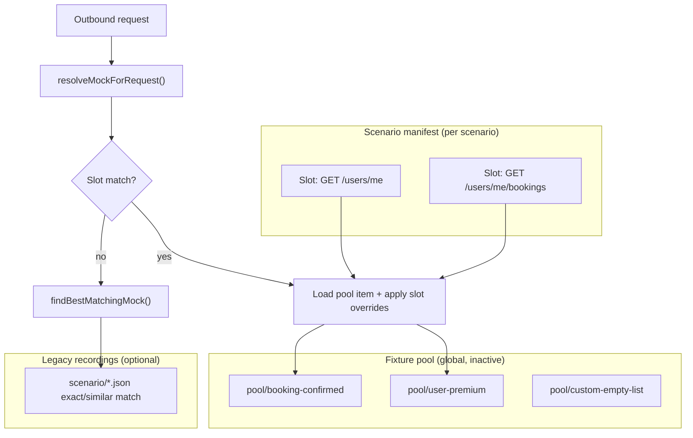

# Fixture pool and endpoint slot assignments (technical plan)

Technical specification for a **fixture pool** (inactive, reusable mock data) and **per-scenario endpoint slots** (explicit wiring from pool → endpoint). Supports hand-crafted fixtures, borrowed API recordings with parameter remapping, and scenario-specific composition without duplicating JSON files.

## Problem statement

Today Mockifyer stores mocks as **request-keyed recordings** under `mock-data/<scenario>/`. A file becomes active when an outbound request **matches** it (exact key, or similar path/method when configured). That model works for record/replay but breaks down when teams need to:

1. **Curate** which response serves an endpoint in a scenario — not “whatever file happens to match.”
2. **Reuse** the same booking/user/error payload across scenarios with different slot wiring.
3. **Borrow** data recorded in another context (e.g. serve `booking/8821` when the app requests bookings for `user/abc`).
4. **Keep fixtures inert** until explicitly assigned — pool items should not affect runtime behavior by merely existing on disk.

Related pain today:

- `alwaysUseRealApi` (passthrough) is per-file and binary; it does not express “in pool, assign later.”
- `similarMatch` implicitly picks the first path match; the user does not choose which variant.
- `responseFieldOverrides` patches one recording; it does not link entities across endpoints.
- Scenario import/export copies whole bundles; variant scenarios duplicate many identical JSON files.

## Goals

| # | Goal |
|---|------|
| G1 | **Fixture pool** at mock-data root: catalogued items inactive until referenced by a slot assignment. |
| G2 | **Endpoint slots** per scenario: method + path pattern (REST) or GraphQL operation + variable template. |
| G3 | **Assignment modes**: static (hand-written), pool reference, borrowed recording with optional param remap / field graft. |
| G4 | **Scenario composition**: change behavior by changing slot→pool mappings, not by copying files. |
| G5 | **Clear match precedence** so slot assignments are predictable vs legacy exact/similar match. |
| G6 | **Dashboard UX** to browse pool, assign to slots, preview “what would serve,” and diff scenarios by assignments only. |
| G7 | **Backward compatible**: existing scenario folders and matching continue to work; pool/slots are opt-in. |

## Non-goals (v1)

- Automatic discovery of entity relationships from OpenAPI/GraphQL schema (manual tags/links only).
- Live pool sync across repos / remote fixture registry.
- Replacing `generateRequestKey` or hash-based storage for legacy recordings.
- Full JSONPath templating engine (limited remap + existing `responseFieldOverrides` only).

## Current baseline

| Area | Behavior today | Relevant files |
|------|----------------|----------------|
| Storage layout | `mock-data/<scenario>/*.json` + `scenario-config.json`, `date-config.json`, `domain-path-rules.json` | [`scenario.ts`](../../packages/mockifyer-core/src/utils/scenario.ts), [`domain-path-rules-store.ts`](../../packages/mockifyer-dashboard/src/utils/domain-path-rules-store.ts) |
| Request matching | Exact `generateRequestKey` → similar path/method (REST only; GraphQL exact query+variables) | [`mock-matcher.ts`](../../packages/mockifyer-core/src/utils/mock-matcher.ts) |
| Passthrough | `alwaysUseRealApi` / `responsePending` — file kept, not served unless overrides force inclusion | [`mock-replay-mode.ts`](../../packages/mockifyer-core/src/utils/mock-replay-mode.ts) |
| Response shaping | `responseFieldOverrides`, `responseDateOverrides` at replay time | [`mock-response-prepare.ts`](../../packages/mockifyer-core/src/utils/mock-response-prepare.ts) |
| Proxy / Redis | Per-scenario mocks by hash; domain path rules per scenario | [`redis-mock-store.ts`](../../packages/mockifyer-dashboard/src/utils/redis-mock-store.ts), [`proxy.ts`](../../packages/mockifyer-dashboard/src/routes/proxy.ts) |
| Scenario bundles | Import/export all mocks + date/proxy config | [`SCENARIO_IMPORT_EXPORT.md`](../../packages/mockifyer-dashboard/SCENARIO_IMPORT_EXPORT.md) |

## Proposed mental model



**Fixture pool item** — reusable payload + metadata; never matched directly unless a slot points at it.

**Endpoint slot** — declarative rule: “when this request shape hits, serve this pool item (with optional remaps).”

**Scenario manifest** — list of slots + assignments for one scenario name.

## Data model

### 1. Pool index — `mock-data/pool/pool-index.json`

```json
{
  "formatVersion": 1,
  "updatedAt": "2026-06-08T12:00:00.000Z",
  "items": [
    {
      "id": "booking-confirmed-8821",
      "label": "Confirmed booking (recorded)",
      "entityType": "booking",
      "tags": ["confirmed", "happy-path"],
      "source": "recorded",
      "storageRef": "pool/items/booking-confirmed-8821.json",
      "createdAt": "2026-06-08T10:00:00.000Z",
      "updatedAt": "2026-06-08T10:00:00.000Z"
    }
  ]
}
```

| Field | Type | Required | Meaning |
|-------|------|----------|---------|
| `id` | string | yes | Stable slug (`[a-zA-Z0-9_-]+`). |
| `label` | string | yes | Human name in dashboard. |
| `entityType` | string | no | e.g. `user`, `booking`, `order` — for filtering and future correlation. |
| `tags` | string[] | no | Free-form labels. |
| `source` | enum | yes | `manual` \| `recorded` \| `recorded-remapped`. |
| `storageRef` | string | yes | Path relative to `mock-data/` for payload file. |

### 2. Pool payload — `mock-data/pool/items/<id>.json`

Same shape as today’s `MockData`, with pool-specific extensions:

```json
{
  "poolItemId": "booking-confirmed-8821",
  "request": {
    "url": "https://api.example.com/v1/bookings/8821",
    "method": "GET"
  },
  "response": {
    "status": 200,
    "data": { "id": "8821", "userId": "user-xyz", "status": "CONFIRMED" }
  },
  "timestamp": "2026-06-08T10:00:00.000Z",
  "sourceRecording": {
    "scenario": "default",
    "filename": "GET_api.example.com_v1_bookings_8821.json"
  }
}
```

Pool payloads are **never** scanned by `findBestMatchingMock` unless explicitly enabled via env `MOCKIFYER_POOL_LEGACY_MATCH=true` (debug only; default off).

Optional on pool item (same as `MockData`):

- `responseFieldOverrides`
- `responseDateOverrides`

### 3. Scenario manifest — `mock-data/<scenario>/scenario-manifest.json`

```json
{
  "formatVersion": 1,
  "scenario": "user-has-booking",
  "updatedAt": "2026-06-08T12:00:00.000Z",
  "slots": [
    {
      "id": "slot-users-me",
      "label": "Current user profile",
      "match": {
        "kind": "rest",
        "method": "GET",
        "pathPattern": "/users/me"
      },
      "assignment": {
        "kind": "pool",
        "poolItemId": "user-premium-001"
      },
      "slotOverrides": {
        "responseFieldOverrides": []
      },
      "enabled": true
    },
    {
      "id": "slot-user-bookings",
      "label": "User bookings list",
      "match": {
        "kind": "rest",
        "method": "GET",
        "pathPattern": "/users/*/bookings",
        "matchQuery": "ignore"
      },
      "assignment": {
        "kind": "pool",
        "poolItemId": "booking-confirmed-8821",
        "requestRemap": {
          "responseFieldOverridesFromRequest": [
            { "targetPath": "userId", "source": "query.userId" }
          ]
        }
      },
      "enabled": true
    },
    {
      "id": "slot-gql-orders",
      "label": "Orders query",
      "match": {
        "kind": "graphql",
        "operationName": "GetOrders",
        "variablesTemplate": {}
      },
      "assignment": {
        "kind": "inline",
        "response": { "status": 200, "data": { "orders": [] } }
      },
      "enabled": true
    }
  ]
}
```

#### Slot `match` kinds

**REST (`kind: "rest"`)**

| Field | Meaning |
|-------|---------|
| `method` | HTTP method (uppercase). |
| `pathPattern` | Path only (no host). Segments: literal or `*` single-segment wildcard. Example: `/users/*/bookings`. |
| `host` | Optional host filter; omit = any host. |
| `matchQuery` | `exact` (default) \| `ignore` \| `requiredParams: string[]` (subset must match). |

**GraphQL (`kind: "graphql"`)**

| Field | Meaning |
|-------|---------|
| `operationName` | Required when present in recordings. |
| `queryHash` | Optional; normalized query document hash for stricter match. |
| `variablesTemplate` | Object: keys must exist in request variables; values `*` = any. Empty `{}` = operation-only match (use sparingly). |

#### Slot `assignment` kinds

| `kind` | Behavior |
|--------|----------|
| `none` | Slot defined but unassigned — fall through to legacy matching. |
| `pool` | Load `poolItemId` from `pool/items/`. |
| `inline` | Serve `response` (and optional synthetic `request` for editor display only). |
| `proxy-fetch` | **Phase 3**: one-shot or refresh: call upstream with `fetchRequest` template, store result in pool optional. |

#### Slot-level overrides (applied at serve time, not persisted into pool file)

- `responseFieldOverrides` — same semantics as [`MockResponseFieldOverride`](../../packages/mockifyer-core/src/types.ts).
- `responseDateOverrides` — same as today.
- `requestRemap.responseFieldOverridesFromRequest` — v1 limited map: copy query/body field into response path (booking `userId` example).

### 4. Redis storage (centralized dashboard)

Mirror filesystem layout with dedicated keys:

| Key | Content |
|-----|---------|
| `{prefix}:pool:index` | `pool-index.json` body |
| `{prefix}:pool:item:{id}` | Pool payload JSON |
| `{prefix}:scenario:{name}:manifest` | `scenario-manifest.json` body |

Legacy mock hashes unchanged: `{prefix}:scenario:{name}:mock:{hash}`.

## Runtime: match resolution

New function in **mockifyer-core**:

```ts
resolveMockForRequest(
  request: StoredRequest,
  context: {
    scenario: string;
    mockDataPath: string;
    manifest?: ScenarioManifest;
    poolIndex?: PoolIndex;
  },
  legacyConfig: MockMatchingConfig
): ResolvedMock | undefined
```

### Precedence (highest first)

| Order | Source | Notes |
|-------|--------|-------|
| 1 | **Enabled slot** in `scenario-manifest.json` | First slot whose `match` fits request (stable slot order in file). |
| 2 | **Exact** `generateRequestKey` in scenario folder | Current behavior. |
| 3 | **Similar match** (REST only) | Current `useSimilarMatch` config. |
| 4 | Miss | Record / passthrough / fail per existing config. |

Slot resolution **wins** over an exact legacy file for the same request when both exist — assignments are intentional. Log at debug: `Mockifyer slot hit: slot-users-me → pool:booking-confirmed-8821`.

### Serving pipeline (slot hit)

1. Load pool payload (or inline assignment).
2. Merge `slotOverrides.responseFieldOverrides` + pool item overrides.
3. Apply `requestRemap` (v1: query/body → response field copy).
4. Run existing `prepareMockResponse()` (dates, status, headers).
5. Return synthetic `CachedMockData` with `filename: pool:<id>` / `filePath: slot:<slotId>` for dashboard traceability.

### GraphQL rules

- Slots use the same normalization as `generateRequestKey` (`normalizeGraphQLQuery`).
- No similar-match fallback for GraphQL slots — slot must match operation + variable template or fall through to legacy exact match.

## Dashboard API (new routes)

Base path: `/api/fixture-pool` and `/api/scenario-slots`.

### Pool

| Method | Path | Purpose |
|--------|------|---------|
| `GET` | `/api/fixture-pool` | List pool index + summary (tags, used-in-scenarios count). |
| `GET` | `/api/fixture-pool/:id` | Full pool item payload. |
| `POST` | `/api/fixture-pool` | Create manual item or import from scenario recording (`sourceScenario`, `filename`). |
| `PUT` | `/api/fixture-pool/:id` | Update label, tags, payload, overrides. |
| `DELETE` | `/api/fixture-pool/:id` | Delete if not referenced (or `force=true`). |
| `POST` | `/api/fixture-pool/:id/fetch` | **Phase 3**: proxy live fetch with param editor → update pool item. |

### Scenario slots

| Method | Path | Purpose |
|--------|------|---------|
| `GET` | `/api/scenario-slots?scenario=` | Load manifest for scenario. |
| `PUT` | `/api/scenario-slots` | Replace or upsert manifest (validate slot ids, pool refs). |
| `POST` | `/api/scenario-slots/preview` | Body: `{ scenario, request }` → which slot/pool would serve (no side effects). |
| `GET` | `/api/scenario-slots/diff?a=&b=` | Assignment diff only (ignore identical pool refs). |

### Scenario bundle extension (format v2)

Extend export/import per [`SCENARIO_IMPORT_EXPORT.md`](../../packages/mockifyer-dashboard/SCENARIO_IMPORT_EXPORT.md):

| New bundle field | Meaning |
|------------------|---------|
| `formatVersion` | `2` when manifest included. |
| `scenarioManifest` | Full manifest for exported scenario. |
| `poolItems` | Optional embedded pool items referenced by manifest (for portable bundles). |

Import options:

- `applyPoolItems` (default `true` when bundle includes them).
- `replaceManifest` (default `true` on replace import).

## Dashboard UI (phased)

### Phase 1 — Pool browser

- New nav section **Fixture pool** (table: label, entityType, tags, source, “Used in N scenarios”).
- Actions: Create manual (JSON editor), **Add to pool** from existing mock list, edit, delete.
- Pool items show **inactive** badge (never auto-match).

### Phase 2 — Endpoint slots per scenario

- In scenario context: **Endpoint slots** tab (alongside mock file tree).
- Auto-suggest slots from Recordings tree (group by method + path pattern).
- Per slot: enable toggle, assignment picker (pool / inline / none), override editor.
- **Preview**: paste sample request or pick from network trace → show resolved response source.

### Phase 3 — Borrow / fetch

- “Record into pool” wizard: pick endpoint, edit params, fetch via dashboard proxy, save as pool item.
- Request remap UI for `responseFieldOverridesFromRequest`.

### Phase 4 — Scenario templates

- Duplicate scenario copying **manifest only** (same pool refs).
- Diff view: `checkout-happy` vs `checkout-empty` highlights slot assignment changes.

## Core / client integration

| Package | Change |
|---------|--------|
| `mockifyer-core` | Types (`PoolIndex`, `ScenarioManifest`, `EndpointSlot`), loaders, `resolveMockForRequest`, path pattern matcher, manifest validation. |
| `mockifyer-axios` / `mockifyer-fetch` | Call `resolveMockForRequest` before `findBestMatchingMock`; reload when `reloadMockData()` (manifest + pool cache). |
| `mockifyer-dashboard` | Routes, Redis store methods, UI components, bundle v2. |
| Providers | Filesystem: read `pool/` and `scenario-manifest.json`. Redis: new keys. SQLite: optional tables `pool_items`, `scenario_slots` (or JSON blobs). |

### Caching

- In-memory cache keyed by `(scenario, manifest.updatedAt, poolIndex.updatedAt)`.
- `reloadMockData()` invalidates slot/pool cache (same as mock file reload today).

### Env flags

| Variable | Default | Purpose |
|----------|---------|---------|
| `MOCKIFYER_USE_ENDPOINT_SLOTS` | `true` when manifest exists | Master switch for slot resolution. |
| `MOCKIFYER_POOL_LEGACY_MATCH` | `false` | Allow pool files in legacy similar match (debug). |

## Correlation / cross-endpoint IDs (Phase 3+)

Optional slot field `links`:

```json
{
  "links": {
    "response.data.userId": { "fromSlot": "slot-users-me", "path": "response.data.id" }
  }
}
```

At serve time, resolve linked slot’s **last served** or **static pool** value. Enables booking↔user consistency without hand-editing every payload. Requires per-session slot serve cache in proxy/RN — document as advanced.

## Migration and compatibility

1. **No manifest** → 100% current behavior.
2. **Promote recording to pool**: dashboard copies `scenario/foo.json` → `pool/items/<id>.json`, adds index entry; original file can stay or be marked passthrough.
3. **Promote recording to slot**: create slot with `match` derived from recording URL/method; assignment `pool` or `inline` from recording response.
4. Existing `alwaysUseRealApi` recordings remain passthrough; unrelated to pool unless user assigns them via import-to-pool flow.

## Validation rules

- Pool `id` unique; `storageRef` must live under `pool/items/`.
- Manifest `slot.id` unique per scenario.
- `assignment.poolItemId` must exist in pool index.
- Deleting pool item blocked when any scenario manifest references it (return referencing scenarios in error).
- `pathPattern` must start with `/`; no `**` in v1.
- GraphQL slots must specify `operationName` or `queryHash`.

## Phased implementation

### Phase 1 — Pool + inactive storage (MVP)

**Deliverables**

- [ ] Types + validators in `mockifyer-core`
- [ ] Filesystem pool index + items CRUD in dashboard API
- [ ] Pool browser UI (list, create manual, import from mock)
- [ ] Tests: pool CRUD, validation, delete guard

**Out of scope**: runtime slot matching.

### Phase 2 — Scenario manifest + runtime resolution

**Deliverables**

- [ ] `scenario-manifest.json` CRUD API
- [ ] `resolveMockForRequest` + REST path pattern matcher
- [ ] Wire into axios/fetch + dashboard proxy mock lookup
- [ ] Endpoint slots UI (assign pool, inline, enable/disable)
- [ ] Preview API + minimal UI
- [ ] Tests: precedence, slot vs exact, GraphQL slot match, overrides at serve time

### Phase 3 — Borrow, remap, bundle v2

**Deliverables**

- [ ] `POST /fixture-pool/:id/fetch` (proxy upstream with edited params)
- [ ] `requestRemap.responseFieldOverridesFromRequest`
- [ ] Scenario export/import v2 with manifest + referenced pool items
- [ ] Scenario duplicate (manifest-only copy)

### Phase 4 — Correlation links + templates

**Deliverables**

- [ ] Slot `links` resolution
- [ ] Scenario diff UI
- [ ] MCP tools: `mockifyer_list_pool`, `mockifyer_list_slots`, `mockifyer_preview_slot`

## Test plan

| Area | Tests |
|------|-------|
| Path patterns | `/users/*/bookings` matches `/users/abc/bookings`, not `/users/abc/bookings/1` |
| Precedence | Slot enabled beats exact legacy file for same URL |
| Pool inert | Pool item on disk with no slot → no match |
| Overrides | Slot + pool overrides merge; dates still applied |
| GraphQL | Variable template `{"userId":"*"}` matches any userId |
| Import guard | Cannot delete pool item referenced by two scenarios |
| Redis | Pool index + manifest round-trip |
| Bundle v2 | Export scenario with 2 pool refs → import on empty repo reproduces behavior |

## Open questions

1. **Host in REST slots**: Match host from URL always, or ignore host by default (path-only)? Recommendation: optional `host` field; default ignore for multi-env URLs.
2. **Multiple slots matching**: First in manifest order vs most specific pattern? Recommendation: v1 fixed order; v2 “longest pathPattern wins.”
3. **Slot + similar match interaction**: When slot `assignment.kind: none`, fall through immediately vs try legacy? Recommendation: fall through to steps 2–4.
4. **RN / Expo**: Pool + manifest synced via existing Metro/hybrid provider? Recommendation: Phase 2 includes Expo filesystem provider reading manifest from scenario folder.
5. **Passthrough pool items**: Should pool items support `alwaysUseRealApi`? Recommendation: no — pool is never auto-served; passthrough remains legacy recording concept only.

## Success criteria

- Team can define `user-has-booking` vs `user-empty` scenarios by changing **only** slot assignments, sharing one pool.
- Adding a new pool item does **not** change any scenario until assigned.
- Booking recorded for user X can serve requests for user Y with documented remap overrides.
- Existing projects without manifest behave identically to today.

## References

- [`packages/mockifyer-core/src/utils/mock-matcher.ts`](../../packages/mockifyer-core/src/utils/mock-matcher.ts) — `generateRequestKey`, `findBestMatchingMock`
- [`packages/mockifyer-core/src/utils/mock-response-field-overrides.ts`](../../packages/mockifyer-core/src/utils/mock-response-field-overrides.ts)
- [`packages/mockifyer-dashboard/src/utils/domain-path-rules-store.ts`](../../packages/mockifyer-dashboard/src/utils/domain-path-rules-store.ts) — per-scenario path rules (orthogonal; slots are response selection, domain rules are record policy)
- [`packages/mockifyer-dashboard/SCENARIO_IMPORT_EXPORT.md`](../../packages/mockifyer-dashboard/SCENARIO_IMPORT_EXPORT.md)
