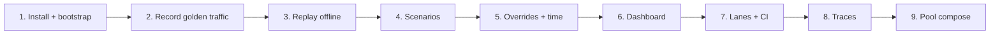
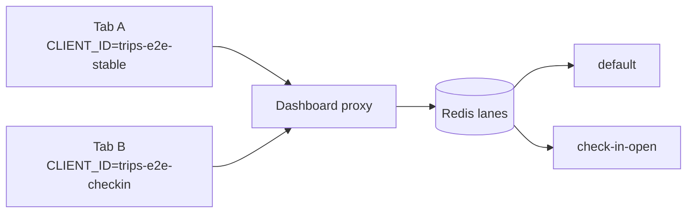
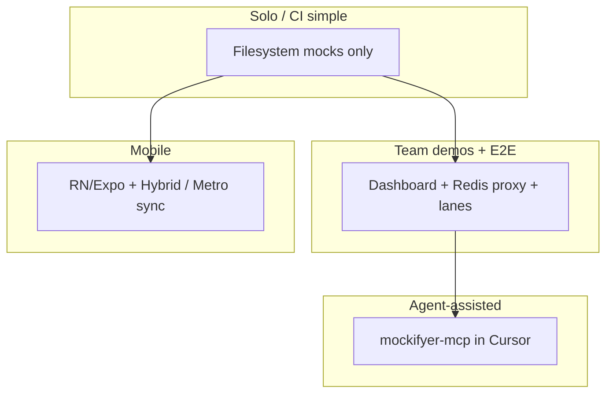

# Mockifyer in Your Project — Adoption Showcase

Slide-style walkthrough from the standpoint of **an existing app** (the Ultimate Trips Showcase as the concrete example). Goal: show every practical step to get Mockifyer running, then how to use its capabilities effectively — scenarios, overrides, traces, lanes, pool composition — and what each setup achieves for demos, QA, and CI.

**How to read:** each `---` starts a new page/slide. Prefer the journeys and “what you get” tables over architecture trivia.

**Companion decks:**

| Doc | Role |
|---|---|
| [`trips-showcase-adoption-presentation.md`](./trips-showcase-adoption-presentation.md) | **This file** — adopt & use Mockifyer in *your* project |
| [`trips-showcase-presentation.md`](./trips-showcase-presentation.md) | Technical deep dive (`$pool`, curls, architecture) |
| [`trips-showcase-demo.md`](./trips-showcase-demo.md) | Live prospect staging (Acts 1–4) |
| [`trips-showcase.md`](./trips-showcase.md) | Build plan for the example app |
| [`mockifyer-why-awesome.md`](./mockifyer-why-awesome.md) | Positioning one-liners |

**Ships as:** `example-projects/trips-showcase/docs/ADOPTION.md` (optional Marp/Slidev export later).

---

# 01 · You already have a project

Imagine you ship a **trips app** today:

- Login, My Trips list, trip detail, check-in CTA
- A BFF (or gateway) that fans out to auth / trips / bookings / catalog
- Real backends that are slow, flaky, shared, or unavailable for demos and CI

**Question this deck answers:**

> How do I wire Mockifyer into *this* project, and which capabilities do I turn on so demos, QA, and automation all share one fixture library?

```text
YOUR TRIPS APP (unchanged product code)
        │
        ▼
   Mockifyer intercepts HTTP (fetch / axios)
        │
        ├── record real responses once
        ├── replay curated product states (scenarios)
        ├── bend fields & time (overrides)
        ├── isolate each tester / E2E run (lanes)
        └── explain multi-hop failures (traces)
```

---

# 02 · What “done” looks like for your app

| Role | Without Mockifyer | With Mockifyer in the trips app |
|---|---|---|
| **Demo** | Needs staging up; check-in window is luck | Flip scenario / clock → NYC check-in CTA on demand |
| **QA** | Shared mock mode stomps parallel runs | Each browser / client id sees its own world |
| **CI** | Flaky live APIs or hand-written stubs | Same JSON goldens as demos; Playwright lanes |
| **Engineer** | Guess which hop failed | Network trace stitches BFF → services |
| **Agent / MCP** | Edit giant JSON by hand | Promote → `$pool` → overrides → bind lane |

Keep product code; add one bootstrap call per process that issues HTTP.

---

# 03 · Journey map (use this as the agenda)



| Step | Capability unlocked | Trips payoff |
|---|---|---|
| 1–3 | Record / replay | App runs without backends |
| 4 | Scenarios | `check-in-open`, `empty-trips`, `booking-error` |
| 5 | Field / date overrides | Open check-in without re-recording |
| 6 | Dashboard | Browse, edit, lock goldens |
| 7 | Redis client lanes | Parallel E2E / demo tabs |
| 8 | Network traces | “Which service caused this?” |
| 9 | Fixture pool + `$pool` | One list → many states, no blob copies |

You can stop after step 3 and already win. Steps 4–9 compound the value.

---

# 04 · Step 1 — Install into the trips app

Pick the client your process uses:

```bash
# Node / Vite BFF or services using fetch
npm install @sgedda/mockifyer-core @sgedda/mockifyer-fetch

# Or axios services
npm install @sgedda/mockifyer-core @sgedda/mockifyer-axios

# Optional: local dashboard UI
npm install --save-dev @sgedda/mockifyer-dashboard
```

```bash
# Optional: AI assistant docs into *your* repo
npx mockifyer-init-ai
```

Minimal env for a service process:

```bash
export MOCKIFYER_PATH=./mock-data
export MOCKIFYER_SCENARIO=default
export MOCKIFYER_RECORD=false   # true only while capturing
```

---

# 05 · Step 1b — Bootstrap once per outbound HTTP process

**Simplest setup (filesystem only)** — clone → run tests / local demo:

```ts
import { initMockifyerForLocalFilesystem } from '@sgedda/mockifyer-fetch';

initMockifyerForLocalFilesystem({
  mockDataPath: process.env.MOCKIFYER_PATH ?? './mock-data',
  useGlobalFetch: true,
  recordMode: process.env.MOCKIFYER_RECORD === 'true',
});
```

**Team / demo setup (dashboard + Redis proxy)** — lanes, shared store, Network UI:

```ts
import { initMockifyerForDashboardProxy } from '@sgedda/mockifyer-fetch';

await initMockifyerForDashboardProxy({
  dashboardBaseUrl: process.env.MOCKIFYER_PROXY_URL ?? 'http://127.0.0.1:3002',
  mockDataPath: process.env.MOCKIFYER_PATH ?? './mock-data',
  clientId: process.env.MOCKIFYER_CLIENT_ID, // e.g. trips-web-demo
  scenario: 'default',
  recordOnMiss: true,
});
```

Call this **before** the first `fetch` / `axios` in:

- the Vite web server / BFF entry
- each Express service (auth, trips, bookings, catalog)
- Playwright workers (via env + same bootstrap if they hit APIs directly)

Frontend that only talks to the BFF does not need its own Mockifyer if the BFF is already intercepted.

---

# 06 · Step 2 — Record once from real APIs

```bash
# Start dashboard (optional but recommended for curation)
npx mockifyer-dashboard --provider redis --mock-data ./mock-data

# Run trips stack with recording on
export MOCKIFYER_RECORD=true
# … start bff + services + web …

# Exercise the happy path once as Alice:
# login → My Trips → open NYC detail → (optional) home merge
```

What lands on disk:

```text
mock-data/
  default/
    …GET_api_trips….json
    …GET_api_home….json
    …GET_bookings….json
    …
```

Each file is a **real** request/response envelope — not a hand-written handler.

**Team tip:** treat `default` (or `recorded-*`) as raw capture; promote curated states into named scenarios later ([`MOCK_WORKFLOW.md`](../../MOCK_WORKFLOW.md)).

---

# 07 · Step 3 — Replay: your app without backends

```bash
export MOCKIFYER_RECORD=false
# same stack — outbound HTTP matches mock-data/default
```

```text
Browser → BFF /api/home
            │
            ├─ Mock hit: auth /me
            ├─ Mock hit: trips list
            ├─ Mock hit: bookings
            └─ Mock hit: catalog
         ← merged UI (check-in rules still run in app code)
```

**What you achieve:**

- Offline / airplane demos
- Onboarding without staging credentials
- Stable payloads for screenshots and sales

Product logic (e.g. “check-in if departure ≤ 10h”) still runs in **your** BFF/UI — Mockifyer only supplies the API world.

---

# 08 · Step 4 — Scenarios = whole product worlds

Scenarios are folders under `mock-data/`, not scattered flags in app code.

| Scenario | Intent in the trips app | How you create it |
|---|---|---|
| `default` / `qa-stable` | Full Alice list, CTA off | Recorded golden |
| `check-in-open` | NYC in check-in window | Derive + overlays |
| `empty-trips` | Empty My Trips | Derive + empty body / select |
| `booking-error` | Bookings hop 503 | Derive + error mock on bookings only |
| `trip-cancelled` | Lisbon cancelled emphasis | Derive + select / field override |

```bash
# Dashboard / MCP
# create from default (copies mock keys, then you retarget)
mockifyer_create_scenario({ scenario: "check-in-open", deriveFrom: "default" })
mockifyer_set_scenario({ scenario: "check-in-open" })  # global switch
```

```bash
# Or env for a single process
export MOCKIFYER_SCENARIO=check-in-open
```

**Say this out loud in demos:** *We didn’t redeploy a mock server — we switched the world.*

---

# 09 · Step 5 — Overrides: bend data without re-recording

After you have a good recording, change **what the app sees** with path overlays:

**Field overrides** (status, flags, nested values):

```json
{
  "responseFieldOverrides": [
    { "path": "trips.0.status", "value": "CONFIRMED" }
  ]
}
```

**Date overrides** (align calendars with product rules):

```json
{
  "responseDateOverrides": [
    { "path": "trips.0.departureAt", "offsetHours": 10 }
  ]
}
```

```ts
// App / BFF — always use Mockifyer time, not new Date()
import { getCurrentDate } from '@sgedda/mockifyer-fetch';

function canCheckIn(trip: { status: string; departureAt: string }): boolean {
  const hoursLeft =
    (Date.parse(trip.departureAt) - getCurrentDate().getTime()) / 3_600_000;
  return trip.status === 'CONFIRMED' && hoursLeft <= 10;
}
```

```text
MCP:
  mockifyer_set_field_overrides({ filename, overrides: [...] })
  mockifyer_get_mock_ai_context({ filename, mode: "profile" })
```

**What you achieve:** open check-in, empty carts, expired sessions, and edge statuses **without** another trip through staging.

---

# 10 · Step 6 — Dashboard: ops for mock data

Run the UI next to your trips stack:

```bash
npx mockifyer-dashboard --provider redis --mock-data ./mock-data
# → http://localhost:3002
```

Use it to:

| Action | Why it matters for trips |
|---|---|
| Browse / search mocks | Find `GET /api/trips` fast |
| Edit response JSON | Fix a typo without re-record |
| Toggle “Always use live API” | Keep recording fresh until you lock replay |
| Scenario switch + date config | Stage Act 1 (check-in CTA) live |
| Client lanes UI | Bind Playwright ids without restarting |
| Network log + Bodies | Feed traces (next section) |
| Scenario locks | Protect goldens from accidental overwrite |

Filesystem mode works without Redis; **lanes + shared proxy** need `--provider redis` (or sqlite where supported).

---

# 11 · Step 7 — Client lanes: two browsers, two worlds



```bash
export MOCKIFYER_CLIENT_ID=trips-e2e-checkin
# requests carry X-Mockifyer-Client-Id

curl -s -X PUT \
  http://localhost:3002/api/client-lanes/trips-e2e-checkin/scenario \
  -H 'Content-Type: application/json' \
  -d '{ "scenario": "check-in-open" }'
```

```text
MCP: mockifyer_set_client_lane_scenario({ clientId, scenario })
     mockifyer_list_client_lanes()
```

**Playwright sketch:**

```ts
projects: [
  { name: 'checkin', use: { extraHTTPHeaders: { 'X-Mockifyer-Client-Id': 'trips-e2e-checkin' } } },
  { name: 'empty',   use: { extraHTTPHeaders: { 'X-Mockifyer-Client-Id': 'trips-e2e-empty' } } },
  { name: 'stable',  use: { extraHTTPHeaders: { 'X-Mockifyer-Client-Id': 'trips-e2e-stable' } } },
]
```

| Project | Lane → scenario | Expect in UI |
|---|---|---|
| `checkin` | `trips-e2e-checkin` → `check-in-open` | Check-in CTA |
| `empty` | `trips-e2e-empty` → `empty-trips` | Empty state |
| `stable` | `trips-e2e-stable` → `default` | Full list, no CTA |

**What you achieve:** parallel demos and CI without fighting over one global mock mode.

---

# 12 · Step 8 — Traces: which hop broke the home screen?

Home in the trips showcase:

```text
Browser → BFF GET /api/home
            → auth /me
            → trips list
            → bookings
            → catalog
```

Each hop shares `X-Mockifyer-Request-Id`. After one call:

```bash
curl -s "http://localhost:3002/api/network-events/trace?requestId=req_abc" \
  | jq '.hops[] | {service, method, path, status, durationMs}'
```

```text
MCP:
  mockifyer_list_network_events({ limit: 50 })
  mockifyer_get_network_trace({ requestId: "req_abc" })
```

**Chaos beat:** switch lane/scenario to `booking-error` → bookings returns 503; BFF degrades; trace shows the failing hop in one glance.

**What you achieve:** multi-service “who caused this?” without attaching three debuggers.

---

# 13 · Step 9 — Fixture pool: one list, many states

When scenario folders start **copying** the same trips JSON, promote once:

```text
1. mockifyer_promote_response → trips-list-alice
2. mockifyer_create_scenario(check-in-open, deriveFrom: default)
3. mockifyer_preview_pool_ref  → NYC-only document
4. mockifyer_set_pool_ref      → embed $pool in scenario mock
5. date/field overlays         → open check-in window
6. mockifyer_set_client_lane_scenario → trips-e2e-checkin
```

Scenario body becomes a **ref**, not a clone:

```json
{
  "$pool": {
    "id": "trips-list-alice",
    "mode": "document",
    "path": "trips",
    "select": { "field": "id", "values": ["trip-nyc-checkin"] }
  }
}
```

| Metric | Target line |
|---|---|
| Promoted list fixtures | **1** (`trips-list-alice`) |
| Product-state scenarios | **4+** |
| Duplicated trip blobs | **0** |

Git diffs show refs + overlays — not megabytes of repeated JSON. Deep dive: [`trips-showcase-presentation.md`](./trips-showcase-presentation.md).

---

# 14 · Capability cheat sheet (trips nouns → yours)

| Capability | Trips example | Replace with your domain |
|---|---|---|
| Record / replay | Capture `/api/trips` | Your primary list/detail APIs |
| Scenario | `check-in-open` | `checkout-open`, `paywall`, `empty-cart` |
| Field override | `trips.0.status` | `orders.0.state` |
| Date override | `departureAt` +10h | `expiresAt`, booking window |
| `getCurrentDate()` | Check-in rule | Any UI clock vs API timestamps |
| Client lane | `trips-e2e-checkin` | `orders-e2e-paywall` |
| Trace | Home fan-out | Checkout / search aggregate |
| `$pool` select | NYC trip only | One SKU / one subscription tier |
| MCP | Compose state in chat | Same tools, your filenames |

---

# 15 · Setup flavors — pick by team stage



| Setup | When to use | What you get |
|---|---|---|
| **Filesystem** | Local, PR CI, “clone and go” | Record/replay, scenarios, overrides, git review |
| **Dashboard + Redis** | Shared demos, parallel QA, Network UI | Lanes, proxy miss/record, traces, locks |
| **React Native** | Simulator/device same goldens | Hybrid provider, Metro sync ([`REACT_NATIVE.md`](../../REACT_NATIVE.md)) |
| **+ MCP** | Agents compose states | Promote, `$pool`, overrides, lanes, traces via tools |

Start at filesystem; add Redis when two people need different worlds at once.

---

# 16 · End-to-end recipe (copy into PROMPTS.md)

Chat / agent prompt that should work against a seeded trips stack:

> Bootstrap is already in the services. Create scenario `check-in-open` from `default`, set `$pool` on the trips list to document-select `trip-nyc-checkin` from `trips-list-alice`, apply a ~10h departure overlay, bind lane `trips-e2e-checkin` to that scenario, then tell me how to verify the check-in CTA in the app and how to pull a network trace of `GET /api/home`.

Manual checklist if you prefer curls / UI:

```text
[ ] initMockifyerForLocalFilesystem or …DashboardProxy in each HTTP process
[ ] MOCKIFYER_PATH shared; RECORD=true once for default
[ ] RECORD=false; confirm My Trips replays
[ ] Derive check-in-open / empty-trips / booking-error
[ ] Field + date overrides; getCurrentDate() in check-in rule
[ ] Dashboard open; scenario switch works live
[ ] Redis lanes for Playwright projects
[ ] Network log on; trace one home request
[ ] Promote trips-list-alice; replace copies with $pool
[ ] restore-demo.sh resets seed for the next visitor
```

---

# 17 · Before / after for eng leads

| Pain today | After Mockifyer in the trips app |
|---|---|
| Hand-written stubs drift from prod | Recorded envelopes stay honest |
| Scenario = duplicate JSON trees | `$pool` + overlays |
| Check-in demo needs clock luck | Date override + `getCurrentDate()` |
| Parallel E2E fights | Client lanes |
| “BFF looks wrong” mystery | Multi-hop network trace |
| Agents can’t safely edit fixtures | MCP promote / preview / set / lane tools |

One-liner to leave on screen:

> **Wire once. Record once. Compose product states. Isolate every client. Trace every hop.**

---

# 18 · Closing — map back to *your* repo tonight

```text
1. npm i @sgedda/mockifyer-fetch (or axios) + core
2. Bootstrap in the process that calls APIs
3. Record default happy path for your “home” screen
4. Derive 2–3 scenarios your demos actually need
5. Add getCurrentDate() anywhere UI compares to API times
6. When two people collide, add Redis lanes
7. When JSON duplicates hurt, promote + $pool
8. When multi-service fails, turn on traces
```

| Next | Link |
|---|---|
| Technical slides (`$pool`, architecture) | [`trips-showcase-presentation.md`](./trips-showcase-presentation.md) |
| Live Acts 1–4 | [`trips-showcase-demo.md`](./trips-showcase-demo.md) |
| Build the example | [`trips-showcase.md`](./trips-showcase.md) |
| Init reference | [`MOCKIFYER_INITIALIZATION.md`](../../MOCKIFYER_INITIALIZATION.md) |
| Record vs curate | [`MOCK_WORKFLOW.md`](../../MOCK_WORKFLOW.md) |
| Positioning | [`mockifyer-why-awesome.md`](./mockifyer-why-awesome.md) |
