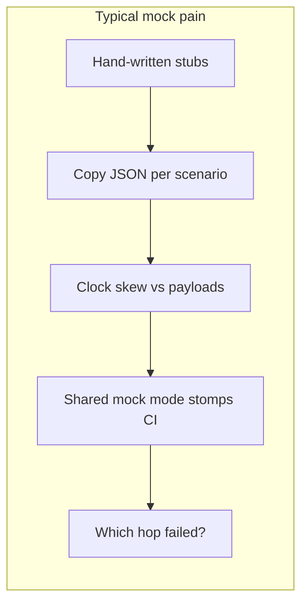
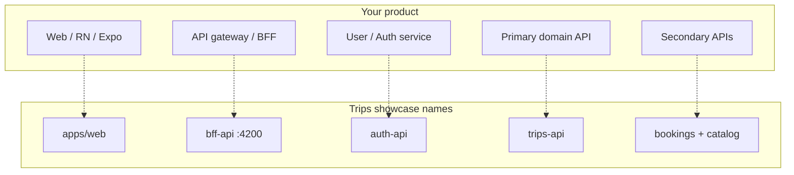
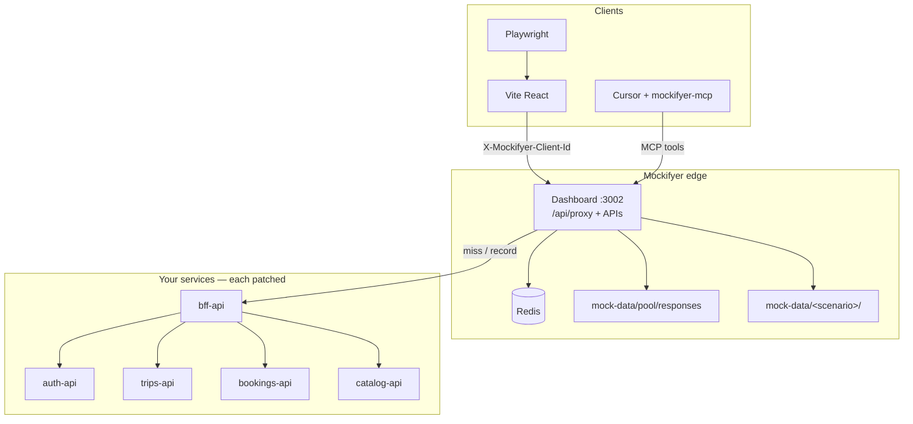
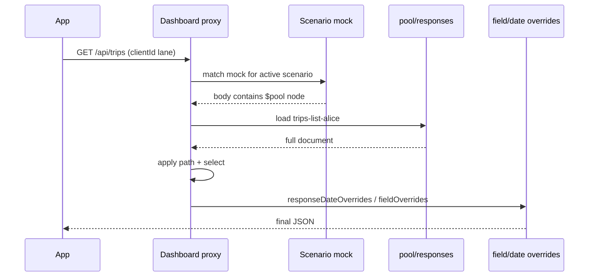
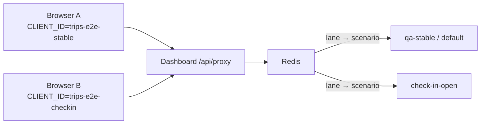
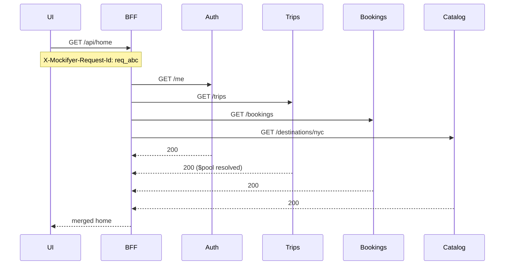
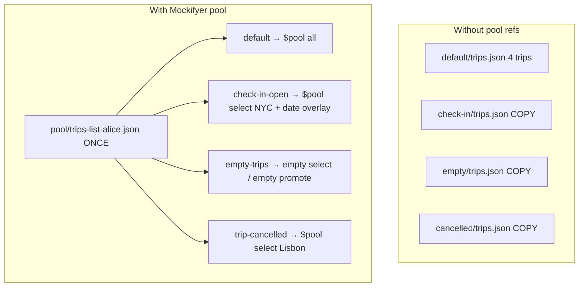

# Trips Showcase — Technical Presentation

Slide-style walkthrough for **developers**: how Mockifyer fits *their* apps and services, using the Ultimate Trips Showcase as the concrete example.

**How to read:** each `---` starts a new page/slide. Graphs + JSON + curl are the source of truth; prose is minimal.

**Positioning copy:** [`mockifyer-why-awesome.md`](./mockifyer-why-awesome.md)  
**Ships as:** `example-projects/trips-showcase/docs/PRESENTATION.md` (optional Marp/Slidev export later).

## Document set (read together)

| Doc | Role |
|---|---|
| [`trips-showcase.md`](./trips-showcase.md) | **Build plan** — app, services, `$pool`, lanes, MCP, tests, seed/restore |
| [`trips-showcase-demo.md`](./trips-showcase-demo.md) | **Live demo staging** — Acts 1–4, wow SLAs, audience cuts |
| [`trips-showcase-presentation.md`](./trips-showcase-presentation.md) | **Technical slides** — graphs, sample payloads, curl/MCP, map to your stack |

**This file** is the technical-slides row above.

---

# 01 · One slide, one idea

**Record real APIs once → promote into a shared pool → compose product states with `$pool` + overlays → isolate each E2E client with a lane — same data in demos and CI.**

```text
YOUR APP  ──fetch──►  Mockifyer proxy  ──resolve──►  pool fixture + scenario overlays
   │                        │
   │                        ├── Redis lanes (per MOCKIFYER_CLIENT_ID)
   │                        └── Network trace (multi-hop)
   └── Playwright / agent (MCP) flips scenarios without redeploy
```

Map: **your BFF** ≈ trips `bff-api`; **your domain services** ≈ auth / trips / bookings / catalog.

---

# 02 · The pain this solves



| Pain | Trips showcase answer |
|---|---|
| Fake handlers drift from prod | Record / seed **real envelopes** |
| Scenario = duplicate blobs | **One** `trips-list-alice` + `$pool` select |
| “Open check-in” needs code change | Date overlay + `getCurrentDate()` |
| Parallel E2E fights | Redis **client lanes** |
| Multi-service mystery | Correlation id → **network trace** |

---

# 03 · Map the showcase onto *your* stack



**Integration surface is small:** each Node process that issues HTTP calls `setupMockifyer` / `initMockifyerForDashboardProxy` once. The UI only talks to the BFF (or your gateway).

---

# 04 · Runtime architecture



**Home chain (trace demo):** Browser → `GET /api/home` (BFF) → auth + trips + bookings + catalog → merged UI.

---

# 05 · Bootstrap (pseudo → real shape)

Every service shares the same lane root:

```ts
// packages/mock-bootstrap — same idea in multi-service-example
await initMockifyerForDashboardProxy({
  dashboardBaseUrl: process.env.MOCKIFYER_PROXY_URL ?? 'http://127.0.0.1:3002',
  mockDataPath: process.env.MOCKIFYER_PATH ?? './mock-data',
  useGlobalFetch: true,
  clientId: process.env.MOCKIFYER_CLIENT_ID, // e.g. trips-web-demo
  config: { recordMode: process.env.MOCKIFYER_RECORD === 'true' },
});
```

```bash
# typical env for a service process
export MOCKIFYER_RUNTIME=proxy
export MOCKIFYER_PATH=./mock-data
export MOCKIFYER_CLIENT_ID=trips-web-demo
export MOCKIFYER_PROXY_URL=http://127.0.0.1:3002
export MOCKIFYER_RECORD=false
```

Frontend (browser) points fetch at the **dashboard proxy** (or BFF that already goes through Mockifyer on the server). Stable `clientId` header for lane isolation.

---

# 06 · Canonical pool fixture (example response)

Promoted once as `trips-list-alice` — **the** shared trips list envelope:

```json
{
  "userId": "alice",
  "meta": { "currency": "EUR", "locale": "en-GB" },
  "trips": [
    {
      "id": "trip-rome-spring",
      "destination": "Rome",
      "status": "CONFIRMED",
      "departureAt": "2026-09-12T08:40:00.000Z"
    },
    {
      "id": "trip-nyc-checkin",
      "destination": "New York",
      "status": "CONFIRMED",
      "departureAt": "2026-07-24T22:00:00.000Z"
    },
    {
      "id": "trip-tokyo-past",
      "destination": "Tokyo",
      "status": "COMPLETED",
      "departureAt": "2026-03-01T11:00:00.000Z"
    },
    {
      "id": "trip-lisbon-cancelled",
      "destination": "Lisbon",
      "status": "CANCELLED",
      "departureAt": "2026-08-02T06:15:00.000Z"
    }
  ]
}
```

**DRY claim:** 1 promoted file → many scenarios. Scenarios do **not** copy this JSON.

---

# 07 · Promote into the pool (curl)

```bash
# Promote an existing scenario recording into the fixture pool
curl -s -X POST http://localhost:3002/api/fixture-pool/responses/promote \
  -H 'Content-Type: application/json' \
  -d '{
    "scenario": "default",
    "filename": "GET_api_trips_alice.json",
    "id": "trips-list-alice"
  }'
```

```text
MCP equivalent:
  mockifyer_promote_response({
    scenario: "default",
    filename: "GET_api_trips_alice.json",
    id: "trips-list-alice"
  })
```

On disk (conceptually):

```text
mock-data/
  pool/responses/trips-list-alice.json   ← canonical
  default/…                              ← may now $pool-ref the same id
  check-in-open/…                        ← $pool + overlays only
```

---

# 08 · Scenario mock = `$pool` node (not a copy)

`check-in-open` trips mock `response.data` (simplified):

```json
{
  "$pool": {
    "id": "trips-list-alice",
    "mode": "document",
    "path": "trips",
    "select": {
      "field": "id",
      "values": ["trip-nyc-checkin"]
    }
  }
}
```

| Field | Meaning |
|---|---|
| `mode: document` | Keep full envelope (`userId`, `meta`, …); filter only at `path` |
| `path: trips` | Array to filter |
| `select` | Keep items whose `id` is in `values` (order preserved) |

```bash
# Preview what serve-time resolve would return
curl -s -X POST \
  http://localhost:3002/api/fixture-pool/responses/trips-list-alice/resolve \
  -H 'Content-Type: application/json' \
  -d '{
    "mode": "document",
    "path": "trips",
    "select": { "field": "id", "values": ["trip-nyc-checkin"] }
  }'
```

```json
{
  "userId": "alice",
  "meta": { "currency": "EUR", "locale": "en-GB" },
  "trips": [
    {
      "id": "trip-nyc-checkin",
      "destination": "New York",
      "status": "CONFIRMED",
      "departureAt": "2026-07-24T22:00:00.000Z"
    }
  ]
}
```

---

# 09 · Resolve pipeline (serve time)



```ts
// Conceptual (core does this — do not reimplement in the example)
const resolved = resolvePoolRef(mock.response.data.$pool, poolStore);
const finalBody = applyOverrides(resolved, {
  responseDateOverrides: [/* departureAt ≈ now+10h */],
  responseFieldOverrides: [/* optional status tweaks */],
});
```

---

# 10 · Overlays: open check-in without re-recording

After `$pool` resolve, scenario overlays bend **time** and fields:

```json
{
  "responseDateOverrides": [
    {
      "path": "trips.0.departureAt",
      "offsetHours": 10
    }
  ]
}
```

App / BFF business rule (pseudo):

```ts
import { getCurrentDate } from '@sgedda/mockifyer-fetch'; // same package as setup

function canCheckIn(trip: Trip): boolean {
  const now = getCurrentDate().getTime(); // NOT new Date()
  const departure = Date.parse(trip.departureAt);
  const hoursLeft = (departure - now) / 3_600_000;
  return trip.status === 'CONFIRMED' && hoursLeft <= 10;
}
```

**Why this matters:** UI clocks and mock payloads stay aligned. Flip Mockifyer “now” or the override → CTA appears — no new recording.

---

# 11 · Create scenario + wire `$pool` (curl / MCP)

```bash
# Derive a new scenario from default (copies mock keys; then you retarget bodies)
curl -s -X POST http://localhost:3002/api/scenarios \
  -H 'Content-Type: application/json' \
  -d '{ "scenario": "check-in-open", "deriveFrom": "default" }'

# Embed $pool on the trips mock in that scenario
curl -s -X PATCH \
  "http://localhost:3002/api/mocks/check-in-open/GET_api_trips_alice.json/pool-ref" \
  -H 'Content-Type: application/json' \
  -d '{
    "pool": {
      "id": "trips-list-alice",
      "mode": "document",
      "path": "trips",
      "select": { "field": "id", "values": ["trip-nyc-checkin"] }
    }
  }'
```

```text
MCP path (Act 3 of the live demo):
  mockifyer_create_scenario({ scenario: "check-in-open", deriveFrom: "default" })
  mockifyer_preview_pool_ref({ id: "trips-list-alice", mode: "document", path: "trips",
    select: { field: "id", values: ["trip-nyc-checkin"] } })
  mockifyer_set_pool_ref({ scenario: "check-in-open", filename: "…", pool: { … } })
  mockifyer_set_field_overrides / date overrides as needed
```

---

# 12 · Client lanes — two worlds, one stack



```bash
# Bind Playwright / demo lane to check-in-open
curl -s -X PUT \
  http://localhost:3002/api/client-lanes/trips-e2e-checkin/scenario \
  -H 'Content-Type: application/json' \
  -d '{ "scenario": "check-in-open" }'

curl -s -X PUT \
  http://localhost:3002/api/client-lanes/trips-e2e-stable/scenario \
  -H 'Content-Type: application/json' \
  -d '{ "scenario": "default" }'

# List lanes
curl -s http://localhost:3002/api/client-lanes | jq .
```

```bash
# App / Playwright process
export MOCKIFYER_CLIENT_ID=trips-e2e-checkin
# requests carry X-Mockifyer-Client-Id: trips-e2e-checkin
```

```text
MCP: mockifyer_set_client_lane_scenario({ clientId, scenario })
     mockifyer_list_client_lanes()
```

---

# 13 · Hit the BFF like a client (curl)

```bash
# Through dashboard proxy (shape illustrative — real proxy wraps method/url/headers/body)
curl -s http://localhost:3002/api/proxy \
  -H 'Content-Type: application/json' \
  -H 'X-Mockifyer-Client-Id: trips-e2e-checkin' \
  -d '{
    "method": "GET",
    "url": "http://127.0.0.1:4200/api/home",
    "headers": { "accept": "application/json" }
  }'
```

Illustrative **merged** home payload (BFF composition):

```json
{
  "user": { "email": "alice@trips.demo", "name": "Alice" },
  "trips": [
    {
      "id": "trip-nyc-checkin",
      "destination": "New York",
      "status": "CONFIRMED",
      "departureAt": "2026-07-24T23:50:00.000Z",
      "checkInOpen": true
    }
  ],
  "bookings": [{ "tripId": "trip-nyc-checkin", "pnr": "NYC9A2" }],
  "catalog": { "destinationTitle": "New York City" }
}
```

`checkInOpen` is **app logic** over mocked fields — not a separate mock server feature.

---

# 14 · Multi-hop + correlation



Each hop runs Mockifyer → same `requestId` stitches the chain in the Network log.

```bash
# After a home call, pull the trace
curl -s "http://localhost:3002/api/network-events/trace?requestId=req_abc" | jq '.hops[] | {service, method, path, status, durationMs}'
```

```text
MCP: mockifyer_list_network_events({ limit: 50 })
     mockifyer_get_network_trace({ requestId: "req_abc" })
```

---

# 15 · Chaos beat — `booking-error`

Scenario `booking-error`: trips still from `$pool` / default; **bookings hop** returns an error mock (not pool).

```json
{
  "status": 503,
  "data": {
    "error": "BOOKINGS_UNAVAILABLE",
    "message": "Upstream bookings timed out"
  }
}
```

```ts
// BFF pseudo — graceful degrade
const [user, trips, bookings, catalog] = await Promise.allSettled([
  fetchAuth(),
  fetchTrips(),
  fetchBookings(),
  fetchCatalog(),
]);

return {
  user: mustOk(user),
  trips: mustOk(trips),
  bookings: bookings.status === 'fulfilled' ? bookings.value : { error: true },
  catalog: catalog.status === 'fulfilled' ? catalog.value : null,
};
```

Prospect line: *outage demos are a scenario switch, not a weekend of stubs.*

---

# 16 · Playwright matrix = lanes

```ts
// e2e/playwright.config.ts (sketch)
export default defineConfig({
  projects: [
    {
      name: 'checkin',
      use: { extraHTTPHeaders: { 'X-Mockifyer-Client-Id': 'trips-e2e-checkin' } },
    },
    {
      name: 'empty',
      use: { extraHTTPHeaders: { 'X-Mockifyer-Client-Id': 'trips-e2e-empty' } },
    },
    {
      name: 'stable',
      use: { extraHTTPHeaders: { 'X-Mockifyer-Client-Id': 'trips-e2e-stable' } },
    },
  ],
});
```

| Project | Lane | Expect |
|---|---|---|
| `checkin` | `trips-e2e-checkin` → `check-in-open` | Check-in CTA visible |
| `empty` | `trips-e2e-empty` → `empty-trips` | Empty state |
| `stable` | `trips-e2e-stable` → `default` | Full list, no CTA |

Same binary, same stack, **isolated worlds**.

---

# 17 · Agent loop (MCP) — end-to-end recipe

```text
1. mockifyer_promote_response        → trips-list-alice
2. mockifyer_create_scenario         → check-in-open (deriveFrom: default)
3. mockifyer_preview_pool_ref        → confirm NYC-only document
4. mockifyer_set_pool_ref            → write $pool into trips mock
5. mockifyer_set_field_overrides     → departureAt / status as needed
6. mockifyer_set_client_lane_scenario→ trips-e2e-checkin → check-in-open
7. Open app / Playwright project checkin → assert CTA
8. mockifyer_get_network_trace       → optional Act 4
```

Chat prompt that should work against the seed:

> Create scenario `check-in-open` from `default`, set `$pool` on the trips list to document-select `trip-nyc-checkin` from `trips-list-alice`, apply a ~10h departure overlay, bind lane `trips-e2e-checkin`, then tell me how to verify in the app.

---

# 18 · Before / after (convincing for eng leads)



| Metric | Target line for demos |
|---|---|
| Promoted list fixtures | **1** (`trips-list-alice`) |
| Product-state scenarios | **4+** |
| Duplicated trip blobs | **0** |

Git review: scenario PR diffs show **refs + overlays**, not megabytes of duplicated JSON.

---

# 19 · Drop-in checklist for *your* app

```text
[ ] Pick one mockDataPath shared by all services
[ ] Bootstrap Mockifyer in each outbound HTTP process (fetch/axios)
[ ] Run dashboard with --provider redis for lanes + proxy
[ ] Record or seed one golden scenario (default)
[ ] Promote the fattest list/detail responses to pool/
[ ] Derive scenarios; replace copied bodies with $pool + overlays
[ ] Assign MOCKIFYER_CLIENT_ID per demo tab / Playwright project
[ ] Use getCurrentDate() anywhere UI logic compares to API timestamps
[ ] Turn on network logging; correlate BFF → hops for one home/detail flow
[ ] Optional: wire mockifyer-mcp in Cursor for agent compose
```

Replace trips nouns with yours: `orders-list-alice`, `checkout-open`, `orders-e2e-paywall`, …

---

# 20 · Closing

**For your services:** intercept → record → promote → `$pool` compose → lane-isolate → trace.

**For your team:** demos and CI share one fixture library; agents can compose states without hand-editing blobs.

| Next | Link |
|---|---|
| Live staging (Acts 1–4) | [`trips-showcase-demo.md`](./trips-showcase-demo.md) |
| Build plan | [`trips-showcase.md`](./trips-showcase.md) |
| This deck in the example | copy into `docs/PRESENTATION.md` when scaffolding |

One-liner to leave on screen:

> **Fixtures are a library. Scenarios are composition. Lanes are isolation. Time is a first-class control.**
