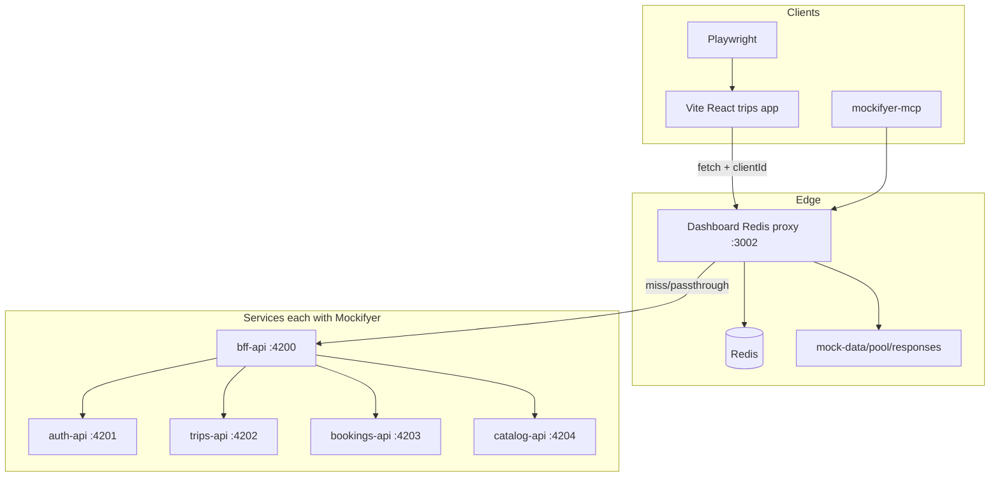

# Ultimate Mockifyer Trips Showcase

Plan of record for the full-vision example app. Builds on serve-time `$pool` refs ([PR #281](https://github.com/sgedda/mockifyer/pull/281), [`POOL_REFS.md`](../../packages/mockifyer-core/docs/POOL_REFS.md)).

This plan owns *what to build*. Architecture stays the same across the set; staging and slides layer on top.

## Document set (read together)

| Doc | Role |
|---|---|
| [`trips-showcase.md`](./trips-showcase.md) | **Build plan** — app, services, `$pool`, lanes, MCP, tests, seed/restore |
| [`trips-showcase-demo.md`](./trips-showcase-demo.md) | **Live demo staging** — Acts 1–4, wow SLAs, audience cuts |
| [`trips-showcase-presentation.md`](./trips-showcase-presentation.md) | **Technical slides** — graphs, sample payloads, curl/MCP, map to your stack |

Ships with the example as `docs/` + README pitch when scaffolding `example-projects/trips-showcase/`.

## Prerequisites (product)

| Dependency | Status |
|---|---|
| Fixture pool extract/promote ([PR #279](https://github.com/sgedda/mockifyer/pull/279)) | Shipped |
| Serve-time `$pool` refs ([PR #281](https://github.com/sgedda/mockifyer/pull/281)) | **In place** — showcase builds on this |
| MCP set/create scenario + client lanes ([PR #284](https://github.com/sgedda/mockifyer/pull/284)) | **Shipped** — tutorial can be MCP-only for scenarios/lanes |
| Endpoint slots / `$entity` | Still deferred — **not required** |

Do **not** re-implement pool activation or scenario MCP tools in the example. Consume:

- `$pool` + `mockifyer_promote_response` / `mockifyer_preview_pool_ref` / `mockifyer_set_pool_ref`
- `mockifyer_create_scenario` / `mockifyer_set_scenario` / `mockifyer_set_client_lane_scenario` / `mockifyer_list_client_lanes`

## Locked decisions

- **App**: React web (Vite + TypeScript), not Expo/RN. **Positioning:** web-first for a clear demo; same intercept + scenarios + lanes pattern as React Native (call out in README / [`trips-showcase-demo.md`](./trips-showcase-demo.md) closing).
- **E2E**: Playwright (align with [mockifyer-web](../../mockifyer-web/); pin latest `@playwright/test` via Context7 at implement time).
- **Scaffold**: `npm create vite@latest` React-TS template (Vite 8 / Node 20.19+).
- **Location**: [`example-projects/trips-showcase/`](../../example-projects/trips-showcase/).
- **Store**: local Redis + dashboard `--provider redis` + `/api/proxy`.
- **Pool reuse (headline)**: promote full trips-list (and detail) responses once → scenarios hold **`$pool` refs** (`mode: "document"`, `path: "trips"`, `select` by trip `id` or `indices`) so envelopes stay intact and trip JSON is not copied per scenario. Scenario-local `responseFieldOverrides` / `responseDateOverrides` for check-in timing and status. Optional entity extract for MCP browse only.
- **Demo polish (for Acts 1–4):** Demo panel must support scenario switch, Mockifyer “now” / date nudge, lane/`clientId` display, and one-click `booking-error` without leaving the app. Pre-demo restore leaves NYC **outside** the check-in window until Act 1. See [`trips-showcase-demo.md`](./trips-showcase-demo.md).

## What this showcase proves (pitch alignment)

| Pitch moment | Showcase mechanism |
|---|---|
| Multi-hop “which service caused this?” | BFF → trips / bookings / catalog + Network trace |
| Rolling product states | `responseDateOverrides` after `$pool` resolve (check-in ≤ 10h) |
| MCP inspects structures / field origin | `get_mock_ai_context` + `get_network_trace` |
| **Shared pool data without duplication** | Promote → `$pool` document + field select → overlays |
| Scenario / client-id for automated tests | Redis lanes + Playwright `MOCKIFYER_CLIENT_ID` |
| In-app demo control | UI → dashboard scenario/lane APIs |

## Presentation (staging, not a different app)

Prospect walkthroughs follow [`trips-showcase-demo.md`](./trips-showcase-demo.md). Same example; different **order of revelation**:

| Path | Acts | Audience |
|---|---|---|
| **A** (~90s) | Time & scenarios | First impression / sales |
| **B** (full) | + parallel lanes → MCP `$pool` compose → optional trace/chaos | QA, platform, architects |

**Success bars:** clone → Act 1 wow in &lt;2 min (`restore-demo.sh`); Act 1 without docs; Acts 2–3 with `PROMPTS.md` / DEMO.md only. **DRY line:** 1 promoted list → 4+ scenarios → 0 duplicated trip blobs.

Multi-service architecture and MCP tool detail support **Acts 3–4**; do not open the live demo with the five-API diagram.

## Architecture



**Home call chain (trace demo):** Browser → BFF `/api/home` → auth + trips + bookings + catalog → merged UI (check-in CTAs).

Each hop: `setupMockifyer` + correlation (reuse [`multi-service-example`](../../example-projects/multi-service-example/) bootstrap). Proxy resolve loads `$pool` from the same `mockDataPath` pool.

## Domain model (realistic seed)

**Users:** `alice@trips.demo` / `demo` (primary); `bob@trips.demo` / `demo` (empty / alternate).

**Trips** (ids used in `$pool.select.values`):

| id | Destination | Intent |
|---|---|---|
| `trip-rome-spring` | Rome | Upcoming, mid-window |
| `trip-nyc-checkin` | NYC | Departure ~now+10h → check-in |
| `trip-tokyo-past` | Tokyo | Completed |
| `trip-lisbon-cancelled` | Lisbon | Cancelled |

**Promoted pool fixtures (canonical):**

- `trips-list-alice` — full list envelope (`userId`, `meta`, `trips[]`)
- `trip-detail-nyc` (optional) — single-object detail for value-mode demos

**Scenarios:**

| Scenario | How data is served |
|---|---|
| `default` / `qa-stable` | `$pool` → `trips-list-alice` document, all (or most) trips |
| `check-in-open` | `$pool` same id, `select` NYC only (or NYC+Rome) + date override on `trips.0.departureAt` |
| `empty-trips` | empty list mock or `$pool` with empty select / dedicated empty promote |
| `booking-error` | bookings hop error mock (not pool) |
| `trip-cancelled` | `$pool` select Lisbon cancelled (+ field override if needed) |

Business rules in BFF/UI: check-in when `departureAt - now <= 10h` and `CONFIRMED`; use `getCurrentDate()`.

## Project layout

```
example-projects/trips-showcase/
  apps/web/
  services/{bff,auth,trips,bookings,catalog}-api/
  packages/mock-bootstrap/
  mock-data/
    pool/
      responses/          # trips-list-alice.json, …
      entities/           # optional extract catalog
    default/              # mocks; trips response may be $pool node
    check-in-open/        # $pool ref + date/field overlays
    empty-trips/
    …
  seeds/
  e2e/
  tests/
  scripts/restore-demo.sh
  README.md                 # prospect pitch: Path A/B, DRY number, RN callout
  docs/DEMO.md              # from trips-showcase-demo.md
  docs/PRESENTATION.md      # from trips-showcase-presentation.md
  docs/TUTORIAL.md
  docs/PROMPTS.md
  docker-compose.yml
```

## App features (UI)

1. Login (Alice/Bob).
2. My Trips list + detail.
3. Check-in CTA from date/status rules.
4. Demo panel (`VITE_DEMO_CONTROLS=true`): scenarios (incl. `empty-trips`, `booking-error`), lane mapping, show `MOCKIFYER_CLIENT_ID`, **time/now nudge** for Act 1 check-in theater.
5. Optional dashboard Network link (Act 4).

Frontend → BFF only; `initMockifyerForDashboardProxy` with stable `clientId` (e.g. `trips-web-demo`).

## Fixture pool + `$pool` tutorial arc (core demo)

This is the **primary** Mockifyer story for the showcase:

1. Seed/record `default` multi-hop mocks.
2. `mockifyer_promote_response` → `trips-list-alice`.
3. Optional: `mockifyer_extract_entity` for trip catalog browse (not required to serve).
4. `mockifyer_create_scenario` with `deriveFrom: "default"` → `check-in-open` ([PR #284](https://github.com/sgedda/mockifyer/pull/284)).
5. `mockifyer_preview_pool_ref` then `mockifyer_set_pool_ref`:

```json
{
  "id": "trips-list-alice",
  "mode": "document",
  "path": "trips",
  "select": { "field": "id", "values": ["trip-nyc-checkin"] }
}
```

6. Field/date overrides on resolved paths (`departureAt` ≈ now+10h).
7. `mockifyer_set_client_lane_scenario` → map `trips-e2e-checkin` to `check-in-open`; run app / Playwright.

Same promoted response; different scenarios only change **refs + overlays**.

### MCP coverage (product — done)

| Need | Tool | Status |
|---|---|---|
| Promote / `$pool` | `mockifyer_promote_response`, `preview_pool_ref`, `set_pool_ref` | PR #281 |
| Create / switch scenario | `mockifyer_create_scenario`, `mockifyer_set_scenario` | **PR #284** |
| Client lanes | `mockifyer_set_client_lane_scenario`, `mockifyer_list_client_lanes` | **PR #284** |

No further MCP product work is required for the showcase tutorial arc.

## Tracing + insights

Network + Bodies on Redis; isolated `tests/trace-home.integration.ts` / script: hit BFF → `X-Mockifyer-Request-Id` → `/api/network-events/trace` → assert hops + field provenance. Tutorial prompts for duplicates / slow hops / “where did this field come from?”.

## Tests

**Jest:** check-in matrix under `check-in-open` vs `default`; empty list; BFF merge (including bodies that came from `$pool` resolve).

**Playwright** lane matrix:

| Project | `MOCKIFYER_CLIENT_ID` | Expect |
|---|---|---|
| `checkin` | `trips-e2e-checkin` | Check-in visible |
| `empty` | `trips-e2e-empty` | Empty state |
| `stable` | `trips-e2e-stable` | Default list |

## Tutorial + restore

**README.md (prospect):** one-liner, Path A/B, DRY number, vs MSW/WireMock one-liner, RN callout, link to `docs/DEMO.md`.

**DEMO.md:** staged Acts 1–4 from [`trips-showcase-demo.md`](./trips-showcase-demo.md); pre-demo clock/lane defaults; audience cheat sheet.

**PRESENTATION.md:** slide-style technical deck from [`trips-showcase-presentation.md`](./trips-showcase-presentation.md) — architecture graphs, sample payloads, curl/MCP, “map to your stack.”

**TUTORIAL.md:** builder path — start stack → login → (optional early Act 1 wow) → Network trace → promote → preview/set `$pool` → overrides → lane switch → Playwright → `restore-demo.sh`. Prefer revealing multi-hop after the first wow.

**PROMPTS.md** (must work with this seed; aligns with demo Act 3 + optional Act 4):

- Promote default trips list to `trips-list-alice`
- Create scenario `check-in-open` derived from `default`
- Preview `$pool` document selecting `trip-nyc-checkin` only
- Set that ref on `check-in-open` trips mock
- Apply ~10h departure override
- Trace home; provenance of destination title
- Duplicates / slowest hop
- Set client lane `trips-e2e-checkin` → `check-in-open`

Seed: `seeds/demo-bundle.json` + committed `mock-data/pool/responses/` (+ scenarios with `$pool` nodes).

## Implementation sequence

1. Scaffold monorepo + Redis + bootstrap + services + Vite auth shell.
2. Seed APIs/data; **promote** list to pool; write scenario mocks as **`$pool` refs** + overlays (not duplicated trip blobs).
3. Redis proxy + clientIds + dates + demo panel.
4. Trace suite.
5. Jest + Playwright lane matrix (lanes set via MCP tools from PR #284).
6. Tutorial / PROMPTS / DEMO / restore; dry-run Path A (Act 1) then full MCP path (create scenario → `$pool` → lane → overrides).
7. README pitch under `example-projects/trips-showcase/` (Path A/B, DRY number, RN callout) + pointer from `example-projects/`.
8. Dry-run [`trips-showcase-demo.md`](./trips-showcase-demo.md) Acts 1–3 end-to-end; optional Act 4.

## Out of scope

- Endpoint slots / `$entity` (use `$pool` instead).
- Re-implementing pool resolve (use PR #281) or scenario/lane MCP tools (use PR #284).
- Real OAuth/Clerk; Detox/Maestro/Expo; publishing the example as npm.

## Key code to leverage

- Prospect staging: [`trips-showcase-demo.md`](./trips-showcase-demo.md)
- Technical slides: [`trips-showcase-presentation.md`](./trips-showcase-presentation.md)
- [`example-projects/multi-service-example`](../../example-projects/multi-service-example/)
- [`POOL_REFS.md`](../../packages/mockifyer-core/docs/POOL_REFS.md) + [PR #281](https://github.com/sgedda/mockifyer/pull/281)
- Scenario/lane MCP ([PR #284](https://github.com/sgedda/mockifyer/pull/284)) + fixture pool / MCP packages
- Trace API, [`MULTI_CLIENT_ISOLATION.md`](../../MULTI_CLIENT_ISOLATION.md), mockifyer-web Playwright

## Implementation todos

- [ ] Scaffold trips-showcase (Vite React web, Express services, mock-bootstrap, Redis compose, package scripts)
- [ ] Auth + trip APIs/BFF merge; seed mocks; promote trips-list to pool/responses; wire scenarios via `$pool` document refs + overlays
- [ ] Wire filesystem + Redis proxy, clientIds, correlation, date helpers, in-app scenario/lane panel
- [x] MCP set/create scenario + client lane tools — **done in [PR #284](https://github.com/sgedda/mockifyer/pull/284)**
- [ ] Add isolated trace integration script/test asserting multi-hop field provenance
- [ ] Add Jest scenario unit tests + Playwright projects keyed by client-id lanes
- [ ] TUTORIAL.md + PROMPTS.md centered on promote → create scenario → `$pool` → lane → overrides; restore-demo.sh + seed bundle; dry-run
- [ ] Ship `docs/DEMO.md` from [`trips-showcase-demo.md`](./trips-showcase-demo.md); README pitch (Path A/B, DRY number, RN callout); Demo panel time + chaos for Acts 1/4; dry-run Acts 1–3
- [ ] Ship `docs/PRESENTATION.md` from [`trips-showcase-presentation.md`](./trips-showcase-presentation.md) (graphs, sample JSON, curls, map-to-your-stack)
