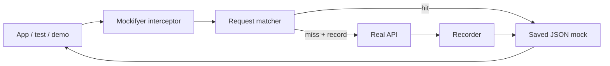
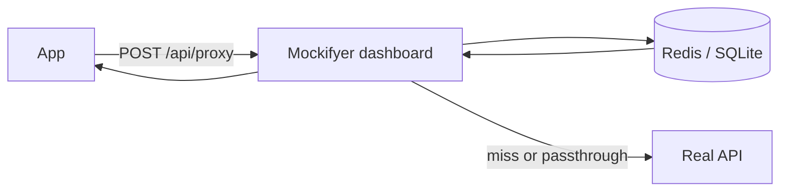
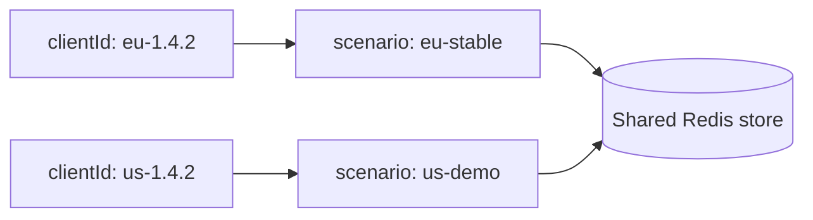

# Mockifyer Presentation

> Markdown slide deck. Use any Markdown presentation tool that treats `---` as
> slide separators, or read directly in GitHub / Cursor.

---

## Mockifyer

API record/replay for apps, tests, demos, and multi-client workflows.

Mockifyer lets teams:

- Capture real HTTP traffic from axios or fetch.
- Replay saved JSON mocks from the repo, Redis, SQLite, memory, or device storage.
- Switch scenarios for demos, edge cases, CI, and mobile builds.
- Browse, edit, and proxy requests through a local dashboard.
- Keep date-sensitive tests deterministic with Mockifyer date helpers.

---

## The problem it solves

Modern apps depend on many APIs, but API-dependent work is often blocked by:

- Unstable staging data.
- Third-party rate limits and outages.
- Hard-to-reproduce edge cases.
- Slow test suites that require network access.
- Mobile simulators and CI jobs needing the same mock state.

Mockifyer turns real API traffic into reviewable, versionable fixtures.

---

## Core idea



One setup call installs the interceptor. Requests are matched to saved mocks; if
recording is enabled, misses can call the real API and save the response.

---

## Package map

| Package | Role |
|---------|------|
| `@sgedda/mockifyer-core` | Types, providers, scenarios, matching, date helpers |
| `@sgedda/mockifyer-axios` | Axios interceptors and dashboard proxy preset |
| `@sgedda/mockifyer-fetch` | Fetch / React Native interceptors and presets |
| `@sgedda/mockifyer-dashboard` | Local UI, mock editor, proxy, Redis / SQLite support |
| `@sgedda/mockifyer-test-helper` | Test utilities |
| `mockifyer-web` | Demo web app in this repository |

The repository root is private metadata; install the published scoped packages.

---

## Basic filesystem setup

```bash
npm install @sgedda/mockifyer-core @sgedda/mockifyer-fetch
```

```typescript
import { setupMockifyer } from '@sgedda/mockifyer-fetch';

setupMockifyer({
  mockDataPath: './mock-data',
  useGlobalFetch: true,
  recordMode: process.env.MOCKIFYER_RECORD === 'true',
});
```

This stores mocks under `mock-data/<scenario>/...` as JSON files.

---

## Axios setup

```bash
npm install @sgedda/mockifyer-core @sgedda/mockifyer-axios
```

```typescript
import { setupMockifyer } from '@sgedda/mockifyer-axios';

setupMockifyer({
  mockDataPath: './mock-data',
  useGlobalAxios: true,
  recordMode: false,
});
```

Use the same `MockifyerConfig` concepts for fetch and axios: paths, scenarios,
recording, proxy, activation mode, and date manipulation.

---

## What a mock contains

Recorded mocks are plain JSON that can be committed and reviewed:

- Request method, URL, query params, headers, and body.
- Response status, headers, and body.
- Metadata such as timestamp and scenario.
- Optional flags like `alwaysUseRealApi` for passthrough recordings.

Because mocks live as files, teams can diff, search, edit, and review them like
source code.

---

## Request matching

Mockifyer identifies requests by:

- HTTP method.
- URL and query string.
- Request body for methods such as POST.
- Normalized GraphQL query plus sorted variables for GraphQL requests.

For normal JSON bodies, matching uses a stable sorted-key representation so key
order does not create accidental misses.

---

## Scenarios

Scenarios are named mock sets:

```text
mock-data/
  default/
  demo-empty-state/
  checkout-error/
  recorded-main/
```

Use scenarios to separate:

- Raw recordings from curated mocks.
- Demo flows from CI goldens.
- Market, version, or customer-specific mock sets.
- Scratch work from reviewed fixtures.

---

## Scenario resolution

Filesystem and SDK flows resolve scenarios from:

1. `MOCKIFYER_SCENARIO`.
2. `MockifyerConfig.defaultScenario` / `scenarios.default`.
3. `scenario-config.json` or lane-specific scenario config.
4. `default`.

Dashboard proxy flows can also resolve scenario from request body, client lane,
Redis active scenario, or filesystem seed data.

---

## Dashboard

Start the local dashboard:

```bash
npx @sgedda/mockifyer-dashboard --path ./mock-data
```

Common options:

```bash
npx mockifyer-dashboard --port 8080
npx mockifyer-dashboard --base /dashboard
npx mockifyer-dashboard --provider redis --redis-url redis://127.0.0.1:6379
```

The dashboard lets teams browse, search, edit, delete, import, export, and proxy
mock data.

---

## Dashboard proxy

The dashboard can become a central proxy:



This is useful when multiple apps, devices, or CI jobs need a shared mock store
with scenario controls.

---

## Proxy preset for fetch

```typescript
import { initMockifyerForDashboardProxy } from '@sgedda/mockifyer-fetch';

await initMockifyerForDashboardProxy({
  dashboardBaseUrl: 'http://localhost:3002',
  mockDataPath: './mock-data',
  clientId: process.env.MOCKIFYER_CLIENT_ID,
  scenario: 'default',
  recordOnMiss: true,
});
```

The preset health-checks the dashboard and Redis provider. If unavailable, it
can fall back to filesystem mocks instead of leaving the app half-proxied.

---

## Client lanes

Client lanes let multiple consumers use the same shared store safely.



Each app, build, market, or CI job can declare a stable `clientId`. The dashboard
maps that lane to a scenario without forcing everyone onto one global active
scenario.

---

## Activation modes

Mockifyer can decide per request whether to intercept:

| Mode | Behavior |
|------|----------|
| `always` | Default; all eligible requests go through Mockifyer |
| `client_id_header` | Only requests with `X-Mockifyer-Client-Id` are intercepted |
| `off` | No interception |

Header-gated mode helps multi-service systems opt specific call chains into
mocking while leaving unrelated traffic real.

---

## Date manipulation

Use Mockifyer's date helper instead of `new Date()` when code must match mock
time:

```typescript
import { getCurrentDate, setupMockifyer } from '@sgedda/mockifyer-axios';

setupMockifyer({
  mockDataPath: './mock-data',
  dateManipulation: {
    fixedDate: '2024-01-01T00:00:00.000Z',
  },
});

const now = getCurrentDate();
```

Date config can also come from environment variables such as
`MOCKIFYER_DATE`, `MOCKIFYER_DATE_OFFSET`, and `MOCKIFYER_TIMEZONE`.

---

## React Native and Expo

React Native uses `@sgedda/mockifyer-fetch` to patch `global.fetch`.

| Runtime | Provider | Behavior |
|---------|----------|----------|
| Development | Hybrid | Device storage plus Metro sync back to `mock-data` |
| Production | Memory | Loads bundled mock data module |

```typescript
import { setupMockifyerForReactNative } from '@sgedda/mockifyer-fetch';

await setupMockifyerForReactNative({
  isDev: __DEV__,
  mockDataPath: 'mock-data',
  bundledDataPath: './assets/mock-data',
  recordMode: __DEV__ && process.env.MOCKIFYER_RECORD === 'true',
});
```

---

## Recording workflow

Recommended team flow:

1. Record real API traffic into a raw scenario.
2. Review generated JSON.
3. Copy or merge relevant responses into curated scenarios.
4. Commit curated mocks with the code or test that depends on them.
5. Re-record into raw or scratch scenarios before refreshing curated fixtures.

This keeps "truth from the wire" separate from stable product, demo, and CI data.

---

## Suggested scenario names

| Role | Examples |
|------|----------|
| Raw recordings | `recorded-main`, `from-staging-2026-01` |
| Curated demos | `demo`, `demo-empty-state`, `checkout-error` |
| Stable tests | `qa-stable`, `ci-smoke`, `payments-golden` |
| Scratch work | `local-alice`, `pr-123`, `debug-auth-flow` |

Naming scenarios by intent prevents accidental overwrites of hand-tuned mocks.

---

## Demo path

1. Start with `MOCKIFYER_RECORD=true`.
2. Run the app and exercise an API-backed flow.
3. Inspect generated files in `mock-data/default`.
4. Turn recording off.
5. Run the same flow with network disabled or API unavailable.
6. Open the dashboard and edit a response body.
7. Switch to a second scenario for an edge case.

The audience sees a real API response become a deterministic fixture.

---

## Where Mockifyer fits

Use Mockifyer when you need:

- Frontend development before backend data is ready.
- Repeatable UI states for QA and demos.
- Fast tests without real API calls.
- Safe contract-drift refreshes from real APIs.
- Mobile mock data that can sync between simulator and repo.
- Shared mock control through dashboard, Redis, or SQLite.

---

## Key takeaways

- Mockifyer records and replays real HTTP through axios and fetch.
- Mocks are JSON, so they are searchable, editable, and reviewable.
- Scenarios model product states, tests, markets, and demos.
- The dashboard adds discovery, editing, proxying, and shared stores.
- React Native support covers device storage, Metro sync, and bundled mocks.
- Client lanes let multiple consumers share infrastructure without sharing state.

---

## Links

- Repository overview: `README.md`
- Initialization guide: `MOCKIFYER_INITIALIZATION.md`
- Team workflow: `MOCK_WORKFLOW.md`
- React Native guide: `REACT_NATIVE.md`
- Dashboard package: `packages/mockifyer-dashboard/README.md`
- Public site: <https://mockifyer.dev/>
