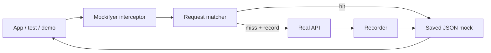
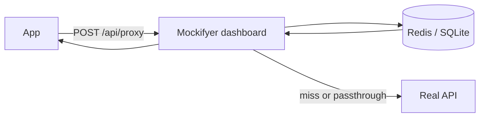
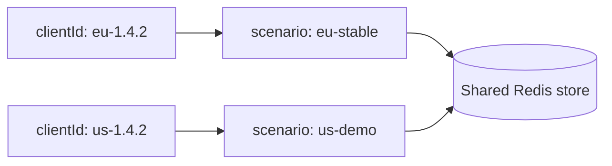
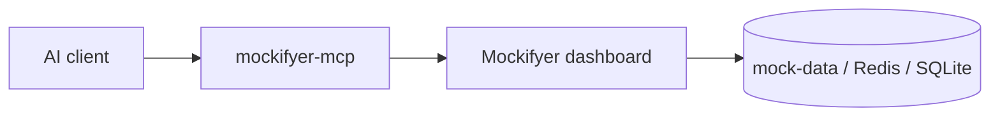
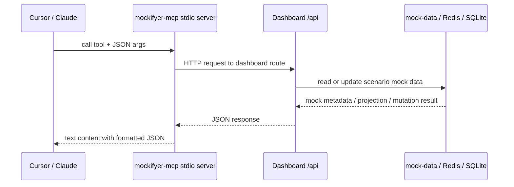
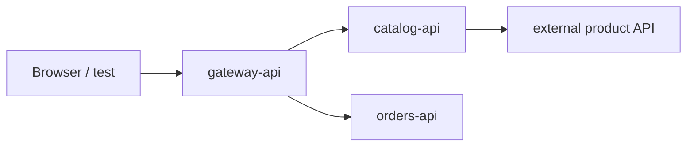

# Mockifyer Presentation

> Markdown slide deck. Use any Markdown presentation tool that treats `---` as
> slide separators, or read directly in GitHub / Cursor.

---

## Mockifyer

API record/replay for apps, tests, demos, and multi-client workflows.

Mockifyer lets teams:

- Capture real HTTP traffic from axios or fetch.
- Replay saved JSON mocks from the repo, Redis, SQLite, memory, or device storage.
- Switch scenarios for demos, edge cases, CI, and mobile builds.
- Browse, edit, and proxy requests through a local dashboard.
- Keep date-sensitive tests deterministic with Mockifyer date helpers.

---

## The problem it solves

Modern apps depend on many APIs, but API-dependent work is often blocked by:

- Unstable staging data.
- Third-party rate limits and outages.
- Hard-to-reproduce edge cases.
- Slow test suites that require network access.
- Mobile simulators and CI jobs needing the same mock state.

Mockifyer turns real API traffic into reviewable, versionable fixtures.

---

## Pain points and solutions

| Developer pain point | Mockifyer solution |
|----------------------|--------------------|
| Staging APIs are slow, flaky, or unavailable | Replay local JSON mocks with no network dependency |
| Demo data changes right before a review | Pin a curated scenario for the exact product state |
| Edge cases are hard to reproduce | Edit response JSON or switch to a dedicated scenario |
| Tests fail because backend state changed | Commit deterministic fixtures with the test suite |
| Mobile and web teams need the same mock state | Share scenarios through repo files, dashboard, Redis, or SQLite |
| Aggregate responses hide the failing downstream service | Use dashboard network traces to inspect each service hop |
| Large mock files are hard to reason about | Use MCP to let AI inspect focused mock context and targeted fields |

The pitch: **record real traffic once, then make it deterministic, reviewable,
shareable, and AI-assistable.**

---

## Aha moment: pinpoint the real cause

The checkout page shows the wrong delivery promise.

Without Mockifyer, the team asks:

- Is the frontend formatting wrong?
- Did the gateway merge the wrong field?
- Did `catalog-api` return stale availability?
- Did `orders-api` return a fallback date?

With Mockifyer:

```text
trace checkout request -> inspect gateway + downstream responses
-> ask MCP which mock field drives deliveryPromise
-> edit that field in a scenario -> replay instantly
```

The recognizable moment: **"I can see the exact service response and field that
made the UI do this."**

---

## Core idea



One setup call installs the interceptor. Requests are matched to saved mocks; if
recording is enabled, misses can call the real API and save the response.

---

## Package map

| Package | Role |
|---------|------|
| `@sgedda/mockifyer-core` | Types, providers, scenarios, matching, date helpers |
| `@sgedda/mockifyer-axios` | Axios interceptors and dashboard proxy preset |
| `@sgedda/mockifyer-fetch` | Fetch / React Native interceptors and presets |
| `@sgedda/mockifyer-dashboard` | Local UI, mock editor, proxy, Redis / SQLite support |
| `@sgedda/mockifyer-mcp` | MCP server exposing dashboard APIs to AI clients |
| `@sgedda/mockifyer-test-helper` | Test utilities |
| `mockifyer-web` | Demo web app in this repository |

The repository root is private metadata; install the published scoped packages.

---

## Basic filesystem setup

```bash
npm install @sgedda/mockifyer-core @sgedda/mockifyer-fetch
```

```typescript
import { setupMockifyer } from '@sgedda/mockifyer-fetch';

setupMockifyer({
  mockDataPath: './mock-data',
  useGlobalFetch: true,
  recordMode: process.env.MOCKIFYER_RECORD === 'true',
});
```

This stores mocks under `mock-data/<scenario>/...` as JSON files.

---

## Axios setup

```bash
npm install @sgedda/mockifyer-core @sgedda/mockifyer-axios
```

```typescript
import { setupMockifyer } from '@sgedda/mockifyer-axios';

setupMockifyer({
  mockDataPath: './mock-data',
  useGlobalAxios: true,
  recordMode: false,
});
```

Use the same `MockifyerConfig` concepts for fetch and axios: paths, scenarios,
recording, proxy, activation mode, and date manipulation.

---

## What a mock contains

Recorded mocks are plain JSON that can be committed and reviewed:

- Request method, URL, query params, headers, and body.
- Response status, headers, and body.
- Metadata such as timestamp and scenario.
- Optional flags like `alwaysUseRealApi` for passthrough recordings.

Because mocks live as files, teams can diff, search, edit, and review them like
source code.

---

## Request matching

Mockifyer identifies requests by:

- HTTP method.
- URL and query string.
- Request body for methods such as POST.
- Normalized GraphQL query plus sorted variables for GraphQL requests.

For normal JSON bodies, matching uses a stable sorted-key representation so key
order does not create accidental misses.

---

## Scenarios

Scenarios are named mock sets:

```text
mock-data/
  default/
  demo-empty-state/
  checkout-error/
  recorded-main/
```

Use scenarios to separate:

- Raw recordings from curated mocks.
- Demo flows from CI goldens.
- Market, version, or customer-specific mock sets.
- Scratch work from reviewed fixtures.

---

## Scenario resolution

Filesystem and SDK flows resolve scenarios from:

1. `MOCKIFYER_SCENARIO`.
2. `MockifyerConfig.defaultScenario` / `scenarios.default`.
3. `scenario-config.json` or lane-specific scenario config.
4. `default`.

Dashboard proxy flows can also resolve scenario from request body, client lane,
Redis active scenario, or filesystem seed data.

---

## Dashboard

Start the local dashboard:

```bash
npx @sgedda/mockifyer-dashboard --path ./mock-data
```

Common options:

```bash
npx mockifyer-dashboard --port 8080
npx mockifyer-dashboard --base /dashboard
npx mockifyer-dashboard --provider redis --redis-url redis://127.0.0.1:6379
```

The dashboard lets teams browse, search, edit, delete, import, export, and proxy
mock data.

---

## Dashboard proxy

The dashboard can become a central proxy:



This is useful when multiple apps, devices, or CI jobs need a shared mock store
with scenario controls.

---

## Proxy preset for fetch

```typescript
import { initMockifyerForDashboardProxy } from '@sgedda/mockifyer-fetch';

await initMockifyerForDashboardProxy({
  dashboardBaseUrl: 'http://localhost:3002',
  mockDataPath: './mock-data',
  clientId: process.env.MOCKIFYER_CLIENT_ID,
  scenario: 'default',
  recordOnMiss: true,
});
```

The preset health-checks the dashboard and Redis provider. If unavailable, it
can fall back to filesystem mocks instead of leaving the app half-proxied.

---

## Client lanes

Client lanes let multiple consumers use the same shared store safely.



Each app, build, market, or CI job can declare a stable `clientId`. The dashboard
maps that lane to a scenario without forcing everyone onto one global active
scenario.

---

## Activation modes

Mockifyer can decide per request whether to intercept:

| Mode | Behavior |
|------|----------|
| `always` | Default; all eligible requests go through Mockifyer |
| `client_id_header` | Only requests with `X-Mockifyer-Client-Id` are intercepted |
| `off` | No interception |

Header-gated mode helps multi-service systems opt specific call chains into
mocking while leaving unrelated traffic real.

---

## Date manipulation

Use Mockifyer's date helper instead of `new Date()` when code must match mock
time. Relative offsets are often stronger than fixed dates because the demo stays
fresh whenever it runs:

```typescript
import { getCurrentDate, setupMockifyer } from '@sgedda/mockifyer-axios';

const DAY_MS = 24 * 60 * 60 * 1000;

setupMockifyer({
  mockDataPath: './mock-data',
  dateManipulation: {
    offset: 7 * DAY_MS, // behave as if it is one week from now
  },
});

const now = getCurrentDate();
```

Date config can also come from environment variables such as
`MOCKIFYER_DATE`, `MOCKIFYER_DATE_OFFSET`, and `MOCKIFYER_TIMEZONE`.

---

## Demo rolling product states

Fixed dates prove determinism. Offsets sell the demo.

| Demo state | Relative date behavior |
|------------|------------------------|
| Trial expires tomorrow | `expiresAt = now + 1 day` |
| Flash sale countdown | `endsAt = now + 2 hours` |
| Subscription renews soon | `renewalDate = now + 7 days` |
| Recently delivered order | `deliveredAt = now - 15 minutes` |

Per-mock response date overrides keep recorded data realistic without making it
stale:

```json
{
  "responseDateOverrides": [
    { "path": "checkout.deliveryPromise", "offsetDays": 2, "format": "iso" },
    { "path": "promotion.endsAt", "offsetHours": 2, "format": "iso" }
  ]
}
```

Pitch line: **"This scenario always looks like the event is about to happen."**

---

## Practical: make one endpoint mocked

Goal: keep most traffic real, but freeze one endpoint for a demo or test.

1. Start the dashboard with the app pointing at `/api/proxy`.
2. In scenario settings, enable **Record on miss**.
3. Trigger the app flow that calls `GET /checkout/summary`.
4. Open the recorded mock in the dashboard.
5. Change replay mode from **Always use live API** to **Use saved mock**.
6. Edit the JSON or add field/date overrides.
7. Re-run the app flow; only that endpoint is now deterministic.

This is the everyday developer loop: **capture the real thing, then pin exactly
the part you care about.**

---

## Practical: live API with date overrides

Goal: keep real backend data, but simulate a time-sensitive state.

In the dashboard mock editor:

1. Select the endpoint, for example `GET /subscriptions/current`.
2. Set replay mode to **Always refresh from live**.
3. Add response date overrides:
   - `trialEndsAt` -> `offsetDays: 1`
   - `renewalDate` -> `offsetDays: 7`
4. Run the app again.

The endpoint still calls the real API and updates the stored snapshot, but the
client receives dates shifted relative to now.

```json
{
  "alwaysRefreshFromLive": true,
  "responseDateOverrides": [
    { "path": "trialEndsAt", "offsetDays": 1, "format": "iso" },
    { "path": "renewalDate", "offsetDays": 7, "format": "iso" }
  ]
}
```

Use this when the backend state is valid, but the product state depends on time.

---

## Practical: MCP builds the scenario with you

Goal: create a scenario that triggers a specific UI state based on code context.

Ask in Cursor:

> "Create a `checkout-card-expiring` scenario. Look at the checkout UI code and
> set the mocks so the card expires soon and the delivery promise is two days
> from now."

The assistant can combine IDE code context with MCP tools:

1. Read the component to find state-driving fields.
2. `mockifyer_search_mocks` for checkout/payment endpoints.
3. `mockifyer_get_mock_ai_context` to inspect fields without huge JSON.
4. `mockifyer_set_field_overrides` for values like `card.status = "EXPIRING"`.
5. Add `responseDateOverrides` for rolling dates.
6. Tell you which scenario and mocks changed.

The result is a named scenario that matches the code path you actually need to
trigger.

---

## React Native and Expo

React Native uses `@sgedda/mockifyer-fetch` to patch `global.fetch`.

| Runtime | Provider | Behavior |
|---------|----------|----------|
| Development | Hybrid | Device storage plus Metro sync back to `mock-data` |
| Production | Memory | Loads bundled mock data module |

```typescript
import { setupMockifyerForReactNative } from '@sgedda/mockifyer-fetch';

await setupMockifyerForReactNative({
  isDev: __DEV__,
  mockDataPath: 'mock-data',
  bundledDataPath: './assets/mock-data',
  recordMode: __DEV__ && process.env.MOCKIFYER_RECORD === 'true',
});
```

---

## MCP: AI access to mock context

Mockifyer MCP exposes dashboard APIs to AI clients such as Cursor and Claude
Desktop.



Instead of pasting large JSON files into chat, the assistant can ask Mockifyer
for focused mock context, endpoint stats, scenarios, and targeted edit tools.

---

## Why MCP is useful

MCP makes AI assistance practical for mock-heavy apps:

- **Less context bloat:** send field summaries and state hints instead of full
  response bodies.
- **Better discovery:** list scenarios, search endpoints, and inspect endpoint
  stats without manually opening files.
- **Safer edits:** change specific JSON paths or clone array items instead of
  rewriting an entire mock body.
- **Faster debugging:** ask which mocks drive a UI state, status, or edge case.
- **Scenario-aware changes:** work against the same active mock data the
  dashboard is serving.

---

## MCP tools

| Tool | Use |
|------|-----|
| `mockifyer_get_mock_ai_context` | Lightweight mock projection for AI |
| `mockifyer_set_field_overrides` | Replay-time path/value overlays |
| `mockifyer_copy_array_item` | Clone array item with optional overrides |
| `mockifyer_list_mocks` | List recordings in a scenario |
| `mockifyer_search_mocks` | Search by filename, endpoint, or method |
| `mockifyer_get_mock` | Fetch full mock JSON when needed |
| `mockifyer_list_scenarios` | Show available and active scenarios |
| `mockifyer_get_endpoint_stats` | Aggregate endpoint, status, and method stats |

The most important default is to prefer `mockifyer_get_mock_ai_context` over
full mock JSON unless the exact body is required.

---

## MCP setup

Run the dashboard first:

```bash
npx mockifyer-dashboard --path ./mock-data
```

Build the MCP server:

```bash
npm --prefix packages/mockifyer-mcp install
npm --prefix packages/mockifyer-mcp run build
```

Add it to Cursor MCP config:

```json
{
  "mcpServers": {
    "mockifyer": {
      "command": "node",
      "args": ["/path/to/mockifyer/packages/mockifyer-mcp/dist/cli.js"],
      "env": {
        "MOCKIFYER_DASHBOARD_URL": "http://localhost:3002"
      }
    }
  }
}
```

---

## What triggers MCP?

MCP is not triggered by app code. It is triggered by **AI intent** when the MCP
server is configured and relevant tools are available.

The assistant is most likely to use Mockifyer MCP when the prompt includes:

- A Mockifyer-related task: "inspect mocks", "create a scenario", "override a
  response field".
- A scenario or target state: `checkout-card-expiring`, `empty-cart`,
  `trial-ending`.
- Endpoint hints: checkout, orders, subscriptions, GraphQL operation names.
- An explicit instruction: "Use Mockifyer MCP".

```text
Use Mockifyer MCP. In scenario checkout-card-expiring,
inspect checkout mocks and make the card expire soon.
```

That prompt gives the assistant both the tool family and the mock world to work
inside.

---

## MCP works best scenario-scoped

Most MCP tools accept an optional `scenario`.

If omitted, the dashboard active scenario is used. For reliable demos and tests,
name the scenario explicitly:

```text
Use scenario checkout-card-expiring.
Search checkout and payment mocks.
Find fields that trigger expired-card UI.
Apply the smallest field/date overrides.
```

Why this matters:

- Avoids editing the wrong scenario.
- Makes the target product state concrete.
- Keeps changes reviewable.
- Lets multiple demo/test states coexist.
- Aligns with dashboard, lanes, and CI workflows.

---

## MCP internals: how a tool call moves



The MCP server does not parse files directly. It is a small bridge from AI tool
calls to the running dashboard API.

---

## MCP tool to dashboard endpoint map

| MCP tool | Dashboard HTTP route |
|----------|----------------------|
| `mockifyer_list_mocks` | `GET /api/mocks?scenario=...` |
| `mockifyer_search_mocks` | `GET /api/mocks/search?q=...&scenario=...` |
| `mockifyer_get_mock_ai_context` | `GET /api/mocks/:filename/ai-context?...` |
| `mockifyer_get_mock` | `GET /api/mocks/:filename?scenario=...` |
| `mockifyer_list_scenarios` | `GET /api/scenario-config` |
| `mockifyer_get_endpoint_stats` | `GET /api/stats?scenario=...` |
| `mockifyer_set_field_overrides` | `PATCH /api/mocks/:filename/field-overrides` |
| `mockifyer_copy_array_item` | `POST /api/mocks/:filename/copy-array-item` |

The `:filename` value is URL-encoded segment-by-segment, so nested mock paths
can be addressed safely.

---

## MCP read endpoint: AI context

`mockifyer_get_mock_ai_context` is the default read tool because it avoids
dumping full response bodies into chat.

```text
GET /api/mocks/:filename/ai-context
  ?scenario=checkout-card-expiring
  &mode=profile
  &maxPaths=25
```

It returns:

- `endpoint`: method, URL, pathname.
- `status`: stored response status.
- `profile.fields`: selected state-driving response paths.
- `profile.schema`: compact type summary.
- `profile.stateHints`: observed values that look useful for state changes.
- `suggestions`: ranked paths when `mode=suggest`.
- `discovery`: how much was included or omitted.

Use `mode=full` only when the AI truly needs the complete mock body.

---

## MCP write endpoint: field overlays

`mockifyer_set_field_overrides` changes replay behavior without sending the full
response body through the AI:

```json
{
  "responseFieldOverrides": [
    { "path": "card.status", "value": "EXPIRING" },
    { "path": "checkout.requiresCvv", "value": true }
  ],
  "merge": true
}
```

Dashboard route:

```text
PATCH /api/mocks/:filename/field-overrides?scenario=checkout-card-expiring
```

The stored response remains reviewable, and the overlay is applied at replay
time.

---

## MCP write endpoint: clone a useful shape

`mockifyer_copy_array_item` creates a new response item from an existing one.
That is useful when a UI needs "one more booking", "one failed payment", or "one
expired entitlement" without hand-writing a large object.

```json
{
  "arrayPath": "bookings",
  "fromIndex": 0,
  "insertAt": "append",
  "itemOverrides": {
    "status": "CANCELLED",
    "reason": "PAYMENT_FAILED"
  }
}
```

Dashboard route:

```text
POST /api/mocks/:filename/copy-array-item?scenario=checkout-card-expiring
```

The result returns the new item index and array length, so the assistant can
report exactly what changed.

---

## MCP-assisted workflow

Ask the AI:

> "What fields drive order status in scenario `default`, and make one booking
> confirmed."

The assistant can:

1. Search order mocks in `default`.
2. Read a lightweight AI context projection.
3. Identify likely fields such as `bookings.0.status`.
4. Apply a focused override or clone an array item.
5. Tell you exactly which mock changed.

```text
search -> ai_context -> set_field_overrides -> rerun app/test
```

This keeps mock edits intentional, reviewable, and small.

---

## Tracing underlying service responses

For multi-service flows, Mockifyer can show the response chain behind one user
action:



Enable **Network** logging and **Bodies** capture in the dashboard. Each logged
hop can then include request and response body previews, not only status codes.

---

## Trace setup

Node services get inbound correlation automatically when Mockifyer is installed:

```typescript
import { setupMockifyer } from '@sgedda/mockifyer-fetch';

setupMockifyer({
  mockDataPath: './mock-data',
  useGlobalFetch: true,
});
```

`setupMockifyer` installs Node inbound correlation capture, so patched fetch /
axios calls propagate request ids to downstream services. Express middleware is
optional now; use `createMockifyerCorrelationMiddleware()` only when you want to
explicitly echo `X-Mockifyer-Request-Id` on the entry service response.

---

## Trace API example

If the entry response exposes a trace header, capture it:

```bash
curl -si 'http://localhost:4101/aggregate' \
  | grep -i x-mockifyer-request-id
```

The dashboard proxy sets this header, and the optional Express middleware can
echo it from a custom entry service.

Fetch the full response chain from the dashboard:

```bash
curl -s \
  'http://localhost:3002/api/network-events/trace?requestId=THE_ID&scenario=default' \
  | jq '.trace.hops[] | { method, url, status, source, response: .response.body }'
```

If you do not have the response header, start from a dashboard Network row:

```bash
curl -s \
  'http://localhost:3002/api/network-events/trace?eventId=ev-123&scenario=default' \
  | jq .
```

---

## Trace output example

```json
{
  "trace": {
    "hops": [
      {
        "method": "GET",
        "url": "http://localhost:4101/aggregate",
        "status": 200,
        "source": "gateway-api",
        "response": { "body": { "products": 3, "orders": 2 } }
      },
      {
        "method": "GET",
        "url": "http://localhost:4102/products",
        "status": 200,
        "source": "catalog-api",
        "response": { "body": { "items": ["sku-1", "sku-2"] } }
      }
    ],
    "incomplete": false
  }
}
```

Use this to answer: "Which underlying service response made the aggregate API
return this value?"

---

## Recording workflow

Recommended team flow:

1. Record real API traffic into a raw scenario.
2. Review generated JSON.
3. Copy or merge relevant responses into curated scenarios.
4. Commit curated mocks with the code or test that depends on them.
5. Re-record into raw or scratch scenarios before refreshing curated fixtures.

This keeps "truth from the wire" separate from stable product, demo, and CI data.

---

## Suggested scenario names

| Role | Examples |
|------|----------|
| Raw recordings | `recorded-main`, `from-staging-2026-01` |
| Curated demos | `demo`, `demo-empty-state`, `checkout-error` |
| Stable tests | `qa-stable`, `ci-smoke`, `payments-golden` |
| Scratch work | `local-alice`, `pr-123`, `debug-auth-flow` |

Naming scenarios by intent prevents accidental overwrites of hand-tuned mocks.

---

## Demo path

1. Start with `MOCKIFYER_RECORD=true`.
2. Run the app and exercise an API-backed flow.
3. Inspect generated files in `mock-data/default`.
4. Turn recording off.
5. Run the same flow with network disabled or API unavailable.
6. Open the dashboard and edit a response body.
7. Switch to a second scenario for an edge case.

The audience sees a real API response become a deterministic fixture.

---

## Where Mockifyer fits

Use Mockifyer when you need:

- Frontend development before backend data is ready.
- Repeatable UI states for QA and demos.
- Fast tests without real API calls.
- Safe contract-drift refreshes from real APIs.
- Mobile mock data that can sync between simulator and repo.
- Shared mock control through dashboard, Redis, or SQLite.
- AI-assisted mock discovery and targeted edits through MCP.
- Multi-hop trace inspection for downstream service responses.

---

## Key takeaways

- Mockifyer records and replays real HTTP through axios and fetch.
- Mocks are JSON, so they are searchable, editable, and reviewable.
- Scenarios model product states, tests, markets, and demos.
- The dashboard adds discovery, editing, proxying, and shared stores.
- React Native support covers device storage, Metro sync, and bundled mocks.
- Client lanes let multiple consumers share infrastructure without sharing state.
- MCP lets AI clients inspect and modify mocks through focused dashboard APIs.
- Network traces connect aggregate responses back to underlying service hops.

---

## Links

- Repository overview: `README.md`
- Initialization guide: `MOCKIFYER_INITIALIZATION.md`
- Team workflow: `MOCK_WORKFLOW.md`
- React Native guide: `REACT_NATIVE.md`
- Dashboard package: `packages/mockifyer-dashboard/README.md`
- MCP package: `packages/mockifyer-mcp/README.md`
- Public site: <https://mockifyer.dev/>
