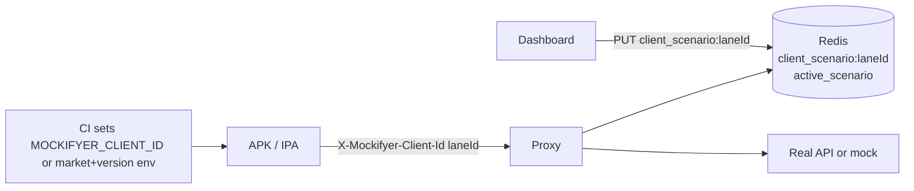

# Per-consumer isolation in Mockifyer — design note

## The three concerns (keep them separate)

- **A. Per-consumer isolation** — Multiple **client lanes** (different builds, markets, or manually chosen ids) hit the same shared store and each may need its own **scenario** at the same time. Today, the active scenario is global per `mockDataPath` / `keyPrefix` ([`packages/mockifyer-core/src/providers/redis-provider.ts`](packages/mockifyer-core/src/providers/redis-provider.ts) stores `{keyPrefix}:active_scenario`; [`packages/mockifyer-core/src/utils/scenario.ts`](packages/mockifyer-core/src/utils/scenario.ts) reads a single `scenario-config.json` per path), so one switch affects everyone. **This plan does not use per-device random ids** — identity is **declared** (dev + CI) or **derived from market + version** so the same id is documented and shippable with a given mock work set.
- **B. Authentication** — only matters if Mockifyer is **hosted for others**. Orthogonal to isolation. Dashboard has no auth today ([`packages/mockifyer-dashboard/src/server.ts`](packages/mockifyer-dashboard/src/server.ts)).
- **C. "Delivered" / pinned mock bundles** — often aligned with **version + market**: the **resolved `clientId`** doubles as the handle you attach to release notes / CI artifacts (“mocks for lane `com.myapp-eu-1.4.2-502`”). Scenarios still hold the actual mock data layout inside that lane.

## Recommendation (phased)

### Phase 1 (chosen scope) — explicit or build-derived `clientId` + per-lane scenario

**Concept.** Each runtime has a **`clientId` string** that identifies a **mock lane** (not a random physical device). Developers set it manually during development; **CI sets the same value** on the native build that ships a given mock dataset. If nothing is configured, **default** to a **deterministic** id from **market + version** (and usually bundle / application id) so every APK/IPA has a stable, documentable lane without per-install UUIDs. The dashboard configures a **scenario per lane** (per `clientId`), so different builds can use different scenarios concurrently.

**`clientId` resolution (no per-device auto-id)**

Precedence (highest first):

1. **`process.env.MOCKIFYER_CLIENT_ID`** — set locally and in CI/native build (Gradle `buildConfigField`, Xcode build setting → Info.plist, `react-native-config`, etc.). Same value in dev and in the shipped binary for that mock work set.
2. **`MockifyerConfig.clientId`** — optional explicit override in `setupMockifyer(...)` (useful if env is awkward in a given host).
3. **Default fallback (deterministic, deliverable):** build a stable string from **market + version** (and **bundle / application id** to avoid collisions across apps), e.g.  
   `sanitize(bundleId + '-' + market + '-' + versionName + '-' + versionCode)`  
   fed by env vars such as `MOCKIFYER_MARKET`, `MOCKIFYER_VERSION_NAME`, `MOCKIFYER_VERSION_CODE`, `MOCKIFYER_APPLICATION_ID` (exact names TBD in implementation), **or** a single precomputed `MOCKIFYER_CLIENT_LANE` produced by the native build script.

**No** random UUID per install, **no** `{mockDataPath}/.mockifyer-client-id`, **no** Keychain/AsyncStorage id for Mockifyer core — those were the “per-device” approach and are **out of scope**.

Implementation sketch:

- `packages/mockifyer-core/src/utils/client-id.ts` (new): `resolveClientId(config: MockifyerConfig): string` implementing the precedence above; document the fallback formula in README.
- `MockifyerConfig.clientId?: string` in [`packages/mockifyer-core/src/types.ts`](packages/mockifyer-core/src/types.ts) (optional; env wins if both set — pick one rule and stick to it; recommend **env first** so CI can inject without code changes).

**Deliverability / observability**

- CI writes **build metadata** next to the artifact (e.g. `mockifyer-client-id.txt` or JSON including `clientId`, `version`, `market`, git SHA). Same values should appear in release notes for the mock work set.
- Optional: first proxy request includes `X-Mockifyer-Client-Id` so the dashboard shows which lane is active without opening the binary.

**Per-lane scenario resolver**

- Redis: extend [`scenarioKey()`](packages/mockifyer-core/src/providers/redis-provider.ts):  
  `proxy.scenario` (if any) → `{keyPrefix}:client_scenario:{clientId}` → `{keyPrefix}:active_scenario` → `getCurrentScenario()`.
- Filesystem: extend [`getCurrentScenario(mockDataPath, clientId?)`](packages/mockifyer-core/src/utils/scenario.ts) to read `{mockDataPath}/scenario-config.{clientId}.json` before `scenario-config.json`. Env `MOCKIFYER_SCENARIO` remains the top override if you keep current semantics.

**Dashboard: client lanes (not “devices”)**

- **No** last-seen / discovery list driven by random per-device ids.
- **Do** support configuring overrides for **known `clientId` values**: either
  - **Registry + editor:** user adds a lane id (or picks from existing `client_scenario:*` keys in Redis), sets scenario + optional **lane note** (e.g. “EU retail 1.4.2”), or
  - **Minimal:** only Redis keys that already exist (`SCAN` / known prefix) plus manual “add lane id” field.

API sketch ([`packages/mockifyer-dashboard/src/routes/client-lanes.ts`](packages/mockifyer-dashboard/src/routes/client-lanes.ts)):

- `GET /api/client-lanes` → list lanes with the configured scenario + optional `note`. If provider is `filesystem`, returns `enabled: false` (lanes are disabled).
- `PUT /api/client-lanes/:clientId/scenario` body `{ scenario: string }` — lane must choose an explicit scenario (no “follow global” in UI).
- `PUT /api/client-lanes/:clientId` body `{ note: string | null }` — optional documentation only.
- `DELETE /api/client-lanes/:clientId` — remove override metadata (not necessarily delete mocks).

**Propagation to dashboard proxy**

- [`packages/mockifyer-fetch/src/clients/fetch-client.ts`](packages/mockifyer-fetch/src/clients/fetch-client.ts): send `X-Mockifyer-Client-Id: <resolved>` and include `clientId` in the proxy JSON body (value = resolved lane id).
- [`packages/mockifyer-dashboard/src/routes/proxy.ts`](packages/mockifyer-dashboard/src/routes/proxy.ts): read header/body, resolve scenario using `clientId`. **No** requirement to upsert a “devices seen” hash for Phase 1.
- The proxy also sets **`X-Mockifyer-Client-Id`** on the **real upstream** HTTP request when a lane `clientId` is resolved, so a downstream service can gate Mockifyer with `activationMode: 'client_id_header'` (see [README — Activation modes](./README.md#activation-modes-when-interceptors-run)).

### Runtime: `activationMode` + `X-Mockifyer-Client-Id`

Libraries respect **`MockifyerConfig.activationMode`** / **`MOCKIFYER_ACTIVATION_MODE`**. In **`client_id_header`** mode, a non-empty **`X-Mockifyer-Client-Id`** on the **outgoing** request is the switch that turns Mockifyer on for that hop (manual, or propagated from another service). **`@sgedda/mockifyer-fetch`** with **`proxy.baseUrl`** and a resolved **`clientId`** still opts in for proxy calls without repeating the header on every inner URL. Full table and examples: [README](./README.md#activation-modes-when-interceptors-run).

**UI**

- Component `ClientLanes.tsx` beside the global scenario picker: table of **lane id** (must match the app’s Mockifyer `clientId`), optional note, per-lane scenario dropdown (explicit scenario only), add/remove lane rows. Creating a lane in the dashboard persists immediately by writing `client_scenario:<clientId>` in Redis.

**Data flow**

**Why this first.** One stable id per **build / mock work set**, reproducible in docs and CI, no per-device identity system. Cost: resolver + env/docs + dashboard lane table.

### Phase 2 — pinned / "delivered" mock sets (opt-in, tiny addition)

Often redundant if `clientId` already encodes market+version. If still needed:

- `MockifyerConfig.bundleRef?: string` forcing a scenario regardless of lane/global overrides.
- Bundle export/import CLI for attaching mock trees to a release.

### Phase 3 — dashboard auth (only if hosted)

Unchanged: optional `MOCKIFYER_DASHBOARD_TOKEN`, etc.

## What *not* to do

- Don't bake auth/users into core for this feature alone.
- Don't invent `tenantId` parallel to `keyPrefix`; `keyPrefix` stays the Redis multi-tenant lever.
- Don't put `clientId` into mock **request keys** — only into **scenario resolution** and dashboard/proxy metadata.
- Don't rely on per-install UUIDs or dotfiles for **lane** identity when the product goal is **deliverable, build-stable ids**.

## Open design choices (before coding)

- **Env vs `MockifyerConfig.clientId` precedence:** recommend **`MOCKIFYER_CLIENT_ID` wins** so native builds inject without JS changes.
- **Fallback string formula:** include `applicationId` + `market` + `versionName` + `versionCode` (document normalization: lowercase, URL-safe).
- **Filesystem per-lane overrides:** keep for parity with Redis, or Redis-only for v1 — decide based on effort.

## Phase 1 todos

- [ ] Implement `resolveClientId()` (env → config → deterministic market+version+bundle fallback). **No** UUID / dotfile / per-device persistence in core.
- [ ] Per-lane scenario resolver in `RedisProvider` and `scenario.ts` (`client_scenario:{clientId}` → `active_scenario` → file/env).
- [ ] Propagate resolved `clientId` from fetch/axios via `X-Mockifyer-Client-Id` + proxy body; dashboard proxy reads it.
- [ ] Dashboard API + UI: **client lanes** (add/edit lane id, optional note, per-lane scenario, follow global). **No** device discovery / last-seen as a product feature.
- [ ] Document env vars + CI snippet for Android/iOS + sample `build-metadata` output for the lane id.
