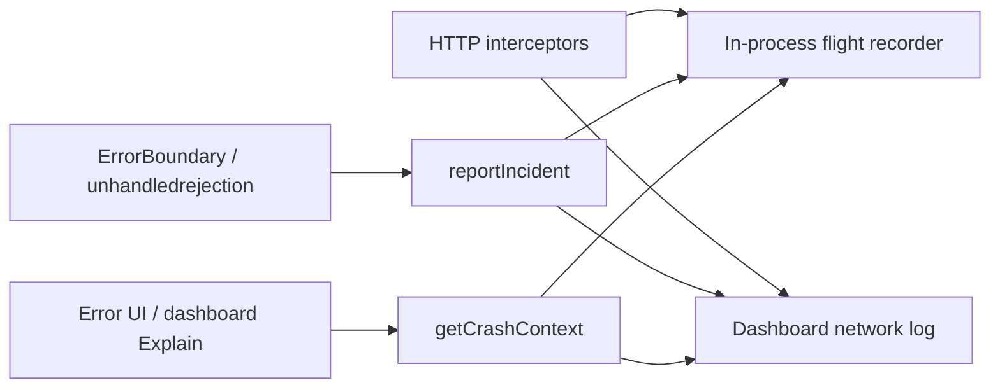

# Debugging, incidents, and “weird” responses

**Status:** shipped (core + dashboard + MCP) · ErrorBoundary via `@sgedda/mockifyer-core/react`
**Related PR:** [#333 — `mockifyerTrace` sidecar](https://github.com/sgedda/mockifyer/pull/333) (trace lookup without mutating response bodies)

Mockifyer already records **what crossed the wire** (mock-hit, upstream, miss, error). This doc describes how that becomes **crash forensics** and **soft-failure debugging** — when HTTP succeeds but the app behaves oddly — without forcing apps to change how they consume API payloads.

## Two failure modes

| Mode | Symptom | What you need |
|------|---------|---------------|
| **Hard failure** | Crash, ErrorBoundary, rejected promise, 4xx/5xx | Pin the moment + show preceding hops |
| **Soft failure** | `200`, “valid” JSON, wrong UI / empty field / stale data | Compare payload to expected shape + match provenance |

Both share the same timeline: correlated hops (`requestId`, `parentRequestId`, `sessionId`, `clientId`) in the dashboard network log or MCP tools.

## Trace without interrupting the flow (shipped — PR #333)

Before PR #333, correlating a response to the dashboard trace often meant **wrapping JSON** (`{ data, mockifyerTrace }`) or reading headers manually. That breaks strict parsers, GraphQL clients, and TypeScript types that expect the upstream shape.

**PR #333** adds a **response sidecar** so apps keep the real payload and still get trace ids:

```typescript
// axios / fetch HTTPResponse
response.data;              // unchanged upstream body
response.mockifyerTrace;    // { requestId, parentRequestId? }
```

### How ids are resolved

1. **Direct HTTP** — from `X-Mockifyer-Request-Id` / `X-Mockifyer-Parent-Request-Id` on the response.
2. **Dashboard `/api/proxy`** — from the proxy JSON envelope (`requestId`, `parentRequestId`) plus outer response headers.
3. **Accidental wrappers stripped** — `stripMockifyerTraceFromBody()` removes simple `{ data, mockifyerTrace }` or GraphQL `extensions.mockifyerTrace` before the body reaches app code or mock files. Full **inline-trace** envelopes (with `mockifyerTrace.hops[]`) are left to existing unwrap/merge logic.

### Using the sidecar in app code (optional, non-blocking)

```typescript
const res = await client.get('/api/matchday/bootstrap');

// Normal flow — no trace handling required
render(res.data);

// When debugging: open dashboard trace without changing res.data
const id = res.mockifyerTrace?.requestId;
if (id && process.env.NODE_ENV === 'development') {
  console.debug(`mockifyer trace: /api/network-events/trace?requestId=${id}`);
}
```

Nothing in the happy path needs to branch on trace metadata. Lookup is **opt-in** after the fact.

### Other trace entry points (already available)

| Source | Lookup key |
|--------|------------|
| Response header | `X-Mockifyer-Request-Id` |
| Sidecar (PR #333) | `response.mockifyerTrace.requestId` |
| Thrown HTTP error | `error.mockifyerRequestId` |
| Express error handler | `createMockifyerErrorHandler()` → header + optional `{ error, requestId }` JSON |
| Dashboard network tab | row `eventId` |
| Inline debug (test only) | `X-Mockifyer-Include-Trace: 1` → in-process hops in body (do not use on consumer traffic) |

Full API: [mockifyer-dashboard README — Network request trace API](../../packages/mockifyer-dashboard/README.md).

## Crash forensics (planned)

**Goal:** answer “what caused this?” by anchoring a **crash/incident** on the same timeline as network hops.



### Planned building blocks

1. **`NetworkFlightRecorder`** (core) — ring buffer of recent `NetworkEvent`s, filled from interceptors even when the dashboard URL is unset.
2. **`reportIncident()`** — `{ type, message, stack, componentStack?, sessionId, clientId, at }`; POST to dashboard alongside network events.
3. **`getCrashContext({ sessionId, at, windowMs })`** — `{ incident, hops[], suspects[] }` where suspects = 4xx/5xx, mock-miss, slow hop, GraphQL `errors`, shape drift flags.
4. **`MockifyerErrorBoundary`** (React) — on catch: report incident + render error **and** last hops from the local buffer (works offline). Complement with global hooks for async errors.
5. **Dashboard “Explain” panel** — incident row on the Network timeline; deep link `/network?incidentId=…`.
6. **MCP `mockifyer_explain_incident`** — agent-friendly narrative over the same window.

### ErrorBoundary sketch

```tsx
<MockifyerErrorBoundary
  fallback={({ error, crashContext }) => (
    <>
      <pre>{error.message}</pre>
      <MockifyerHopList hops={crashContext.hops} suspects={crashContext.suspects} />
    </>
  )}
>
  <App />
</MockifyerErrorBoundary>
```

The forensics panel must never throw — if context lookup fails, still show the React error.

## “Weird” responses — HTTP OK, behavior wrong (planned + partial)

Soft failures are often **invisible in status codes**: `200` with `null` where the UI expects an object, empty arrays, wrong enum, similar-match returning the wrong mock, passthrough refresh changing a field.

Mockifyer can help when it compares **what came back** to **what you expected**:

| Signal | Meaning |
|--------|---------|
| `source: mock-hit` vs `upstream` vs `mock-miss` | Was this replayed, live, or a fallback? |
| Match mode (planned) | exact / similar / passthrough |
| Shape fingerprint vs stored mock (planned) | keys + coarse types; flag `null_where_object`, `empty_collection` |
| Contract drift (planned) | see [contract-drift-detection plan](../../.cursor/plans/contract-drift-detection.md) |

**Replay loop:** once a weird body is identified, pin it as a scenario mock and reproduce deterministically — Mockifyer’s core strength.

**Screen-level explain (planned):** bindings like those in [matchday-dashboard flow](./flows/matchday-dashboard.md) — “MatchdayHeader reads `$.tempC` from hop 1” — so a blank field maps to a specific hop/body path without a crash.

## Suggested rollout

| Phase | Deliverable | Depends on |
|-------|-------------|------------|
| **A** ✅ | `mockifyerTrace` sidecar, body stripping, error `mockifyerRequestId` | PR #333 |
| **B** ✅ | Local flight recorder + `getRecentFlightHops()` / `getCrashContext()` in core | — |
| **C** ✅ | `reportIncident` + dashboard incident rows + `/explain` | B |
| **D** ✅ | `MockifyerErrorBoundary` + `installMockifyerCrashHooks()` | B, C |
| **E** ✅ | Shape / anomaly metadata on hops + soft anomaly flags | B |
| **F** | Contract drift checks (CI + dashboard) | [plan](../../.cursor/plans/contract-drift-detection.md) |

## Config direction (draft)

```typescript
setupMockifyer({
  networkLog: {
    enabled: true,
    captureBodies: true, // or dev-only
    flightRecorder: { maxEvents: 200 }, // planned
    incidents: { enabled: true },       // planned
  },
  sessionId: 'sess_…', // or auto per boot / test run
});
```

## Principles

- **Never break the app path** — trace and forensics are sidecars; observability must not change upstream payloads or fail requests.
- **Same ids everywhere** — incident, hop, and dashboard `/trace` share `requestId` / `sessionId`.
- **Evidence over guesswork** — “likely cause” narratives cite hops and body previews, not magic.
- **Quiet by default** — ring buffer + dashboard/MCP, not verbose console on every call.

## Using it

### Per-screen session (recommended)

```tsx
import { MockifyerErrorBoundary, useMockifyerScreenSession } from '@sgedda/mockifyer-core/react';

function MatchdayScreen() {
  const sessionId = useMockifyerScreenSession({ screenName: 'matchday' });

  return (
    <MockifyerErrorBoundary sessionId={sessionId} windowMs={15_000} config={mockifyerConfig}>
      <MatchdayContent />
    </MockifyerErrorBoundary>
  );
}
```

`useMockifyerScreenSession` calls `setFlightRecorderRuntimeContext({ sessionId })` on mount.  
Fetch/axios interceptors stamp **the same id** on every hop in that screen.

**Prefetch grace (automatic):** when `sessionId` is set, `getCrashContext` also pulls hops from **other sessions** within the last **5s** before the incident (or before the first same-session hop). Parent/navigator prefetches are included without manual flow ids. Disable with `prefetchGraceMs={0}`.

### Error UI + terminal

- **On screen:** error message first; **top 8 hops visible** (most relevant first); “Show all N hops” for the rest.
- **Ranking:** flagged suspects → same-session → recent prefetch → recency within the time window. Session id **boosts** order; it does not hide other hops in the window.
- **Metro / console:** one-line error; ranked hops in a collapsed `console.groupCollapsed` group.

```tsx
<MockifyerErrorBoundary logToConsole sessionId={sessionId} windowMs={60_000} visibleHopCount={8} />
```

### Global async crashes

```typescript
import { installMockifyerCrashHooks } from '@sgedda/mockifyer-core';

installMockifyerCrashHooks({ config: mockifyerConfig, sessionId });
```

### Post-hoc trace (PR #333 — no body wrapping)

```typescript
const res = await client.get('/api/foo');
const traceId = res.mockifyerTrace?.requestId;
// GET /api/network-events/trace?requestId=…
```

### Dashboard explain API

```bash
curl -s 'http://localhost:3002/api/network-events/explain?incidentId=ev-…&scenario=default' | jq .
```

Returns `{ context: { incident, hops, suspects }, narrative }`.

### MCP

`mockifyer_explain_incident({ incidentId: "…" })` — same shape as the explain API.

## See also

- [Network trace API](../../packages/mockifyer-dashboard/README.md#network-request-trace-api)
- [MCP tools](../../packages/mockifyer-mcp/README.md)
- [Example multi-service trace](../../example-projects/multi-service-example/README.md)
- [Matchday flow doc (GUI ↔ hop bindings)](./flows/matchday-dashboard.md)
