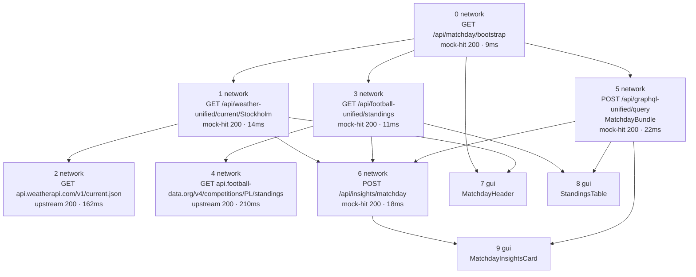

# Flow: Matchday Dashboard

**Intent:** User opens the Matchday screen for a selected city and team. The BFF
loads weather + football standings in parallel, enriches with an upstream
weather provider and league API, runs a GraphQL “matchday bundle” query, then
posts an insights summary. The GUI renders three components from those hops.

**Provenance:** trace `req_md_7f3a91` · scenario `matchday-happy` · lane
`client_demo_1` · generated `2026-08-20T19:10:00Z` · incomplete: false ·
**6 network + 3 gui hops**

> Example fixture only — illustrates the living architecture-doc shape. Live
> values would refresh from the latest matching network trace; hop structure and
> GUI field paths stay stable from named-flow bindings.

## Diagram



## Hops

| # | Kind | Label | Meta |
|---|------|-------|------|
| 0 | network | `GET /api/matchday/bootstrap?city=Stockholm&team=AIK` | mock-hit · 200 · 9ms |
| 1 | network | `GET /api/weather-unified/current/Stockholm` | mock-hit · 200 · 14ms |
| 2 | network | `GET api.weatherapi.com/v1/current.json?q=Stockholm` | upstream · 200 · 162ms |
| 3 | network | `GET /api/football-unified/standings?league=PL` | mock-hit · 200 · 11ms |
| 4 | network | `GET api.football-data.org/v4/competitions/PL/standings` | upstream · 200 · 210ms |
| 5 | network | `POST /api/graphql-unified/query` · `MatchdayBundle` | mock-hit · 200 · 22ms |
| 6 | network | `POST /api/insights/matchday` | mock-hit · 200 · 18ms |
| 7 | gui | `MatchdayHeader` | consumes hops 0, 1 |
| 8 | gui | `StandingsTable` | consumes hops 3, 5 |
| 9 | gui | `MatchdayInsightsCard` | consumes hops 5, 6 |

---

### Hop 0 — network · `GET /api/matchday/bootstrap`

**Request**

| Field | Value |
|-------|-------|
| `query.city` | `Stockholm` |
| `query.team` | `AIK` |
| `query.date` | `2026-08-20` |
| `headers.X-Mockifyer-Request-Id` | `req_md_7f3a91` |
| `headers.X-Mockifyer-Client-Id` | `client_demo_1` |
| `headers.Accept` | `application/json` |

**Response** `200`

```json
{
  "sessionId": "sess_matchday_2208",
  "city": "Stockholm",
  "team": {
    "id": "team_aik",
    "name": "AIK",
    "shortName": "AIK",
    "crestUrl": "https://cdn.example/crests/aik.svg"
  },
  "league": {
    "code": "PL",
    "name": "Premier League"
  },
  "kickoffLocal": "2026-08-20T20:00:00+02:00",
  "features": {
    "weather": true,
    "standings": true,
    "graphqlBundle": true,
    "insights": true
  }
}
```

---

### Hop 1 — network · `GET /api/weather-unified/current/Stockholm`

**Request**

| Field | Value |
|-------|-------|
| `path` | `/api/weather-unified/current/Stockholm` |
| `parentRequestId` | `req_md_7f3a91` |
| `requestId` | `req_md_weather_01` |
| `headers.X-Mockifyer-Request-Id` | `req_md_weather_01` |

**Response** `200`

```json
{
  "city": "Stockholm",
  "country": "SE",
  "observedAt": "2026-08-20T18:55:00Z",
  "tempC": 18.4,
  "tempF": 65.1,
  "feelsLikeC": 17.1,
  "humidity": 64,
  "windKph": 14.2,
  "windDir": "SW",
  "condition": {
    "code": 1003,
    "text": "Partly cloudy",
    "icon": "//cdn.weather/64x64/day/116.png"
  },
  "provider": "weatherapi",
  "source": "bff-cache"
}
```

---

### Hop 2 — network · `GET api.weatherapi.com/v1/current.json`

**Request**

| Field | Value |
|-------|-------|
| `query.q` | `Stockholm` |
| `query.aqi` | `no` |
| `parentRequestId` | `req_md_weather_01` |
| `requestId` | `req_md_weather_up_02` |
| `headers.X-Api-Key` | `***` |

**Response** `200` (preview; full body truncated in network log)

```json
{
  "location": {
    "name": "Stockholm",
    "region": "Stockholms Lan",
    "country": "Sweden",
    "lat": 59.33,
    "lon": 18.07,
    "tz_id": "Europe/Stockholm",
    "localtime": "2026-08-20 20:55"
  },
  "current": {
    "last_updated_epoch": 1724180100,
    "last_updated": "2026-08-20 20:55",
    "temp_c": 18.4,
    "temp_f": 65.1,
    "is_day": 1,
    "condition": {
      "text": "Partly cloudy",
      "icon": "//cdn.weatherapi.com/weather/64x64/day/116.png",
      "code": 1003
    },
    "wind_mph": 8.8,
    "wind_kph": 14.2,
    "wind_degree": 225,
    "wind_dir": "SW",
    "humidity": 64,
    "feelslike_c": 17.1,
    "uv": 4.0
  }
}
```

---

### Hop 3 — network · `GET /api/football-unified/standings`

**Request**

| Field | Value |
|-------|-------|
| `query.league` | `PL` |
| `query.season` | `2025` |
| `parentRequestId` | `req_md_7f3a91` |
| `requestId` | `req_md_foot_03` |

**Response** `200` — array projected as **length + sample + itemShape** (not full table)

```json
{
  "league": "PL",
  "season": 2025,
  "updatedAt": "(string, ISO-8601 · volatile)",
  "table": {
    "length": 20,
    "samplePick": ["first", "highlight:teamId=team_aik"],
    "sample": [
      {
        "position": 1,
        "teamId": "team_ars",
        "team": "Arsenal",
        "played": 2,
        "points": 6,
        "form": ["W", "W"]
      },
      {
        "position": 8,
        "teamId": "team_aik",
        "team": "AIK",
        "played": 2,
        "points": 1,
        "form": ["D", "L"]
      }
    ],
    "itemShape": {
      "position": "number",
      "teamId": "string",
      "team": "string",
      "played": "number",
      "won": "number",
      "draw": "number",
      "lost": "number",
      "gf": "number",
      "ga": "number",
      "gd": "number",
      "points": "number",
      "form": "string[]"
    }
  }
}
```
---

### Hop 4 — network · `GET api.football-data.org/v4/competitions/PL/standings`

**Request**

| Field | Value |
|-------|-------|
| `parentRequestId` | `req_md_foot_03` |
| `requestId` | `req_md_foot_up_04` |
| `headers.X-Auth-Token` | `***` |

**Response** `200` (preview)

```json
{
  "filters": { "season": "2025" },
  "area": { "id": 2072, "name": "England", "code": "ENG" },
  "competition": { "id": 2021, "name": "Premier League", "code": "PL" },
  "season": {
    "id": 2304,
    "startDate": "2025-08-15",
    "endDate": "2026-05-24",
    "currentMatchday": 2
  },
  "standings": [
    {
      "type": "TOTAL",
      "table": [
        {
          "position": 1,
          "team": { "id": 57, "name": "Arsenal FC", "tla": "ARS" },
          "playedGames": 2,
          "won": 2,
          "draw": 0,
          "lost": 0,
          "points": 6,
          "goalsFor": 5,
          "goalsAgainst": 1,
          "goalDifference": 4
        },
        {
          "position": 8,
          "team": { "id": 9001, "name": "AIK", "tla": "AIK" },
          "playedGames": 2,
          "won": 0,
          "draw": 1,
          "lost": 1,
          "points": 1,
          "goalsFor": 2,
          "goalsAgainst": 3,
          "goalDifference": -1
        }
      ]
    }
  ]
}
```

---

### Hop 5 — network · `POST /api/graphql-unified/query` · `MatchdayBundle`

**Request**

```json
{
  "operationName": "MatchdayBundle",
  "query": "query MatchdayBundle($city: String!, $teamId: ID!, $league: String!) {\n  matchday(city: $city, teamId: $teamId) {\n    id\n    kickoff\n    venue { name capacity }\n    home { id name }\n    away { id name }\n    weatherHint\n  }\n  standingsPreview(league: $league, limit: 5) {\n    position\n    team { id name }\n    points\n  }\n  notifications(teamId: $teamId) {\n    id\n    severity\n    message\n  }\n}",
  "variables": {
    "city": "Stockholm",
    "teamId": "team_aik",
    "league": "PL"
  }
}
```

**Response** `200`

```json
{
  "data": {
    "matchday": {
      "id": "md_2026_08_20_aik",
      "kickoff": "2026-08-20T18:00:00Z",
      "venue": {
        "name": "Friends Arena",
        "capacity": 50053
      },
      "home": {
        "id": "team_aik",
        "name": "AIK"
      },
      "away": {
        "id": "team_mal",
        "name": "Malmö FF"
      },
      "weatherHint": "Mild evening, light breeze"
    },
    "standingsPreview": {
      "length": 5,
      "sample": [
        {
          "position": 1,
          "team": { "id": "team_ars", "name": "Arsenal" },
          "points": 6
        },
        {
          "position": 8,
          "team": { "id": "team_aik", "name": "AIK" },
          "points": 1
        }
      ],
      "itemShape": {
        "position": "number",
        "team": { "id": "string", "name": "string" },
        "points": "number"
      }
    },
    "notifications": {
      "length": 2,
      "sample": [
        {
          "id": "n_1",
          "severity": "info",
          "message": "Kickoff in 65 minutes"
        }
      ],
      "itemShape": {
        "id": "string",
        "severity": "info | warning | error",
        "message": "string"
      }
    }
  }
}
```

---

### Hop 6 — network · `POST /api/insights/matchday`

**Request**

```json
{
  "city": "Stockholm",
  "tempC": 18.4,
  "condition": "Partly cloudy",
  "teamId": "team_aik",
  "teamPoints": 1,
  "teamPosition": 8,
  "opponent": "Malmö FF",
  "kickoff": "2026-08-20T18:00:00Z",
  "weatherHint": "Mild evening, light breeze"
}
```

**Response** `200`

```json
{
  "insightId": "ins_md_9912",
  "headline": "Comfortable conditions for a mid-table scrap",
  "summary": "Partly cloudy 18°C at Friends Arena. AIK sit 8th on 1 pt; expect a tight match vs Malmö FF.",
  "tags": ["weather-ok", "form-mixed", "home"],
  "confidence": 0.81,
  "cta": {
    "label": "View starting XI",
    "href": "/matchday/md_2026_08_20_aik/lineup"
  },
  "chips": [
    { "id": "chip_wx", "label": "18°C · Partly cloudy" },
    { "id": "chip_tbl", "label": "8th · 1 pt" },
    { "id": "chip_ko", "label": "Kickoff 20:00" }
  ]
}
```

---

### Hop 7 — gui · `MatchdayHeader`

Fields this component uses:

| Component field | From hop | JSON path | Live value |
|-----------------|----------|-----------|------------|
| `titleCity` | 0 · bootstrap | `$.city` | `Stockholm` |
| `teamName` | 0 · bootstrap | `$.team.name` | `AIK` |
| `teamCrestUrl` | 0 · bootstrap | `$.team.crestUrl` | `https://cdn.example/crests/aik.svg` |
| `kickoffLocal` | 0 · bootstrap | `$.kickoffLocal` | `2026-08-20T20:00:00+02:00` |
| `tempC` | 1 · weather BFF | `$.tempC` | `18.4` |
| `conditionText` | 1 · weather BFF | `$.condition.text` | `Partly cloudy` |
| `conditionIcon` | 1 · weather BFF | `$.condition.icon` | `//cdn.weather/64x64/day/116.png` |
| `windKph` | 1 · weather BFF | `$.windKph` | `14.2` |

```text
MatchdayHeader
  ┌──────────────────────────────────────────────────────────┐
  │  [crest] AIK · Stockholm                                 │
  │  Kickoff 20:00 (+02)                                     │
  │  18.4°C  Partly cloudy  wind 14.2 kph                    │
  └──────────────────────────────────────────────────────────┘
    teamName/titleCity/kickoffLocal ← hop0
    tempC/conditionText/windKph     ← hop1
```

---

### Hop 8 — gui · `StandingsTable`

| Component field | From hop | JSON path | Live value |
|-----------------|----------|-----------|------------|
| `leagueCode` | 3 · standings BFF | `$.league` | `PL` |
| `rows` | 3 · standings BFF | `$.table` | `length=20 · sample[first]=Arsenal · sample[highlight]=AIK` |
| `highlightTeamId` | 0 · bootstrap | `$.team.id` | `team_aik` |
| `previewRows` | 5 · GraphQL | `$.data.standingsPreview` | `length=5 · sample[2]` |
| `homeName` | 5 · GraphQL | `$.data.matchday.home.name` | `AIK` |
| `awayName` | 5 · GraphQL | `$.data.matchday.away.name` | `Malmö FF` |
| `venueName` | 5 · GraphQL | `$.data.matchday.venue.name` | `Friends Arena` |

```text
StandingsTable
  League PL · highlight team_aik
  1 Arsenal 6pts · 2 Liverpool 4pts · … · 8 AIK 1pt
  Fixture strip: AIK vs Malmö FF @ Friends Arena
    rows/leagueCode     ← hop3
    preview/fixture/venue ← hop5
```

---

### Hop 9 — gui · `MatchdayInsightsCard`

| Component field | From hop | JSON path | Live value |
|-----------------|----------|-----------|------------|
| `headline` | 6 · insights | `$.headline` | `Comfortable conditions for a mid-table scrap` |
| `summary` | 6 · insights | `$.summary` | `Partly cloudy 18°C at Friends Arena. AIK sit 8th on 1 pt; expect a tight match vs Malmö FF.` |
| `tags` | 6 · insights | `$.tags` | `["weather-ok","form-mixed","home"]` |
| `confidence` | 6 · insights | `$.confidence` | `0.81` |
| `ctaLabel` | 6 · insights | `$.cta.label` | `View starting XI` |
| `ctaHref` | 6 · insights | `$.cta.href` | `/matchday/md_2026_08_20_aik/lineup` |
| `chips` | 6 · insights | `$.chips` | `[{ label: 18°C · Partly cloudy }, …]` |
| `notificationPrimary` | 5 · GraphQL | `$.data.notifications[0].message` | `Kickoff in 65 minutes` |
| `notificationWarn` | 5 · GraphQL | `$.data.notifications[1].message` | `Away end nearly sold out` |
| `graphqlWeatherHint` | 5 · GraphQL | `$.data.matchday.weatherHint` | `Mild evening, light breeze` |

```text
MatchdayInsightsCard
  ┌──────────────────────────────────────────────────────────┐
  │  Comfortable conditions for a mid-table scrap            │
  │  Partly cloudy 18°C … AIK 8th … vs Malmö FF              │
  │  chips: [18°C · Partly cloudy] [8th · 1 pt] [Kickoff…]   │
  │  note: Kickoff in 65 minutes · Away end nearly sold out  │
  │  [ View starting XI ]   confidence 0.81                  │
  └──────────────────────────────────────────────────────────┘
    headline/summary/chips/cta ← hop6
    notifications/weatherHint  ← hop5
```

---

## Notes

- Hops **2** and **4** are upstream enrichments under BFF hops **1** and **3** (`parentRequestId` chain).
- GUI hops **7–9** are not HTTP; they are declared bindings whose **Live value** columns are filled from the latest matching network bodies.
- Sensitive headers (`X-Api-Key`, `X-Auth-Token`) stay redacted in exported docs, matching network-log policy.
- **Arrays / volatile fields:** by default the renderer writes `length` + small `sample` + `itemShape`, not every row. Use binding `present: full | sample | length | shape | omit`. Prefer `--stable` regen for checked-in docs so timestamps and full lists do not churn every run.
- **Debugging direction:** crash forensics, soft “weird response” failures, and the PR #333 `mockifyerTrace` sidecar are described in [debugging-and-incidents.md](../debugging-and-incidents.md).
