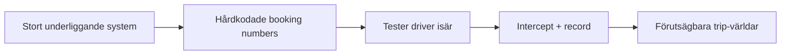
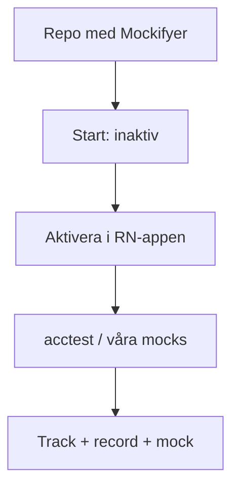
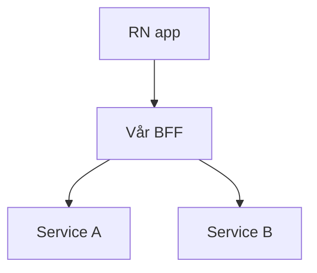

<!--
Obsidian Advanced Slides: slides separated by ---
Talk order (locked):
  1) Short background — why / how it started
  2) Packages and what each is for
  3) How it runs — per repo, acctest only, off by default, enable in RN app
  4) Demo — start tracking with Metro key "t" → trace, nested calls, search
  5) Switch scenario in the app + under the hood in the dashboard
  6) MCP example
  7) Close → code lab
Replace SCREENSHOT placeholders with your images.
-->

# Mockifyer

### Record · track · mock — predictable trip worlds

30 minutes · then we code together

<!-- speaker: Kort bakgrund → paket → aktivering → demo (t) → scenario → MCP → lab -->

---

# Agenda

1. **Bakgrund** — varför det behövdes  
2. **Paket** — vad som används till vad  
3. **Hur den körs** — per repo, acctest, av som default  
4. **Demo** — spårning med `t` · nested calls · sök  
5. **Byta scenario** — i appen + i dashboarden  
6. **MCP** — kort exempel  
7. **Code lab** tillsammans  

---

# Bakgrund — varför

## Beroende av ett stort underliggande system

- Administrativt jobb för att sätta upp “rätt” trip  
- Data försvann → lägga till igen  
- Nya typer av trips → mer väntan  
- Bara för att se hur **vår** app ser ut  

<!-- SCREENSHOT: optional staging / admin pain -->

---

# Bakgrund — första lösningen

## Hårdkodat: booking number → trips för en user

- Löst demos lite  
- Skört, manuellt  
- Inte en generell modell av API:t  

### Sedan: automated tests drev isär

UI ↔ data ↔ staging ↔ hacken

### Idén

**Varför inte intercepta och spela in requests via ett bibliotek?**

---

# Från idé till Mockifyer

Samma världar för demos, tester och att hjälpa en gäst

---

# Paket — vad används till vad

| Paket | Till vad |
|-------|----------|
| **`@sgedda/mockifyer-core`** | Matching, scenarios, dates, Atlas-data |
| **`@sgedda/mockifyer-fetch`** | `fetch` / **React Native** · Metro · `t` Atlas |
| **`@sgedda/mockifyer-axios`** | Axios (Node / services) |
| **`@sgedda/mockifyer-dashboard`** | UI · Redis · Network · scenarios |
| **`@sgedda/mockifyer-mcp`** | AI-verktyg (Cursor / Claude) |

Fungerar idag med **Node**, **React Native** och **React web**

[mockifyer.dev](https://mockifyer.dev/)

---

# Hur den körs — per repo

### Läggs till i respektive repo där ni vill

- **Spela in** responses  
- **Tracka** anrop (nested)  
- **Mocka** / byta produktvärldar  

### Hos oss (praktiken)

- Endast mot **acctest** (inte prod)  
- **Inaktiverad från början** — opt-in  
- Aktiveras via **RN-appen** (Dev / runtime toggle)  
- Services kopplas via **dashboard + Redis** när ni vill dela lanes / hops  

<!-- speaker: Undvik tyst abstraktion i prod. Store = off. Acctest only. -->

---

# Aktivering — opt-in

| Läge | Betydelse |
|------|-----------|
| **Av som default** | Ingen intercept förrän ni vill |
| **RN-appen** | Slå på Mockifyer i Dev |
| **`launch_client` / Maestro** | Endast när E2E skickar lane |
| **`off`** | Store / builds utan mocks |

<!-- SCREENSHOT: RN Dev — Mockifyer off → on -->

---

# Demo · starta spårning med `t`

### I Metro-terminalen: tryck **`t`**

- Startar **Atlas**-capture + live stream  
- (Stoppa med `t` igen → kan generera HTML-docs)  

Sedan visar vi:

1. **Trace** — korrelerade / nestlade anrop  
2. **Nested calls** — expand / collapse  
3. **Sök** — hitta data i payloads  

<!-- SCREENSHOT: Metro tip "press t" / Atlas stream -->

<!-- speaker: DEFAULT_METRO_ATLAS_KEY = "t". a = Android — rör inte. -->

---

# Trace & nestlade anrop

**Live wires** — vad appen faktiskt anropar just nu

- Träd av hops (BFF → underliggande)  
- Expand / collapse  
- Öppna request / response  

<!-- SCREENSHOT: Atlas TTY eller Network — nested tree expanded -->

<!-- speaker: Dashboard Network = samma idé live i UI. Atlas = stream + HTML map/search. -->

---

# Sök i datat

### Hitta vad som finns — även det UI inte visar

- Sök i path / body / requestId  
- Bra för: “finns booking fields vi inte använder än?”  

<!-- SCREENSHOT: Atlas HTML Search eller bodies search hit -->

**Network** = just nu · **Atlas** = karta + sök över sessionen

---

# Byta scenario i appen

### Produktvärldar (exempel)

| Värld | Scenario |
|-------|----------|
| Inga trips | `trips-empty` |
| En trip | `trips-one` |
| Flera | `trips-many` |
| Check-in | `checkin-open` |

Byt i **Dev-delen av RN-appen** → UI uppdateras

**Scenario** = vilken värld · **Lane** = vilken enhet/test som pekar dit  
*(Runtime on/off ≠ scenario)*

<!-- SCREENSHOT: in-app scenario picker + UI before/after -->

---

# Under huven — dashboard

Efter scenario-byte i appen, visa i dashboard:

- **Aktiv scenario / client lane**  
- **Mocks** för den världen  
- **Network** — hops följer samma lane  
- Valfritt: Date Config för check-in “idag”  

<!-- SCREENSHOT: dashboard scenario + lane + mock list -->

Samma värld som appen — delad via Redis när services är kopplade

---

# MCP — kort exempel

**MCP** = AI-klienten (Cursor / Claude) får verktyg mot dashboarden

Exempel prompts:

- “Set my lane to `trips-empty`”  
- “Override booking status …” / copy array item  
- “Trace the last failing hop”  

Vi provar gärna i **code lab**.

<!-- SCREENSHOT: MCP chat → tool call → result -->

---

# Om ni missar något — ta med kort

| Ämne | En mening |
|------|-----------|
| **Hur en värld föds** | Record → passthrough → curate → replay |
| **Matching** | REST = method+URL+body · GraphQL = query+variables |
| **Allowlist / excludedUrls** | Bara våra API:er · brus utanför |
| **Overrides** | Datum offset från now · fler booking numbers i array |
| **Maestro** | `mockifyerClientId` + `scenario` → förutsägbara E2E |
| **Vem** | Dev · QA · destination — samma världar |

<!-- speaker: Välj 1–2 om tid finns; annars lab. -->

---

# Recap

- Behövdes för att slippa admin-helvetet och drift i tester  
- Paket per yta: core · fetch/RN · axios · dashboard · mcp  
- **Per repo** · **acctest** · **av som default** · på via RN  
- **`t`** → track · nested · sök  
- Scenario i appen ↔ dashboard under huven  
- MCP för AI-driven lane/override  

---

# Code lab

Tillsammans:

1. Aktivera i appen  
2. `t` → se nested hops + sök  
3. Byt scenario · kolla dashboard  
4. Valfritt: record · override · MCP · Maestro  

→ [CODE_LAB.md](./CODE_LAB.md) · [DEMO_RUNBOOK.md](./DEMO_RUNBOOK.md)
