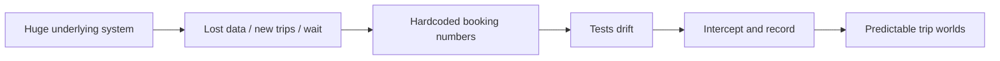
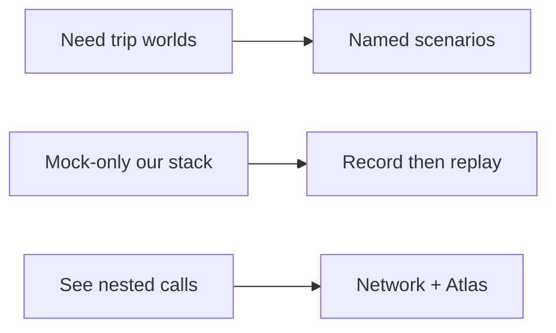
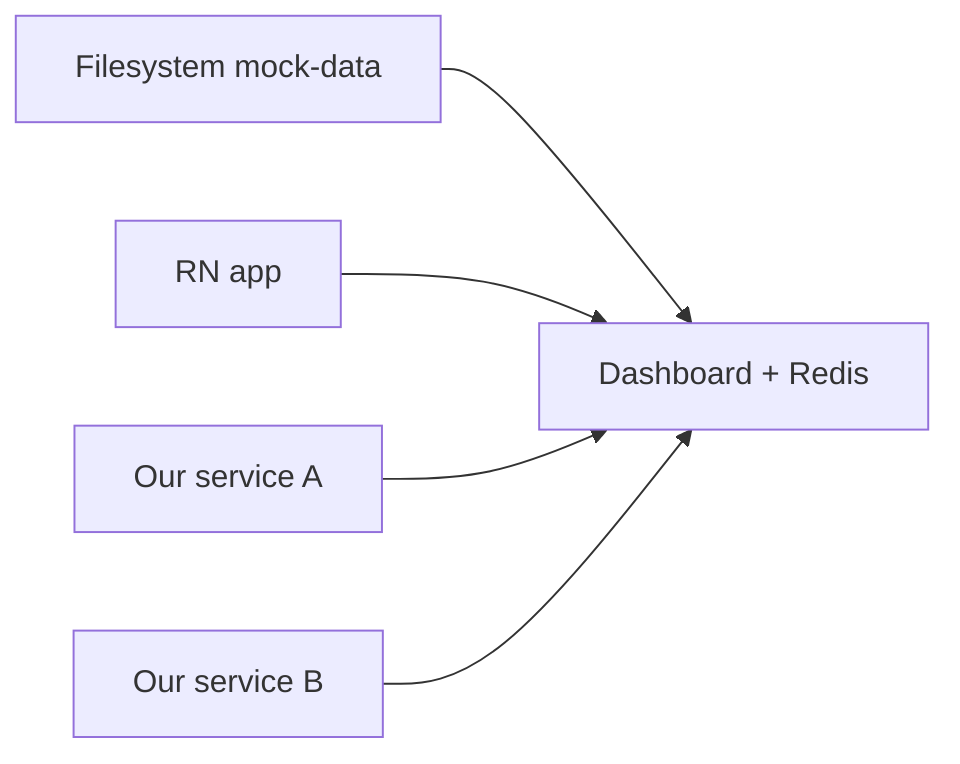
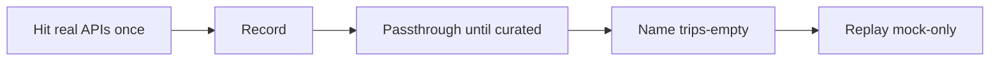
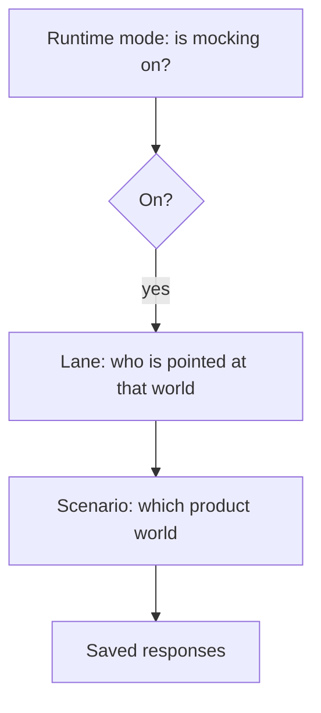
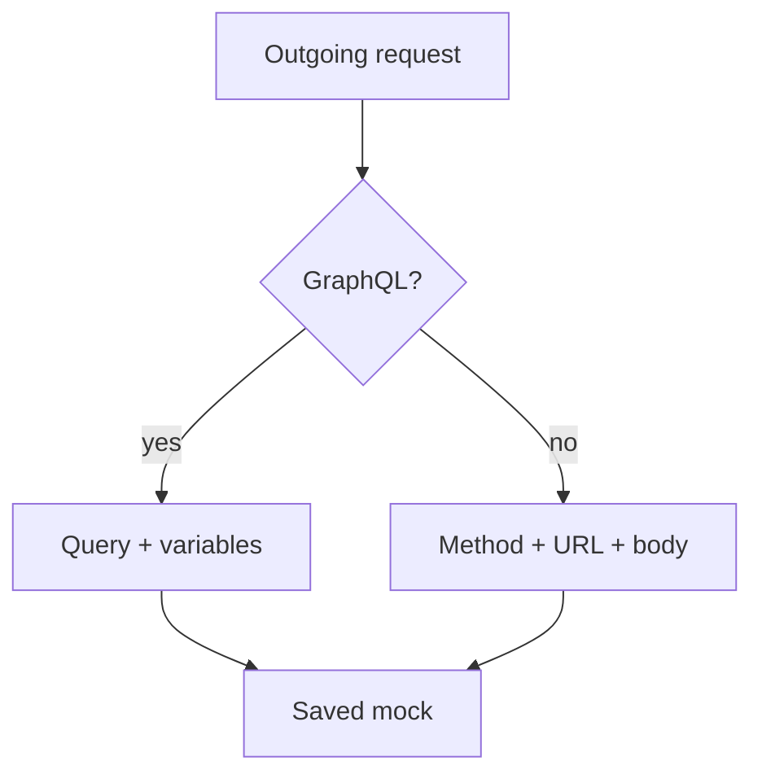

<!--
Obsidian Advanced Slides / similar: slides separated by ---
Drop screenshots into the vault and replace SCREENSHOT placeholders.
Speaker notes in HTML comments under each slide.
Dual audience: lead with product outcome; eng detail in footers / notes.
-->

# Mockifyer

### Predictable trip worlds for demos, tests, and helping guests

30 minutes · then we code together

<!-- speaker: Mixed room. Tech-focused but plain language first. Screenshots you supply. -->

---

# What you’ll leave with

- Why we needed this (the struggle)
- **Product worlds** — no trips / one / many / check-in
- Who can use them — developer, tester, destination
- How builders see the wires — Network & Atlas
- Then: **code lab** together

---

# The old way hurt

## Always dependent on a huge underlying system

- Admin work just to set up the “right” trip
- Lost data → add again
- New kinds of trips → more waiting
- Just to see how **our** app looks

<!-- SCREENSHOT: optional admin / staging pain -->

<!-- speaker: Personal story. Cost = waiting on other teams/systems. -->

---

# First escape hatch

## Hardcoded: booking number → trips for a user

- Unblocked demos a bit
- Brittle, manual
- Not a real model of the API

<!-- SCREENSHOT: optional booking-number hack sketch -->

<!-- speaker: Prototype of controlling what the user sees. -->

---

# Then tests drifted

- Automated tests vs staging vs the hack
- Maintaining both became the job
- UI, data, and “truth” diverged

### The idea

**Why not intercept and record requests through a library?**

---

# From struggle to Mockifyer



Recording the wire = the general solution

---

# What I need to see in the app

| World | Example name |
|-------|----------------|
| **No trips** | `trips-empty` |
| **One trip** | `trips-one` |
| **Many trips** | `trips-many` |
| **During check-in** | `checkin-open` |

Works as intended **and** looks good — without hunting staging.

<!-- SCREENSHOT: four UI frames — empty / one / many / check-in -->

---

# Same worlds · three jobs

| Who | Job |
|-----|-----|
| **Developer** | Works + looks right; debug the wires |
| **Tester** | Stable edges; no scavenger hunt |
| **Destination** | Show a guest “what you’ll see when…” |

One infrastructure. Simple flip for people. Deep tools for builders.

<!-- SCREENSHOT: Dev · Tester · Destination graphic -->

---

# Independence

### Run without that huge system

**Before:** app → many live systems (fragile)

**After:** app → Mockifyer → our saved worlds (stable)

Mock-only **our** stack — not partner lottery every morning.



---

# Opt-in — not a silent layer

Extra interception can hide bugs or surprise production.

**We turn Mockifyer on when we mean to.**

| Plain | Mode | When |
|-------|------|------|
| On | `on` | Dev wants mocks |
| Off until I enable | `manual` | Opt-in at the desk |
| Only for E2E | `launch_client` | Maestro lane |
| Never | `off` | Store builds |

<!-- SCREENSHOT: runtime toggle off → on -->

<!-- speaker: If MOCKIFYER_MODE unset, RN library defaults to on — set mode deliberately. Runtime toggle ≠ scenario switch. -->

---

# Where mocks live

### Filesystem first → Redis + dashboard now

**Early:** JSON in the repo — simple, git-reviewable  
*(RN: device + Metro sync to the project folder)*

**Now:** **Redis + dashboard** between our services  
One control plane — app, BFF, nested backends share scenarios & lanes



---

# How a world is born

We don’t invent trip JSON first — we **capture a real run**, then shape it.



- New recordings often stay **live until you activate** the mock
- Keep **recorded-*** vs **curated** worlds separate

<!-- SCREENSHOT: passthrough checkbox → curated mock -->

<!-- speaker: alwaysUseRealApi / MOCK_WORKFLOW. Re-record can destroy curation. -->

---

# Three ideas (don’t mix them up)

| Word | Plain meaning |
|------|----------------|
| **Scenario** | Which product world (no trips / check-in) |
| **Lane** | Which phone or test run points at that world |
| **Runtime mode** | Whether Mockifyer is on — not which world |



<!-- speaker: Eng: MOCKIFYER_MODE, clientId, scenario folder / Redis. -->

---

# Matching — how a call finds its mock

Same URL is **not** enough for GraphQL.

| Kind | How it matches |
|------|----------------|
| **REST** | Method + URL + query; JSON body → shape hash |
| **GraphQL** | Normalized **query + variables** (not operation name alone) |

Trip list vs check-in mutation → **different mocks** on `/graphql`



<!-- speaker: Similar-match is REST-only fallback; never soft-matches GraphQL. -->

---

# Only our APIs

**Allowlist** (shipped) — discover host/paths; record/replay off until you enable them  
**`excludedUrls`** — fully bypass (auth, analytics, noise)

Mock-only *our* system = narrow abstraction (ties to opt-in)

<!-- SCREENSHOT: domain-path-rules or allowlist UI -->

<!-- speaker: recordingExclusions = don’t persist, still replay. -->

---

# Demo · flip product worlds

### In-app Dev — for everyone

`trips-empty` → `trips-one` → `trips-many` → check-in

- Developer: works + looks good  
- Tester: reproduce  
- Destination: “what the guest sees”

**Runtime toggle** = Mockifyer on/off · **Scenario** = which world

<!-- SCREENSHOT: in-app scenario picker + UI before/after -->

<!-- speaker: Hero demo. Predictable presentation. -->

---

# Predictable testing & presentation

Same trip world every time — not “hope staging has the right booking.”

**People:** flip in the app  
**Machines:** launch arguments (Maestro)

---

# Maestro · pin a world for a test

```yaml
- launchApp:
    clearState: true
    arguments:
      mockifyerClientId: e2e-trips-empty
      scenario: trips-empty
- assertVisible:
    id: home_empty_state
```

“Open the app *as if* there are no trips.”

> For engineers: under `launch_client`, **scenario alone is not enough** — need `mockifyerClientId`.

<!-- SCREENSHOT: Maestro YAML + green assert -->

<!-- speaker: Lab can run this. OSS: example-projects/maestro-login-flow -->

---

# Builders lean-in

### Next: how we see the wires

Stay for the story — or lean in for the stack.

---

# Network · live nested calls

**Dashboard Network** = what’s happening **right now**

- Expand / collapse correlated trees  
- Open a response body  
- Re-trigger from the app → new hop appears

<!-- SCREENSHOT: Network Expand/Collapse + body -->

<!-- speaker: Nav: Statistics · Mocks · Hops · Overrides · Network · Date Config · Settings -->

---

# Network vs Atlas

| | **Network** | **Atlas** |
|---|-------------|-----------|
| Plain | Live wires **now** | **Map** of the session |
| Use | Debug while the app runs | Architecture · search bodies · share |

Live wires → Network.  
Map + search across what we captured → **Atlas**.

---

# Atlas · systems we actually call

- **Architecture / Map** — overview of underlying systems from our app  
- **Search** — data that exists in payloads but the UI doesn’t use yet  
- Streaming terminal optional (collapse/expand hops)

<!-- SCREENSHOT: Atlas Architecture/Map + Search hit -->

<!-- speaker: Prefer HTML Map/Search live; TTY as screenshot if short on time. -->

---

# Time & overrides

### Check-in needs “today”

| Approach | Pros | Cons |
|----------|------|------|
| **`getCurrentDate()`** | One control plane | Touches app code |
| **Date overrides** | App keeps `new Date()` | Many fields to wire |

**Overrides** = change a saved mock without a whole new world

- **A)** Date path = now + offset (fresh check-in window)  
- **B)** Extend arrays — e.g. more **booking numbers** (echo of the old hack)

<!-- SCREENSHOT: date offset and/or array before/after -->

<!-- speaker: Demo ONE of A or B. Lane date can override scenario Date Config. -->

---

# Packages · not mobile-only

Works **today** with:

- **Node** — servers, BFF, scripts  
- **React Native / Expo** — today’s story  
- **React web**

| Package | Role |
|---------|------|
| `@sgedda/mockifyer-core` | Matching, scenarios, dates |
| `@sgedda/mockifyer-fetch` | fetch / React Native |
| `@sgedda/mockifyer-axios` | Axios |
| `@sgedda/mockifyer-dashboard` | UI · Redis · Network |
| `@sgedda/mockifyer-mcp` | AI tools — **try in the lab** |

[mockifyer.dev](https://mockifyer.dev/) · open source on GitHub

---

# Recap

- Huge system → booking hack → drift → **record the wire**
- **Shared trip worlds** for developer, tester, destination
- Opt-in · filesystem → Redis between our services
- Predictable demos **and** tests
- Network = now · Atlas = map + search

Curated picks for destination · **off** in store builds · mind PII when recording

---

# Now we code together

### Code lab

Flip a world · read the wire · birth a mock · override · optional Maestro / MCP

See **CODE_LAB.md** in this folder

<!-- speaker: Hand off. Non-tech can stay on flip exercise. -->
